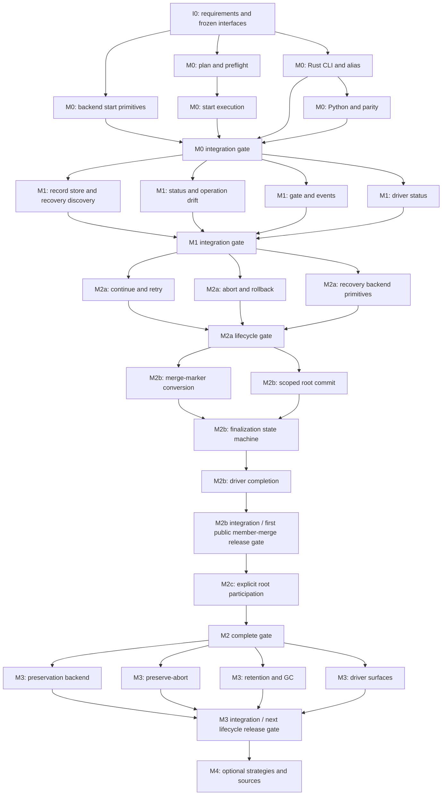

# GWZ Merge Implementation Plan

Status: **proposed** (revised 2026-07-19). Owner: Gianni.

This plan implements `GwzMergeDesign.md`, including the dispositions in
`GwzMergeDesign-ReviewF5.md`, `GwzMergeDesign-ReviewF5-2.md`, and
`GwzMergePlan-ReviewF5.md`. The design is the behavioral authority for merge.
`GWZDesign.md` remains authoritative for the overall workspace model, and
`GWZRequirements.md` remains the baseline for required behavior. This plan owns
implementation sequencing and public release boundaries.

Plan-review disposition: F2, F3, and F5 are accepted. F1 and F4 were based on
an older design revision: the current design already specifies explicit
workspace-root participation, `MergeOp.gc`, its validation matrix, and
`OperationStateChanged`. Root participation therefore remains in M2c. This
revision also records the protocol-level fate of `BranchOp.merge`, adds a fresh
native Python build gate, and budgets/splits implementation tasks. The release
boundary is later than the implementation checkpoints: M0, M1, and M2a are not
independently releasable. The first public member-merge release occurs only
after M2b supplies durable status, continue, coordinated abort, and recoverable
finalization alongside start and dry-run.

The plan is deliberately organized for a lead agent plus parallel specialist
agents. Parallel work begins only after shared interfaces compile and are
frozen. Integration happens at the end of every wave rather than after all
features have been developed independently.

## 1. Objective

Deliver a first-class, recoverable workspace merge lifecycle:

```text
gwz merge <source>
gwz merge --status
gwz merge --continue
gwz merge --abort
gwz merge --abort --preserve
gwz merge --gc [<merge-id>]
```

The implementation must provide:

- identical core semantics to Rust CLI, Python, JSON, and JSONL callers;
- evidence-before-mutation recovery state;
- complete preflight before the first repository mutation;
- expected conflict reporting across all independent participants;
- safe continue, retry, abort, preservation, and interrupted recovery;
- explicit opt-in workspace-root participation;
- mandatory, scoped workspace composition evidence on successful change;
- protocol and event parity generated from taut;
- deprecated Rust/Python `gwz branch --merge` syntax that lowers to the
  first-class merge request and response, while direct protocol
  `BranchRequest { op: merge }` returns a typed deprecation error.

Advanced strategies and sources remain in M4 and are not allowed to delay the
recoverable normal-merge lifecycle.

### 1.1 Release boundaries

Implementation waves exist to keep work reviewable and parallelizable; they
are not promises that the intermediate behavior is suitable for users.

- M0, M1, and M2a are internal integration checkpoints only.
- The first public member-merge release is gated after M2b and includes start,
  dry-run, `--status`, `--continue`, coordinated `--abort`, and finalization.
- Ordinary abort is non-destructive: post-merge drift rejects the entire abort
  rather than discarding user work.
- Explicit `@root` participation follows only after M2c passes its recovery
  gate. It may be included in the next release train with M3.
- Preserve-abort, retention, and cleanup form the next lifecycle release
  increment after the first member-merge release.
- Strategy and source expansions in M4 ship independently after the normal
  recoverable lifecycle is established.

## 2. Execution model

Use no more than four active lanes at once:

| Lane | Default responsibility |
| --- | --- |
| Lead | Requirements, shared interfaces, central dispatch, integration, design conformance, full-suite gates. |
| Core lifecycle agent | Planning, durable state, status, continue, abort, finalization, or root lifecycle as assigned per wave. |
| Git backend agent | Narrow checked Git primitives and real-repository backend tests. |
| Driver/parity agent | Rust CLI, Python client/CLI, renderers, generated-doc checks, and cross-driver parity tests. |

The lanes are responsibilities, not permanent ownership of every feature. A
wave may give two lifecycle slices to two agents and keep the driver work with
the lead. The important rule is that every file has one writer for the duration
of a wave.

### 2.1 Why parallelism starts after interface freeze

The following are high-fan-out contracts:

- taut messages and enum values;
- merge operation and participant lifecycle states;
- durable record schema;
- backend trait signatures and postconditions;
- stable error and drift codes;
- central handler and event interfaces;
- open-operation gate behavior.

Changing one of these while several agents build features would force
coordinated rewrites across core, tests, CLI, Python, and generated artifacts.
The lead therefore lands them as one compiling foundation. Parallel agents then
implement against those contracts without adding alternate models.

### 2.2 Shared-worktree coordination

When agents share one worktree, they do not edit the same file concurrently.
Before a wave starts, the lead publishes an ownership table containing:

- task id;
- owned files or directories;
- read-only dependencies;
- tests the agent may add or change;
- interfaces that are frozen.

An agent that needs a frozen interface changed stops and sends the requested
change to the lead. The lead decides whether it is a correction within the
design or a design expansion, updates the contract once, and tells every
affected agent to rebase its work conceptually on that revision.

The lead owns integration files throughout:

- `gwz-core/protocol/gwz.taut.py`;
- generated protocol artifacts;
- `gwz-core/src/workspace_ops/mod.rs`;
- the merge module's top-level dispatch;
- central operation-runtime dispatch and gate wiring;
- requirements and authoritative design documents;
- workspace-wide integration tests where multiple slices meet.

### 2.3 Task size budget

Each assignable task targets at most 500 changed handwritten lines, including
focused production code and tests. Generated protocol/corpus files do not count
toward the budget because their size is mechanical, but their source-schema
change does. Documentation-only updates are reported separately.

The lead estimates the task before assignment. If the likely change exceeds
500 lines or spans more than one independently testable responsibility, the
lead splits it before an agent starts. Crossing the estimate during work is a
handoff point, not permission to expand the task silently.

Initial budgets are:

| Task | Target handwritten change |
| --- | ---: |
| I0-R requirements/design alignment | ≤200 lines |
| I0-P taut schema, generation, and request validation | ≤450 lines |
| I0-M lifecycle/record model and transitions | ≤450 lines |
| I0-S backend and handler seams | ≤350 lines |
| I0-F Python native-test freshness guard | ≤50 lines |
| M0-A backend start primitives | ≤450 lines |
| M0-B1 plan and preflight | ≤450 lines |
| M0-B2 deterministic start execution | ≤450 lines |
| M0-C1 Rust CLI and docs | ≤400 lines |
| M0-C2 Python client/CLI and parity | ≤450 lines |
| M1-A store and recovery discovery | ≤500 lines |
| M1-B status and drift | ≤450 lines |
| M1-C1 transitions, events, and central gate | ≤500 lines |
| M1-C2 Rust/Python status surfaces | ≤400 lines |
| M2a-A continue and retry | ≤500 lines |
| M2a-B abort and resumable rollback | ≤500 lines |
| M2a-C recovery backend primitives | ≤450 lines |
| M2b-A1 merge-marker model/conversion | ≤300 lines |
| M2b-A2 finalization state machine | ≤500 lines |
| M2b-B scoped root commit primitive | ≤450 lines |
| M2b-C driver/event completion | ≤400 lines |
| M2c-A root planning/execution | ≤500 lines |
| M2c-B root recovery/reconciliation | ≤500 lines |
| M2c-C root abort/drift tests | ≤500 lines |
| M3-A preservation backend | ≤500 lines |
| M3-B preserve-abort lifecycle | ≤500 lines |
| M3-C1 retention/GC lifecycle | ≤350 lines |
| M3-C2 preservation/GC drivers | ≤350 lines |
| Each separately released M4 addition | ≤500 lines |

## 3. Mandatory engineering rules

Every task follows this loop:

1. Add or identify a focused failing test.
2. Run it and record the expected failure.
3. Implement the smallest design-conforming behavior.
4. Run the focused test to green.
5. Run the owning crate's relevant suite.
6. Refactor only while the tests remain green.
7. Hand off files, commands, results, and any unresolved concern to the lead.

Additional constraints:

- Protocol payloads are taut-defined. No handwritten shadow message types.
- Append enum values; never renumber existing wire values.
- Workspace behavior belongs in `gwz-core`, not either CLI.
- The Rust and Python drivers never implement their own merge policy.
- Drivers do not call Git or read/write GWZ artifacts directly.
- The Git backend exposes narrow, checked operations rather than lifecycle
  policy.
- Every mutating backend primitive verifies its postcondition.
- Existing user changes in the worktree are preserved unless they are inside
  the assigned task and intentionally changed.
- No later milestone is pulled into an earlier one merely because an interface
  reserves it.
- Passing a wave gate does not authorize a release. Only the release gates
  identified in this plan do.
- Requirements and design are updated before implementing behavior outside the
  current accepted contract.

## 4. Target code boundaries

The existing `handle_branch.rs` merge implementation is migrated, not expanded
into the final lifecycle handler. The intended core shape is:

```text
gwz-core/src/workspace_ops/merge/
  mod.rs              request dispatch only
  model.rs            internal plan/record/state types
  validate.rs         per-MergeOp request validation
  plan.rs             selection and start preflight
  start.rs            deterministic participant execution
  store.rs            atomic open/archive record persistence
  recovery.rs         discovery before normal manifest parsing
  status.rs           live comparison and structured drift
  continue_op.rs      conflict completion and retry
  abort.rs            abort plan, checked unwind, resumability
  marker.rs           additive merge evidence model/conversion
  finalize.rs         candidate composition and publication state machine
  root.rs             explicit-root reconciliation and root-specific recovery
  preserve.rs         backup refs and coordinated stash preservation
  gc.rs               archived-record and private-ref cleanup
```

This is the preferred decomposition, not permission to create speculative
abstractions. A file is introduced when its milestone starts. Small adjacent
types may remain together until separation materially improves ownership or
testing.

Other principal boundaries are:

| Area | Principal paths |
| --- | --- |
| Protocol source | `gwz-core/protocol/gwz.taut.py` |
| Rust generated protocol | `gwz-core/src/protocol/generated.rs`, `gwz-core/src/cbor.rs`, protocol corpus |
| Python generated protocol | `gwz-py/src/gwz/protocol/generated/` |
| Backend contract and implementation | `gwz-core/src/git/gitbackend.rs`, `gwz-core/src/git/` |
| Operation runtime/events | `gwz-core/src/operation/` |
| Core service entry | `gwz-core/src/workspace_ops/merge/`, `gwz-core/src/workspace_ops/mod.rs` |
| Existing compatibility code | `gwz-core/src/workspace_ops/handle_branch.rs` |
| Rust CLI | `gwz-cli/src/`, `gwz-cli/docs/commands/` |
| Python native bridge/client/CLI | `gwz-py/native/src/`, `gwz-py/src/gwz/`, `gwz-py/src/tests/` |
| Requirements/design | `gwz-core/dev-docs/` |

Focused core tests may live adjacent to the new merge modules. Full
filesystem-backed service scenarios should follow the existing
`src/workspace_ops/tests/` convention. Backend behavior belongs in
`src/git/tests/`. Driver parsing/rendering remains in each driver's existing
test layout.

## 5. Interface checkpoint I0

I0 is sequential and lead-owned. No feature agent starts implementation until
this checkpoint compiles.

### I0.1 Requirements

Task: I0-R. Budget: at most 200 handwritten changed lines.

Update `GWZRequirements.md` before behavior changes. Requirements must cover at
least:

- first-class merge request and action;
- default member selection and explicit `@root` selection;
- frozen participant plan and root-last execution;
- durable evidence before mutation;
- operation and participant lifecycle states;
- lock freeze after M1;
- structured participant and operation drift;
- continue/retry rules;
- all-or-nothing abort preflight and reverse rollback;
- finalizing and idempotent publication;
- preservation and retention;
- central open-operation gate;
- Rust/Python and human/machine-output parity.

`GWZRequirements.md` itself is the requirement-id registry. The lead assigns
ids once there, and tests, documentation, and release notes cite those exact
ids. Do not reuse the old branch-merge requirement as the complete lifecycle
contract; mark its compatibility role explicitly.

### I0.2 Taut protocol

Task: I0-P. Budget: at most 450 handwritten changed lines, excluding generated
artifacts.

Define the complete reserved shape from the design:

- `merge` service method;
- `MergeOp = start | resume | abort | status | gc`;
- `MergeMode`;
- participant and operation lifecycle enums;
- operation drift enum;
- merge request, response, repository summary, counts, and preservation
  messages;
- merge action enum value;
- `OperationStateChanged` appended to `EventKind`;
- `deprecated_operation` appended to `GwzErrorCode`;
- typed validation, wrong-id, drift, open-operation, and recovery errors.

Implement `merge/validate.rs` and its complete table tests in I0-P. The
per-operation accepted-field matrix is core-owned, not generated separately in
each driver. Fields reserved for later milestones decode but return a typed
phase/unsupported result until their milestone lands.

Retain the existing numeric `BranchOp.merge` wire value. A direct
`BranchRequest { op: merge }` returns `deprecated_operation` naming the `merge`
method; it never invokes merge internally. Only Rust/Python CLI compatibility
syntax constructs `MergeRequest(start)`.

Regenerate in this order:

1. Rust protocol and corpus from `gwz-core/protocol/regen.py`.
2. Python protocol from `gwz-py/scripts/regen_protocol.py`.
3. Rust/Python drift and round-trip checks.

Only the lead edits the schema or generated artifacts during I0 and later
waves. I0 records and freezes the taut generator version for the merge project.
The vendored-taut `generated_protocol_is_current` test and the release/PyPI
generator must agree on the schema output before feature work starts; a taut
upgrade is its own interface checkpoint and never occurs mid-wave.

### I0.3 Internal lifecycle contract

Task: I0-M. Budget: at most 450 handwritten changed lines.

Define internal types with no Git mutation:

- `MergePlan` and ordered `MergeParticipantPlan`;
- `MergeOperationRecord` with version, baseline digests, frozen targets, and
  per-participant result;
- operation-state transition validation;
- participant-state transition validation;
- candidate publication progress;
- participant and operation drift values;
- preservation evidence references;
- retry and rollback eligibility results.

The operation record is a serde persistence model, not a competing public
protocol. Conversion to the public response is explicit and tested.

### I0.4 Backend contract

Task: first half of I0-S. Combined I0-S budget: at most 350 handwritten changed
lines.

Freeze signatures and postconditions for the design's narrow primitives:

```text
merge_analysis
merge_simulate                 # reserved until M4
merge_state
abort_merge
set_branch_target_checked
create_backup_ref
stash_for_merge_preservation
commit_gwz_paths_checked
```

Existing methods may satisfy a primitive when their current contract is strong
enough. Otherwise add a new method with an unsupported default so fake backends
and unrelated implementations keep compiling while milestones land.

The contract must distinguish:

- attached branch and exact HEAD;
- clean index/worktree, ordinary dirt, untracked files, and unresolved index;
- native merge state and exact `MERGE_HEAD`;
- checked expected-current ref updates;
- `expected_head = none` for the root's first evidence commit.

### I0.5 Handler and module seams

Task: second half of I0-S.

Add a compiling merge module with:

- one public core handler;
- one `MergeOp` dispatcher;
- request validation before op dispatch;
- a typed `deprecated_operation` result from protocol-level
  `BranchRequest { op: merge }`;
- injected backend, operation context, clock/id facilities, and store seam;
- no lifecycle behavior beyond typed unsupported responses at this checkpoint.

The compatibility alias must target this public handler once M0 lands. It must
not retain a second implementation path.

### I0.6 Python native-test freshness

Task: I0-F. Budget: at most 50 handwritten changed lines.

Update `gwz-py/run_tests.py` to rebuild/install the current native module with
`maturin develop` before pytest, or implement an equally strict binary freshness
check that fails on stale native code. The chosen command must be visible in
test output. Until that runner change lands, every gate explicitly runs
`maturin develop` before `run_tests.py`; a pre-existing `_gwz_core` shared
library is never accepted as evidence of current parity.

### I0 exit gate

I0 is complete only when:

- requirements and protocol diffs are reviewed together;
- generated Rust and Python artifacts are current;
- protocol corpus and byte parity pass;
- request-validation table tests exist, initially green for the implemented
  validation layer;
- the Python native module has been rebuilt from the current core before its
  tests run;
- the workspace compiles with the new backend and handler seams;
- no feature agent needs to edit a frozen interface to start its task.

## 6. Dependency map



## 7. Wave M0 — first-class start

Goal: replace the hidden branch operation with a first-class start/dry-run
surface while intentionally retaining the existing partial-lock behavior until
M1 provides durable recovery.

### M0-A — Git start primitives

Owner: Git backend agent. Budget: at most 450 handwritten changed lines.

Owned files:

- merge-related implementation under `gwz-core/src/git/`;
- focused tests under `gwz-core/src/git/tests/`.

Work:

- implement non-mutating merge analysis needed by planning;
- ensure source resolution is commit-only and repository-local;
- expose precise status needed by preflight;
- preserve existing ordinary merge behavior for up-to-date, fast-forward,
  clean merge, and conflict;
- self-verify each result;
- add real-repository tests for every integration kind and dirty/in-progress
  rejection signal.

The agent does not decide selection, batch failure, lock, or output policy.

### M0-B1 — Core planning and preflight

Owner: core lifecycle agent. Budget: at most 450 handwritten changed lines.

Owned files:

- `merge/plan.rs`;
- focused fake-backend planning/preflight tests.

Work:

- plan default active members with root excluded;
- return the phased typed result for explicit root before M2;
- preflight all selected members before mutation;
- freeze deterministic manifest order;
- implement dry-run as advisory, mutation-free planning.

Request validation is already complete and frozen in I0-P.

### M0-B2 — Deterministic start execution

Owner: core lifecycle agent after M0-B1. Budget: at most 450 handwritten
changed lines.

Owned files:

- `merge/start.rs`;
- focused fake-backend start tests.

Work:

- execute expected conflicts through later independent members;
- stop on unexpected host/backend failure;
- return first-class merge response/action values;
- retain M0's documented partial lock advance for clean outcomes.

### M0-C1 — Rust CLI surface

Owner: driver/parity agent. Budget: at most 400 handwritten changed lines.

Owned files:

- new merge parser/renderer modules in `gwz-cli/src/`;
- `gwz-cli/docs/commands/merge.md` and generated reference inputs;
- `gwz-cli/mkdocs.yml` for the command navigation entry;
- Rust CLI parsing/rendering and machine-output fixtures.

Work:

- add top-level `gwz merge <source>` and `--dry-run`;
- map deprecated Rust CLI `branch --merge` to `MergeRequest(start)`;
- render source-to-target plans and every result;
- emit action `merge` for human, JSON, and JSONL paths;
- print only the honest interim ordinary-Git conflict guidance from the design;
- keep user-facing documentation capability-based and free of internal
  milestone names;
- reject unavailable lifecycle flags and reserved policies with typed results.

### M0-C2 — Python surface and parity

Owner: driver/parity agent after M0-C1. Budget: at most 450 handwritten changed
lines.

Owned files:

- Python client and CLI merge modules/tests outside generated protocol;
- Python native dispatch changes;
- cross-driver machine-output parity fixtures.

Work:

- expose the Python client call and CLI start/dry-run forms;
- map deprecated Python CLI `branch --merge` syntax to `MergeRequest(start)`;
- verify direct Python protocol `BranchRequest(op=merge)` receives the typed
  deprecation result;
- keep Python parsing and rendering behavior aligned with the Rust CLI.

The drivers submit requests and render responses. They do not reproduce core
validation or Git behavior.

### M0 integration gate

Lead tasks:

- wire the public handler and compatibility alias;
- remove the old branch merge handler behavior after its tests are transferred,
  while retaining the numeric `BranchOp.merge` wire value and its typed
  `deprecated_operation` response;
- resolve only integration issues, not silently change frozen contracts;
- add cross-layer start/dry-run scenarios;
- confirm the interim partial-lock behavior is tested and recorded in internal
  implementation notes rather than published release documentation;
- run the core, Rust CLI, Python, protocol, and documentation gates.

M0 is an internal integration checkpoint and must not be published as a merge
release. It proves start and dry-run behavior while the durable lifecycle is
still absent. Status, coordinated continue, and coordinated abort remain hidden
and must not be advertised. The first public release requires M1, M2a, and M2b
to pass as one coherent delivery gate.

## 8. Wave M1 — durable open lifecycle

Goal: create inspectable evidence before mutation, freeze the accepted lock
during an open merge, and prevent unrelated GWZ mutations.

### M1-A — Record store and recovery discovery

Owner: lifecycle/store agent. Budget: at most 500 handwritten changed lines.

Owned files:

- `merge/store.rs`;
- `merge/recovery.rs`;
- store/recovery unit and fault-injection tests.

Work:

- serialize the versioned operation record under `.gwz/merge/`;
- write temporary file, flush, rename, and verify;
- retain unknown fields across read-modify-write;
- write the record before the first participant mutation;
- update after every participant outcome and state transition;
- discover open state before normal manifest parsing;
- archive closed records and implement the default last-20 ordinary retention
  policy without deleting preservation owners;
- return typed `record_unreadable` rather than treating corruption as no merge.

### M1-B — Status and drift

Owner: status agent. Budget: at most 450 handwritten changed lines.

Owned files:

- `merge/status.rs`;
- response conversion tests;
- status-focused filesystem scenarios.

Work:

- compare every recorded participant with live branch, HEAD, index/worktree,
  and native integration state;
- produce structured participant drift and eligibility;
- produce operation-level baseline lock/manifest and record drift;
- report lifecycle state, participant counts, and preservation evidence;
- explain unattempted drift with restore-before-or-abort guidance;
- remain strictly read-only.

The agent works against the frozen store read interface. It does not change the
record schema.

### M1-C1 — State transitions, events, and central gate

Owner: lead. Budget: at most 500 handwritten changed lines.

Owned files:

- central merge dispatch and state-transition wiring;
- affected files under `gwz-core/src/operation/`;
- central gate table implementation and its core tests.

Work:

- enforce legal operation-state transitions;
- emit state-transition events only after durable record updates;
- add the single pre-dispatch open-operation allowlist;
- implement every command row from the design, including remote tag forms and
  plan-only existing-workspace init;
- add gate-table and event-order tests.

### M1-C2 — Rust/Python status surfaces

Owner: driver/parity agent. Budget: at most 400 handwritten changed lines.

Owned files:

- merge status parsing/rendering in `gwz-cli/src/` and its tests;
- merge status client/CLI/rendering in `gwz-py/` and its tests;
- command documentation outside the lead-owned design/requirements files.

Work:

- implement `gwz merge --status` in Rust and Python for integration testing;
- render participant drift, operation drift, lifecycle state, and recovery
  eligibility in human and machine output;
- keep status unreleased until continue and abort are implemented and the M2b
  release gate passes;
- do not print unavailable `--continue` or `--abort` instructions during this
  internal checkpoint.

M1-C1 and M1-C2 are separate ownership rows. Neither agent edits the other's
files during the wave.

### M1 integration gate

Lead verifies:

- a record exists before a mutation spy observes the first backend write;
- process restart discovers and renders the same open operation;
- a conflicted batch leaves the accepted lock at the baseline;
- manifest edits appear in status before continue/abort is attempted;
- unrelated mutators reject at the central gate;
- read-only commands remain available;
- crash and unreadable-record tests fail closed.

M1 is not a release boundary: it can describe an open merge but cannot yet
close one through GWZ. The lock change from the internal M0 implementation is
covered by tests and unreleased documentation updates. First-release user and
machine-output documentation describes only the durable baseline-lock behavior,
not the discarded interim M0 behavior.

## 9. Wave M2a — continue, retry, and coordinated abort

Goal: safely finish or unwind a member-only coordinated merge, including mixed
up-to-date, successful, conflicted, failed, and unattempted states.

Before parallel work starts, the lead confirms the retry, rollback, and state
transition interfaces remain sufficient. Any correction lands once before the
agents begin.

### M2a-A — Continue and retry

Owner: continue agent. Budget: at most 500 handwritten changed lines.

Owned files:

- `merge/continue_op.rs`;
- continue/retry-focused tests.

Work:

- preflight the whole operation before creating any resolution commit;
- verify exact branch, before HEAD, `MERGE_HEAD`, and resolved index;
- verify previously clean results have not drifted;
- retry failed participants only at the classified unchanged-before point;
- resume unattempted participants in original order;
- retain an open operation when new conflicts/failures remain;
- hand a fully successful participant set to the frozen finalization seam;
- make repeated/closed requests typed and idempotent where specified.

### M2a-B — Abort and resumable rollback

Owner: abort agent. Budget: at most 500 handwritten changed lines.

Owned files:

- `merge/abort.rs`;
- abort-focused fake and filesystem tests.

Work:

- compute a complete rollback plan before mutation;
- include fast-forwarded and cleanly merged results, not only conflicts;
- treat up-to-date/unattempted participants as verified no-ops;
- reject the entire abort on any affected drift;
- roll back in reverse mutation order;
- durably mark each successful rollback;
- resume safely after interruption;
- verify exact baseline manifest/lock state before close;
- reserve preserve handling through an injected seam without implementing M3.

### M2a-C — Recovery backend primitives

Owner: Git backend agent. Budget: at most 450 handwritten changed lines.

Owned files:

- merge-state, abort, and checked-ref implementation under `src/git/`;
- corresponding real-repository tests.

Work:

- inspect exact native merge state;
- abort only the expected native merge;
- update a target branch only from the expected current object id;
- restore branch/worktree to the recorded before state;
- distinguish all safety-relevant index/worktree states;
- support idempotent verification after a prior successful rollback.

### M2a integration gate

The lead runs the mixed three-member scenario as a required acceptance test:

```text
app   up-to-date
lib   clean merge
docs  conflict
```

The gate proves:

- continue completes a resolved `docs` merge and preserves `lib` exactly;
- abort restores `lib` and aborts `docs`, leaving `app` untouched;
- edits or commits made later in `lib` reject abort before `docs` changes;
- an interrupted rollback resumes without repeating unsafe mutations;
- unexpected failed/unattempted states follow their recorded retry rules.

M2a remains an internal checkpoint. Continue and abort are not released until
M2b proves that successful completion and interrupted finalization publish one
coherent workspace composition.

## 10. Wave M2b — finalization and evidence

Goal: publish one coherent workspace composition after successful participant
merges and make every publication step idempotently recoverable.

### M2b-A1 — Merge-marker model and conversion

Owner: marker agent. Budget: at most 300 handwritten changed lines.

Owned files:

- `merge/marker.rs` and its focused tests;
- additive marker support in a file allocated exclusively by the lead before
  the wave starts.

Work:

- extend the existing marker model with the additive optional merge section;
- convert verified participant results to marker candidate data;
- keep root composition commit identity as the containing commit rather than a
  self-reference;
- test schema compatibility and exact before/source/result evidence.

### M2b-A2 — Candidate composition and publication state machine

Owner: finalization agent after M2b-A1's conversion interface is frozen.
Budget: at most 500 handwritten changed lines.

Owned files:

- `merge/finalize.rs`;
- finalization state-machine and fault-injection tests.

Work:

- enter durable `finalizing` before artifact creation;
- re-observe and verify every participant result;
- build candidate lock, marker, and boundary bytes without publishing them;
- record candidate hashes and each completed publication step;
- create mandatory evidence using the frozen marker conversion;
- publish and verify the accepted lock/boundary;
- resume from every injected crash point without a second evidence commit;
- archive only after all postconditions are verified.

### M2b-B — Scoped root commit primitive

Owner: Git backend agent. Budget: at most 450 handwritten changed lines.

Work:

- implement `commit_gwz_paths_checked` using an isolated/scoped index;
- verify that only supplied GWZ-owned candidate paths differ from the parent;
- preserve unrelated root index and worktree state;
- use an expected-current root ref check;
- support `expected_head = none` for the root's first evidence commit;
- return commit and candidate hashes for idempotent recovery;
- add tests for concurrent ref movement, unrelated staged/dirty files, unborn
  root, and repeat verification.

### M2b-C — Driver and event completion

Owner: driver/parity agent. Budget: at most 400 handwritten changed lines.

Work:

- render `finalizing` and the current publication step;
- unhide status and expose continue and abort in Rust/Python CLIs and clients;
- render wrong-id and drift rejections consistently;
- add JSON/JSONL fields and event parity checks;
- update command docs and recovery examples.

### M2b integration gate

Required fault points include:

- before candidate creation;
- after entering `finalizing`;
- after candidate persistence;
- after root evidence commit;
- after lock publication;
- before archive/close.

At each point, status must explain the state, continue must resume
idempotently, and abort must account for any recorded evidence commit.

### First public member-merge release gate

M2b is the first point at which the default member-only merge lifecycle may be
released. The lead verifies all M0, M1, M2a, and M2b gates together and proves:

- Rust and Python expose start, dry-run, status, continue, and coordinated
  abort with matching human, JSON, and JSONL behavior;
- a durable record exists before the first participant mutation and survives a
  process restart;
- status is strictly read-only and reports recorded versus live state, drift,
  and continue/abort eligibility for every participant;
- every open operation has a supported GWZ path to completion or safe abort;
- ordinary abort preflights the entire rollback and rejects without mutation
  when any affected participant contains post-merge drift;
- successful continue/finalization publishes and archives exactly once across
  every tested interruption point;
- unavailable preserve, strategy, and custom-message forms remain hidden and
  return typed unsupported errors when submitted directly;
- explicit `@root` remains unadvertised and returns its typed unsupported error
  until M2c passes; and
- public documentation describes capabilities and limitations without exposing
  internal milestone names.

There is no public release candidate at M0, M1, or M2a.

## 11. Wave M2c — explicit workspace-root participation

Goal: permit explicit `--target @root` without allowing root metadata to
redefine or strand the in-flight operation.

Root work starts only after member-only continue, abort, and finalization pass
M2b. It is not developed in parallel with the first finalization implementation.

### M2c-A — Root planning and execution

Owner: root lifecycle agent. Budget: at most 500 handwritten changed lines.

Owned files:

- `merge/root.rs`;
- root-specific additions in plan/start through lead-coordinated patches;
- root-focused tests.

Work:

- accept explicit root and continue excluding it by default;
- require a born root for root merge participation;
- freeze participant selection from pre-merge metadata;
- record baseline bytes through the root before-commit tree and digests;
- execute members first and root last;
- continue through expected member conflicts before attempting root;
- retain root as unattempted after an earlier unexpected host failure.

### M2c-B — Root recovery and reconciliation

Owner: recovery/finalization agent. Budget: at most 500 handwritten changed
lines.

Work:

- discover lifecycle operations when live root metadata is conflicted or
  unparsable;
- allow staging only when root is a recorded conflicted participant;
- reload merged root metadata only for finalization;
- reject invalid identity/path/source changes;
- reconcile verified selected-member results into the candidate lock;
- never add/remove/reorder in-flight participants from merged root metadata;
- place composition evidence on top of the root merge result;
- distinguish root merge result from root evidence commit in the record.

### M2c-C — Root abort and drift tests

Owner: abort/backend test agent. Budget: at most 500 handwritten changed lines.

Work:

- cover root up-to-date, fast-forward, clean merge, and conflict;
- detect root post-merge drift;
- remove an incomplete evidence commit before unwinding root merge;
- roll root back before members because it executed last;
- restore and verify exact baseline manifest and lock bytes;
- prove root-only all-up-to-date is a no-op;
- exercise wrong-id, process restart, and unreadable-live-metadata recovery.

### M2 complete gate

The lead runs the complete design matrix for member-only, root-only, and mixed
selection. Explicit root support is not released until conflict recovery works
without a valid live manifest. M2c may ship as a follow-up to the first
member-only release or in the same release train as M3; it does not retroactively
make the M0 or M1 checkpoints releasable.

## 12. Wave M3 — preservation, retention, and GC

Goal: safely preserve eligible post-merge drift before coordinated rollback and
provide explicit lifecycle cleanup.

### M3-A — Preservation backend

Owner: Git backend agent. Budget: at most 500 handwritten changed lines.

Work:

- create and verify stable private backup refs;
- integrate existing coordinated stash bundles with merge ownership;
- include untracked and exclude ignored files;
- return durable object ids;
- make repeated creation idempotent;
- prove GWZ-generated push refspecs never include `refs/gwz/*`.

### M3-B — Preserve-abort lifecycle

Owner: lifecycle agent. Budget: at most 500 handwritten changed lines.

Owned file: `merge/preserve.rs` except the GC surface assigned below.

Work:

- preflight preservation for every drifted affected participant;
- create and verify all artifacts before rollback begins;
- leave the operation open with recoverable evidence if preservation fails;
- support committed, uncommitted, and combined eligible drift;
- reject unresolved-index and ambiguous states with manual recovery guidance;
- never automatically reapply preserved work;
- then enter the existing coordinated abort path without a second policy
  implementation.

### M3-C1 — Retention and GC lifecycle

Owner: lifecycle/store agent. Budget: at most 350 handwritten changed lines.

Owned files:

- GC operation handling in `merge/gc.rs`;
- retention/archived-record changes in `merge/store.rs` allocated exclusively
  for this task;
- GC and retention tests.

Work:

- implement id-qualified archived status if still deferred;
- enforce default retention for unowned ordinary records;
- refuse GC of the open operation;
- remove verified archived records and private refs together;
- leave coordinated stash bundle deletion under explicit `gwz stash drop`.

### M3-C2 — Preservation and GC driver surfaces

Owner: driver/parity agent. Budget: at most 350 handwritten changed lines.

Work:

- add `--abort --preserve` and `--gc [<merge-id>]` to Rust/Python surfaces;
- expose id-qualified archived status when M3-C1 enables it;
- render every recovery object id and cleanup consequence;
- add Rust/Python parsing, rendering, and parity tests.

### M3 integration gate

Run preservation failure injection before and after each artifact creation.
No rollback may begin until every required artifact is verified. Successful
preserve-abort must report enough information to recover work without the
operation record.

M3 is the planned next lifecycle release increment after the first public
member-merge release. It ships `--abort --preserve`, retention, and explicit
cleanup only after this gate is green. If explicit-root work is bundled into
the same release train, the M2c gate must also be green.

## 13. Wave M4 — controlled expansion

M4 is a sequence of small, separately releasable additions:

1. in-memory merge simulation and conflict-predicting dry-run;
2. `--ff-only`;
3. `--no-ff`;
4. custom merge messages;
5. exact per-member snapshot sources;
6. `--into` only after switch-plus-merge rollback has its own accepted design;
7. an explicit partial/skip policy only after its machine-reporting and
   composition semantics are designed.

Each addition starts with a requirements/design update and extends the existing
lifecycle. None creates a second start, continue, abort, or finalization path.

## 14. Test architecture

### 14.1 Protocol tests

Cover:

- every `MergeOp` round trip;
- exact enum wire values and append-only evolution;
- accepted/rejected field combinations;
- Rust corpus and generated-code currency;
- Python generated-code currency;
- Rust/Python request and response parity;
- deprecated CLI aliases producing merge action and response types;
- the retained `BranchOp.merge` numeric value and a direct protocol request
  returning `deprecated_operation` without invoking the merge handler.

### 14.2 Pure lifecycle tests

Use an in-memory/fake backend and temporary record store for:

- transition legality;
- request validation;
- complete preflight before mutation;
- deterministic ordering;
- expected-conflict continuation versus unexpected-failure stop;
- continue and abort eligibility;
- reverse rollback planning;
- drift conversion;
- state-to-response conversion;
- idempotent retry/close behavior.

These tests must be fast enough to run after every lifecycle edit.

### 14.3 Real Git backend tests

Use temporary repositories for:

- all merge graph shapes;
- native conflict metadata;
- exact abort and checked ref updates;
- dirty/index/untracked/unresolved distinctions;
- backup refs and stashes;
- scoped root commits and unrelated index preservation;
- unborn root evidence commit;
- simulated concurrent ref movement.

### 14.4 Filesystem service tests

Exercise complete workspaces for:

- the three-member mixed-state scenario;
- conflict followed by later independent participants;
- failure and process restart at every durable boundary;
- baseline lock/manifest drift;
- root-invalid-metadata recovery;
- open-operation command gate;
- marker, lock, boundary, archive, and preservation artifacts;
- retention and GC.

### 14.5 Driver tests

Both drivers cover:

- parsing and mutual exclusion;
- request construction only, without duplicated policy;
- human output and recovery commands;
- JSON/JSONL completeness;
- event rendering;
- deprecated syntax;
- documentation/reference currency.

## 15. Verification gates

Focused commands are chosen per task. At every wave gate, run at least:

```text
cd <workspace-root>
cargo fmt --all -- --check
cargo test -p gwz-core
cargo test -p gwz

cd gwz-core
python protocol/regen.py --check

cd ../gwz-py
.venv/bin/python -m maturin develop
.venv/bin/python run_tests.py
```

The explicit `maturin develop` remains in the documented gate even after
`run_tests.py` gains its own freshness guard; an implementation may avoid a
duplicate build only when the runner proves it has rebuilt the same current
source revision during that invocation.

Run clippy and the repository's Bazel/Razel targets before declaring any
integration or release gate green when those toolchains are available:

```text
cd <workspace-root>
cargo clippy --workspace --all-targets -- -D warnings
bazel test //gwz-core/... //gwz-cli/...
```

The lead records commands and outcomes in the handoff or change description.
Tests are not considered green when generated protocol or generated CLI docs
are stale.

## 16. Agent handoff contract

Every agent returns:

- task id and objective;
- files changed;
- first failing test and why it failed;
- focused passing tests;
- broader suite run and result;
- frozen interfaces consumed;
- any interface change requested or deliberately avoided;
- fault cases covered;
- remaining risks or follow-up work.

The lead then:

1. reviews the diff against the task and design;
2. checks that file ownership was respected;
3. rejects duplicated protocol, policy, or artifact logic;
4. runs focused integration tests;
5. runs the wave gate;
6. updates requirements/docs if the accepted contract changed;
7. opens the next dependency wave only after the current gate is green.

No wave ends with “all agents finished.” It ends with one integrated tree that
passes its gate.

## 17. Change-control triggers

Stop feature work and return to lead-owned design/interface work if any task
discovers that it requires:

- changing the meaning or wire value of a published enum;
- changing the durable record in a way older readers cannot retain;
- allowing an operation transition not present in the design;
- destructive rollback without complete preflight;
- accepting post-merge drift implicitly;
- reparsing conflicted root metadata to find recovery state;
- writing workspace artifacts from a driver;
- adding a second compatibility implementation;
- adding partial selection, adoption, force-abort, or automatic preservation
  reapplication;
- weakening checked-ref or postcondition verification.

These are design decisions, not local implementation details.

## 18. Milestone definitions of done

Milestone completion controls implementation sequencing. Only rows explicitly
marked as release gates authorize a public merge release.

| Milestone | Definition of done | Delivery significance |
| --- | --- | --- |
| I0 | Requirements, taut protocol, lifecycle model, backend seams, and handler compile; generated parity passes. | Internal foundation only. |
| M0 | First-class start/dry-run and deprecated alias work in both drivers with current conflict behavior honestly documented. | Internal checkpoint; not releasable. |
| M1 | Evidence precedes mutation; open state survives restart; status/drift/gate work; accepted lock remains baseline. | Internal checkpoint; status is not released without close paths. |
| M2a | Member-only continue/retry and coordinated abort pass mixed-state, drift, and interrupted-recovery tests. | Internal checkpoint; finalization is still required. |
| M2b | Successful merge finalizes exactly once with scoped evidence and resumable `finalizing`. | **First public member-merge release gate:** start, dry-run, status, continue, and safe coordinated abort. |
| M2c | Explicit root works through start, conflict, continue, finalization, drift, and abort without relying on valid live metadata. | Follow-up explicit-root release gate; may be bundled with M3. |
| M3 | Preserve-abort, evidence retention, archived status, and GC are safe, explicit, and recoverable. | **Next lifecycle release gate:** preservation, retention, and cleanup. |
| M4 | Each optional strategy/source ships independently without weakening the established lifecycle. | Later independent feature releases. |

## 19. Recommended first implementation run

The first run should stop at I0 rather than immediately launching feature
agents:

1. Lead updates requirements and taut protocol.
2. Lead regenerates Rust and Python protocol artifacts.
3. Lead adds request-validation and lifecycle transition tests.
4. Lead adds internal record and backend seams with unsupported defaults.
5. Lead creates the empty merge dispatcher and verifies the workspace.
6. Lead installs the Python native-test freshness guard and verifies a rebuild.
7. Lead publishes the frozen ownership/interface checkpoint.
8. With the lead retaining one lane, start M0-A, M0-B1, and M0-C1 in the three
   agent lanes. Start M0-C2 when the driver lane hands off M0-C1, and start
   M0-B2 when M0-B1 hands off its frozen plan interface.

This yields useful concurrency without asking agents to guess the contracts
that their work must share.
