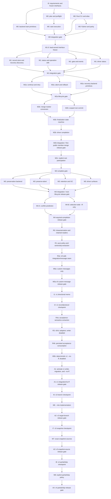

# GWZ Merge Implementation Plan

Status: **active** (revised 2026-08-04). Owner: Gianni. M2b through M4, the
god-file refactor, R0, R1, R2a, M5a, and I1 are complete. M5a custom messages
have green local technical, compatibility, and cross-driver gates. The I1
direction memo is accepted after two independent reviews found no P0–P3
issue; the next checkpoint is the lead-owned I2 durable record interface.
Completed release builds remain the Windows, macOS, Linux x86, and Linux arm64
platform evidence for the preceding release baseline.

The current release slice is M5a custom messages only. `--no-ff` is not writable
or releasable under record v0; it is implemented as M5b behind the disabled v1
writer and activates only with A1 after the I1/I2 and R4a/R3/R4b sequence.

This plan implements `GwzMergeDesign.md`, including the dispositions in
`GwzMergeDesign-ReviewF5.md`, `GwzMergeDesign-ReviewF5-2.md`, and
`GwzMergePlan-ReviewF5.md`. The design is the behavioral authority for merge.
`GWZDesign.md` remains authoritative for the overall workspace model, and
`GWZRequirements.md` remains the baseline for required behavior. This plan owns
implementation sequencing and public release boundaries.

The M5–M8 durability architecture and revised release sequence are specified
by `../../dev-docs/GwzM5-8Refactor.md`, including numbered Review 8 and the
independent F5/F5-2 corrections. This plan and `GwzMergeDesign.md` use the same
M5a/M5b/A1 and I6/I7/I8 names; the document-consistency gate below prevents
either document from silently reintroducing a v0 no-ff path.

Plan-review disposition: F2, F3, and F5 are accepted. F1 and F4 were based on
an older design revision: the current design already specifies explicit
workspace-root participation, `MergeOp.gc`, its validation matrix, and
`OperationStateChanged`. Root participation therefore remains in M2c. This
revision also records the protocol-level fate of `BranchOp.merge`, adds a fresh
native Python build gate, and budgets/splits implementation tasks. The release
boundary is later than the implementation checkpoints: M0, M1, and M2a are not
independently releasable. The first public member-merge release occurs only
after M2b supplies durable status, continue, coordinated abort, and recoverable
finalization alongside start and dry-run.

The plan is deliberately organized for a lead agent plus parallel specialist
agents. Parallel work begins only after shared interfaces compile and are
frozen. Integration happens at the end of every wave rather than after all
features have been developed independently.

## 1. Objective

Deliver a first-class, recoverable workspace merge lifecycle:

```text
gwz merge <source>
gwz merge --status [<merge-id>]
gwz merge --continue
gwz merge --abort
gwz merge --abort --preserve
gwz merge --gc [<merge-id>]
```

The implementation must provide:

- identical core semantics to Rust CLI, Python, JSON, and JSONL callers;
- evidence-before-mutation recovery state;
- complete preflight before the first repository mutation;
- expected conflict reporting across all independent participants;
- safe continue, retry, abort, preservation, and interrupted recovery;
- explicit opt-in workspace-root participation;
- mandatory, scoped workspace composition evidence on successful change;
- protocol and event parity generated from taut;
- deprecated Rust/Python `gwz branch --merge` syntax that lowers to the
  first-class merge request and response, while direct protocol
  `BranchRequest { op: merge }` returns a typed deprecation error.

Conflict prediction and selection-wide `--ff-only` form the required M4
completion release. V0-safe custom messages follow in M5a. Deterministic
`--no-ff` is M5b under v1 and activates only at A1; it has no independently
releasable v0 path. Target-branch switching through `--into` is isolated in
I6/M6/A2. Exact per-member snapshot sources follow through I7/M7/A3, and
explicitly designed merge partial/skip semantics follow through I8/M8/A4.

### 1.1 Release boundaries

Implementation waves exist to keep work reviewable and parallelizable; they
are not promises that the intermediate behavior is suitable for users.

- M0, M1, and M2a are internal integration checkpoints only.
- The first public member-merge release is gated after M2b and includes start,
  dry-run, `--status`, `--continue`, coordinated `--abort`, and finalization.
- Ordinary abort is non-destructive: post-merge drift rejects the entire abort
  rather than discarding user work.
- Explicit `@root` participation, preserve-abort, retention, and cleanup have
  passed their combined implementation, verification, and independent-review
  gate and are committed.
- M4 ships conflict prediction and selection-wide `--ff-only` together as the
  next required merge-completion release.
- M5a ships only `-m`/custom-message behavior under v0 after M4 and rejects
  `--no-ff` before record creation.
- I1/I2, R4a, disabled-writer R3, R4b, and disabled M5b precede A1.
- A1 atomically activates the v1 writer, eligible v0 migration, and
  deterministic `--no-ff` start surface.
- I6/M6/A2 owns `--into` and cannot begin implementation until coordinated
  switch-plus-merge rollback has an accepted v2 design.
- I7/M7/A3 owns exact per-member snapshot sources and the v3
  wire/archive/downgrade contract.
- I8/M8/A4 owns merge partial/skip semantics and cannot begin implementation until
  participant state, exit status, composition, root, and machine-reporting
  behavior have an accepted design.

## 2. Execution model

Use no more than four active lanes at once:

| Lane | Default responsibility |
| --- | --- |
| Lead | Requirements, shared interfaces, central dispatch, integration, design conformance, full-suite gates. |
| Core lifecycle agent | Planning, durable state, status, continue, abort, finalization, or root lifecycle as assigned per wave. |
| Git backend agent | Narrow checked Git primitives and real-repository backend tests. |
| Driver/parity agent | Rust CLI, Python client/CLI, renderers, generated-doc checks, and cross-driver parity tests. |

The lanes are responsibilities, not permanent ownership of every feature. A
wave may give two lifecycle slices to two agents and keep the driver work with
the lead. The important rule is that every file has one writer for the duration
of a wave.

### 2.1 Why parallelism starts after interface freeze

The following are high-fan-out contracts:

- taut messages and enum values;
- merge operation and participant lifecycle states;
- durable record schema;
- backend trait signatures and postconditions;
- stable error and drift codes;
- central handler and event interfaces;
- open-operation gate behavior.

Changing one of these while several agents build features would force
coordinated rewrites across core, tests, CLI, Python, and generated artifacts.
The lead therefore lands them as one compiling foundation. Parallel agents then
implement against those contracts without adding alternate models.

### 2.2 Shared-worktree coordination

When agents share one worktree, they do not edit the same file concurrently.
Before a wave starts, the lead publishes an ownership table containing:

- task id;
- owned files or directories;
- read-only dependencies;
- tests the agent may add or change;
- interfaces that are frozen.

An agent that needs a frozen interface changed stops and sends the requested
change to the lead. The lead decides whether it is a correction within the
design or a design expansion, updates the contract once, and tells every
affected agent to rebase its work conceptually on that revision.

The lead owns integration files throughout:

- `gwz-core/protocol/gwz.taut.py`;
- generated protocol artifacts;
- `gwz-core/src/workspace_ops/mod.rs`;
- the merge module's top-level dispatch;
- central operation-runtime dispatch and gate wiring;
- requirements and authoritative design documents;
- workspace-wide integration tests where multiple slices meet.

### 2.3 Task size budget

Each assignable task targets at most 500 changed handwritten lines, including
focused production code and tests. Generated protocol/corpus files do not count
toward the budget because their size is mechanical, but their source-schema
change does. Documentation-only updates are reported separately.

The lead estimates the task before assignment. If the likely change exceeds
500 lines or spans more than one independently testable responsibility, the
lead splits it before an agent starts. Crossing the estimate during work is a
handoff point, not permission to expand the task silently.

Initial budgets are:

| Task | Target handwritten change |
| --- | ---: |
| I0-R requirements/design alignment | ≤200 lines |
| I0-P taut schema, generation, and request validation | ≤450 lines |
| I0-M lifecycle/record model and transitions | ≤450 lines |
| I0-S backend and handler seams | ≤350 lines |
| I0-F Python native-test freshness guard | ≤50 lines |
| M0-A backend start primitives | ≤450 lines |
| M0-B1 plan and preflight | ≤450 lines |
| M0-B2 deterministic start execution | ≤450 lines |
| M0-C1 Rust CLI and docs | ≤400 lines |
| M0-C2 Python client/CLI and parity | ≤450 lines |
| M1-0 lead-owned interface freeze | ≤300 lines |
| M1-A store and recovery discovery | ≤500 lines |
| M1-B status and drift | ≤450 lines |
| M1-C1 transitions, events, and central gate | ≤500 lines |
| M1-C2 Rust/Python status surfaces | ≤400 lines |
| M2a-A continue and retry | ≤500 lines |
| M2a-B abort and resumable rollback | ≤500 lines |
| M2a-C recovery backend primitives | ≤450 lines |
| M2b-A1 merge-marker model/conversion | ≤300 lines |
| M2b-A2 finalization state machine | ≤500 lines |
| M2b-B scoped root commit primitive | ≤450 lines |
| M2b-C driver/event completion | ≤400 lines |
| M2c-A root planning/execution | ≤500 lines |
| M2c-B root recovery/reconciliation | ≤500 lines |
| M2c-C root abort/drift tests | ≤500 lines |
| M3-A preservation backend | ≤500 lines |
| M3-B preserve-abort lifecycle | ≤500 lines |
| M3-C1 retention/GC lifecycle | ≤350 lines |
| M3-C2 preservation/GC drivers | ≤350 lines |
| M4-A conflict prediction | ≤500 lines |
| M4-B selection-wide `--ff-only` | ≤500 lines |
| R0 characterization/retained-reader foundation | ≤500 lines per harness or fixture slice |
| R1 runtime/store or participant-policy extraction | ≤500 lines per ownership slice |
| R2a v0-safe integration/message seam | ≤500 lines |
| M5a custom merge messages | ≤350 lines |
| I1 v1 directional memo | documentation/interface-only; ≤300 lines |
| I2 v1 record/protocol checkpoint | ≤500 lines per independently reviewed interface slice |
| R4a acceptance-semantics extraction | ≤500 lines per pure semantic slice |
| R3 v0/v1 record, adapter, archive, and upgrade machinery | ≤500 lines per store/adapter slice |
| R4b accepted-workspace persistence/finalizer consumption | ≤500 lines per finalization slice |
| M5b deterministic v1 `--no-ff`, writer disabled | ≤500 lines |
| A1 v1 writer/migration/no-ff activation | ≤250 lines |
| I6/M6 v2 `--into` checkpoint/implementation | ≤500 lines per interface or implementation slice |
| I7/M7 v3 snapshot checkpoint/implementation | ≤500 lines per interface or implementation slice |
| I8/M8 v4 partial/skip checkpoint/implementation | ≤500 lines per interface or implementation slice |

R0 also freezes the more precise production/test LOC and file ceilings required
by `GwzM5-8Refactor.md`. Moved LOC is reported separately. A package stops for
scope review when it exceeds a frozen ceiling by more than 20%, adds an
unlisted production module, or changes its declared wire/protocol delta.

## 3. Mandatory engineering rules

Every task follows this loop:

1. Add or identify a focused failing test.
2. Run it and record the expected failure.
3. Implement the smallest design-conforming behavior.
4. Run the focused test to green.
5. Run the owning crate's relevant suite.
6. Refactor only while the tests remain green.
7. Hand off files, commands, results, and any unresolved concern to the lead.

Additional constraints:

- Protocol payloads are taut-defined. No handwritten shadow message types.
- Append enum values; never renumber existing wire values.
- Workspace behavior belongs in `gwz-core`, not either CLI.
- The Rust and Python drivers never implement their own merge policy.
- Drivers do not call Git or read/write GWZ artifacts directly.
- The Git backend exposes narrow, checked operations rather than lifecycle
  policy.
- Every mutating backend primitive verifies its postcondition.
- Existing user changes in the worktree are preserved unless they are inside
  the assigned task and intentionally changed.
- No later milestone is pulled into an earlier one merely because an interface
  reserves it.
- Passing a wave gate does not authorize a release. Only the release gates
  identified in this plan do.
- Requirements and design are updated before implementing behavior outside the
  current accepted contract.

## 4. Target code boundaries

The existing `handle_branch.rs` merge implementation is migrated, not expanded
into the final lifecycle handler. The intended core shape is:

```text
gwz-core/src/workspace_ops/merge/
  mod.rs              request dispatch only
  model.rs            internal plan/record/state types
  validate.rs         per-MergeOp request validation
  plan.rs             selection and start preflight
  start.rs            deterministic participant execution
  store.rs            atomic open/archive record persistence
  recovery.rs         discovery before normal manifest parsing
  status.rs           live comparison and structured drift
  continue_op.rs      conflict completion and retry
  abort.rs            abort plan, checked unwind, resumability
  marker.rs           additive merge evidence model/conversion
  finalize.rs         candidate composition and publication state machine
  root.rs             explicit-root reconciliation and root-specific recovery
  preserve.rs         backup refs and coordinated stash preservation
  gc.rs               archived-record and private-ref cleanup
```

This is the preferred decomposition, not permission to create speculative
abstractions. A file is introduced when its milestone starts. Small adjacent
types may remain together until separation materially improves ownership or
testing.

Other principal boundaries are:

| Area | Principal paths |
| --- | --- |
| Protocol source | `gwz-core/protocol/gwz.taut.py` |
| Rust generated protocol | `gwz-core/src/protocol/generated.rs`, `gwz-core/src/cbor.rs`, protocol corpus |
| Python generated protocol | `gwz-py/src/gwz/protocol/generated/` |
| Backend contract and implementation | `gwz-core/src/git/gitbackend.rs`, `gwz-core/src/git/` |
| Operation runtime/events | `gwz-core/src/operation/` |
| Core service entry | `gwz-core/src/workspace_ops/merge/`, `gwz-core/src/workspace_ops/mod.rs` |
| Existing compatibility code | `gwz-core/src/workspace_ops/handle_branch.rs` |
| Rust CLI | `gwz-cli/src/`, `gwz-cli/docs/commands/` |
| Python native bridge/client/CLI | `gwz-py/native/src/`, `gwz-py/src/gwz/`, `gwz-py/src/tests/` |
| Requirements/design | `gwz-core/dev-docs/` |

Focused core tests may live adjacent to the new merge modules. Full
filesystem-backed service scenarios should follow the existing
`src/workspace_ops/tests/` convention. Backend behavior belongs in
`src/git/tests/`. Driver parsing/rendering remains in each driver's existing
test layout.

## 5. Interface checkpoint I0

I0 is sequential and lead-owned. No feature agent starts implementation until
this checkpoint compiles.

### I0.1 Requirements

Task: I0-R. Budget: at most 200 handwritten changed lines.

Update `GWZRequirements.md` before behavior changes. Requirements must cover at
least:

- first-class merge request and action;
- default member selection and explicit `@root` selection;
- frozen participant plan and root-last execution;
- durable evidence before mutation;
- operation and participant lifecycle states;
- lock freeze after M1;
- structured participant and operation drift;
- continue/retry rules;
- all-or-nothing abort preflight and reverse rollback;
- finalizing and idempotent publication;
- preservation and retention;
- central open-operation gate;
- Rust/Python and human/machine-output parity.

`GWZRequirements.md` itself is the requirement-id registry. The lead assigns
ids once there, and tests, documentation, and release notes cite those exact
ids. Do not reuse the old branch-merge requirement as the complete lifecycle
contract; mark its compatibility role explicitly.

### I0.2 Taut protocol

Task: I0-P. Budget: at most 450 handwritten changed lines, excluding generated
artifacts.

Define the complete reserved shape from the design:

- `merge` service method;
- `MergeOp = start | resume | abort | status | gc`;
- `MergeMode`;
- participant and operation lifecycle enums;
- operation drift enum;
- merge request, response, repository summary, counts, and preservation
  messages;
- merge action enum value;
- `OperationStateChanged` appended to `EventKind`;
- `deprecated_operation` appended to `GwzErrorCode`;
- typed validation, wrong-id, drift, open-operation, and recovery errors.

Implement `merge/validate.rs` and its complete table tests in I0-P. The
per-operation accepted-field matrix is core-owned, not generated separately in
each driver. Fields reserved for later milestones decode but return a typed
phase/unsupported result until their milestone lands.

Retain the existing numeric `BranchOp.merge` wire value. A direct
`BranchRequest { op: merge }` returns `deprecated_operation` naming the `merge`
method; it never invokes merge internally. Only Rust/Python CLI compatibility
syntax constructs `MergeRequest(start)`.

Regenerate in this order:

1. Rust protocol and corpus from `gwz-core/protocol/regen.py`.
2. Python protocol from `gwz-py/scripts/regen_protocol.py`.
3. Rust/Python drift and round-trip checks.

Only the lead edits the schema or generated artifacts during I0 and later
waves. I0 records and freezes the taut generator version for the merge project.
The vendored-taut `generated_protocol_is_current` test and the release/PyPI
generator must agree on the schema output before feature work starts; a taut
upgrade is its own interface checkpoint and never occurs mid-wave.

### I0.3 Internal lifecycle contract

Task: I0-M. Budget: at most 450 handwritten changed lines.

Define internal types with no Git mutation:

- `MergePlan` and ordered `MergeParticipantPlan`;
- `MergeOperationRecord` with version, exact persisted baseline bytes and
  digests, optional Git-normalized committed-byte digests for root recovery,
  frozen targets, and per-participant result;
- operation-state transition validation;
- participant-state transition validation;
- candidate publication progress;
- participant and operation drift values;
- preservation evidence references;
- retry and rollback eligibility results.

The operation record is a serde persistence model, not a competing public
protocol. Conversion to the public response is explicit and tested.

### I0.4 Backend contract

Task: first half of I0-S. Combined I0-S budget: at most 350 handwritten changed
lines.

Freeze signatures and postconditions for the design's narrow primitives:

```text
merge_analysis
merge_simulate                 # required by M4-A
merge_state
abort_merge
set_branch_target_checked
create_backup_ref
stash_for_merge_preservation
commit_gwz_paths_checked
```

Existing methods may satisfy a primitive when their current contract is strong
enough. Otherwise add a new method with an unsupported default so fake backends
and unrelated implementations keep compiling while milestones land.

The contract must distinguish:

- attached branch and exact HEAD;
- clean index/worktree, ordinary dirt, untracked files, and unresolved index;
- native merge state and exact `MERGE_HEAD`;
- checked expected-current ref updates;
- `expected_head = none` for the root's first evidence commit.

### I0.5 Handler and module seams

Task: second half of I0-S.

Add a compiling merge module with:

- one public core handler;
- one `MergeOp` dispatcher;
- request validation before op dispatch;
- a typed `deprecated_operation` result from protocol-level
  `BranchRequest { op: merge }`;
- injected backend, operation context, clock/id facilities, and store seam;
- no lifecycle behavior beyond typed unsupported responses at this checkpoint.

The compatibility alias must target this public handler once M0 lands. It must
not retain a second implementation path.

### I0.6 Python native-test freshness

Task: I0-F. Budget: at most 50 handwritten changed lines.

Update `gwz-py/run_tests.py` to rebuild/install the current native module with
`maturin develop` before pytest, or implement an equally strict binary freshness
check that fails on stale native code. The chosen command must be visible in
test output. Until that runner change lands, every gate explicitly runs
`maturin develop` before `run_tests.py`; a pre-existing `_gwz_core` shared
library is never accepted as evidence of current parity.

### I0 exit gate

I0 is complete only when:

- requirements and protocol diffs are reviewed together;
- generated Rust and Python artifacts are current;
- protocol corpus and byte parity pass;
- request-validation table tests exist, initially green for the implemented
  validation layer;
- the Python native module has been rebuilt from the current core before its
  tests run;
- the workspace compiles with the new backend and handler seams;
- no feature agent needs to edit a frozen interface to start its task.

## 6. Dependency map


```mermaid
flowchart TD
    I0["I0: requirements and frozen interfaces"] --> M0A["M0: backend start primitives"]
    I0 --> M0B1["M0: plan and preflight"]
    M0B1 --> M0B2["M0: start execution"]
    I0 --> M0C1["M0: Rust CLI and alias"]
    M0C1 --> M0C2["M0: Python and parity"]
    M0A --> G0["M0 integration gate"]
    M0B2 --> G0
    M0C1 --> G0
    M0C2 --> G0
    G0 --> M10["M1-0: lead-owned interface freeze"]
    M10 --> M1A["M1: record store and recovery discovery"]
    M10 --> M1B["M1: status and operation drift"]
    M10 --> M1C1["M1: gate and events"]
    M10 --> M1C2["M1: driver status"]
    M1A --> G1["M1 integration gate"]
    M1B --> G1
    M1C1 --> G1
    M1C2 --> G1
    G1 --> M2A["M2a: continue and retry"]
    G1 --> M2B["M2a: abort and rollback"]
    G1 --> M2C["M2a: recovery backend primitives"]
    M2A --> G2A["M2a lifecycle gate"]
    M2B --> G2A
    M2C --> G2A
    G2A --> M2M["M2b: merge-marker conversion"]
    G2A --> M2G["M2b: scoped root commit"]
    M2M --> M2F["M2b: finalization state machine"]
    M2G --> M2F
    M2F --> M2D["M2b: driver completion"]
    M2D --> G2B["M2b integration / first public member-merge release gate"]
    G2B --> M2R["M2c: explicit root participation"]
    M2R --> G2C["M2 complete gate"]
    G2C --> M3A["M3: preservation backend"]
    G2C --> M3B["M3: preserve-abort"]
    G2C --> M3C1["M3: retention and GC"]
    G2C --> M3C2["M3: driver surfaces"]
    M3A --> G3["M3 integration / next lifecycle release gate"]
    M3B --> G3
    M3C1 --> G3
    M3C2 --> G3
    G3 --> M4A["M4-A: conflict prediction"]
    G3 --> M4B["M4-B: selection-wide --ff-only"]
    M4A --> G4["M4 required-completion release gate"]
    M4B --> G4
    G4 --> R0["R0: characterization and retained readers"]
    R0 --> R1["R1: pure policy and ownership extraction"]
    R1 --> R2A["R2a: v0-safe integration/message seam"]
    R2A --> M5A["M5a: custom messages only"]
    M5A --> G5A["M5a v0 custom-message release gate"]
    G5A --> I1["I1: v1 directional memo"]
    I1 --> I2["I2: v1 record/protocol checkpoint"]
    I2 --> R4A["R4a: acceptance-semantics extraction"]
    R4A --> R3["R3: v0/v1 adapters; writer disabled"]
    R3 --> R4B["R4b: persisted acceptance consumption"]
    R4B --> M5B["M5b: deterministic v1 --no-ff; disabled"]
    M5B --> A1["A1: activate v1 writer, migration, and --no-ff"]
    A1 --> G1V["A1 v1 integration/no-ff release gate"]
    G1V --> I6["I6: v2 branch checkpoint"]
    I6 --> M6["M6: --into implementation"]
    M6 --> A2["A2: v2 target-branch release gate"]
    A2 --> I7["I7: v3 snapshot checkpoint"]
    I7 --> M7["M7: exact snapshot sources"]
    M7 --> A3["A3: v3 snapshot-source release gate"]
    A3 --> I8["I8: v4 partial/skip checkpoint"]
    I8 --> M8["M8: explicit partial/skip policy"]
    M8 --> A4["A4: v4 partial/skip release gate"]
```

## 7. Wave M0 — first-class start

Goal: replace the hidden branch operation with a first-class start/dry-run
surface while intentionally retaining the existing partial-lock behavior until
M1 provides durable recovery.

### M0-A — Git start primitives

Owner: Git backend agent. Budget: at most 450 handwritten changed lines.

Owned files:

- merge-related implementation under `gwz-core/src/git/`;
- focused tests under `gwz-core/src/git/tests/`.

Work:

- implement non-mutating merge analysis needed by planning;
- ensure source resolution is commit-only and repository-local;
- expose precise status needed by preflight;
- preserve existing ordinary merge behavior for up-to-date, fast-forward,
  clean merge, and conflict;
- self-verify each result;
- add real-repository tests for every integration kind and dirty/in-progress
  rejection signal.

The agent does not decide selection, batch failure, lock, or output policy.

### M0-B1 — Core planning and preflight

Owner: core lifecycle agent. Budget: at most 450 handwritten changed lines.

Owned files:

- `merge/plan.rs`;
- focused fake-backend planning/preflight tests.

Work:

- plan default active members with root excluded;
- return the phased typed result for explicit root before M2;
- preflight all selected members before mutation;
- freeze deterministic manifest order;
- implement dry-run as advisory, mutation-free planning.

Request validation is already complete and frozen in I0-P.

### M0-B2 — Deterministic start execution

Owner: core lifecycle agent after M0-B1. Budget: at most 450 handwritten
changed lines.

Owned files:

- `merge/start.rs`;
- focused fake-backend start tests.

Work:

- execute expected conflicts through later independent members;
- stop on unexpected host/backend failure;
- return first-class merge response/action values;
- retain M0's documented partial lock advance for clean outcomes.

### M0-C1 — Rust CLI surface

Owner: driver/parity agent. Budget: at most 400 handwritten changed lines.

Owned files:

- new merge parser/renderer modules in `gwz-cli/src/`;
- `gwz-cli/docs/commands/merge.md` and generated reference inputs;
- `gwz-cli/mkdocs.yml` for the command navigation entry;
- Rust CLI parsing/rendering and machine-output fixtures.

Work:

- add top-level `gwz merge <source>` and `--dry-run`;
- map deprecated Rust CLI `branch --merge` to `MergeRequest(start)`;
- render source-to-target plans and every result;
- emit action `merge` for human, JSON, and JSONL paths;
- print only the honest interim ordinary-Git conflict guidance from the design;
- keep user-facing documentation capability-based and free of internal
  milestone names;
- reject unavailable lifecycle flags and reserved policies with typed results.

### M0-C2 — Python surface and parity

Owner: driver/parity agent after M0-C1. Budget: at most 450 handwritten changed
lines.

Owned files:

- Python client and CLI merge modules/tests outside generated protocol;
- Python native dispatch changes;
- cross-driver machine-output parity fixtures.

Work:

- expose the Python client call and CLI start/dry-run forms;
- map deprecated Python CLI `branch --merge` syntax to `MergeRequest(start)`;
- verify direct Python protocol `BranchRequest(op=merge)` receives the typed
  deprecation result;
- keep Python parsing and rendering behavior aligned with the Rust CLI.

The drivers submit requests and render responses. They do not reproduce core
validation or Git behavior.

### M0 integration gate

Lead tasks:

- wire the public handler and compatibility alias;
- remove the old branch merge handler behavior after its tests are transferred,
  while retaining the numeric `BranchOp.merge` wire value and its typed
  `deprecated_operation` response;
- resolve only integration issues, not silently change frozen contracts;
- add cross-layer start/dry-run scenarios;
- confirm the interim partial-lock behavior is tested and recorded in internal
  implementation notes rather than published release documentation;
- run the core, Rust CLI, Python, protocol, and documentation gates.

M0 is an internal integration checkpoint and must not be published as a merge
release. It proves start and dry-run behavior while the durable lifecycle is
still absent. Status, coordinated continue, and coordinated abort remain hidden
and must not be advertised. The first public release requires M1, M2a, and M2b
to pass as one coherent delivery gate.

## 8. Wave M1 — durable open lifecycle

Goal: create inspectable evidence before mutation, freeze the accepted lock
during an open merge, and prevent unrelated GWZ mutations.

### M1-0 — Lead-owned interface freeze

Owner: lead. Budget: at most 300 handwritten changed lines.

Status: **complete** (2026-07-19).

This checkpoint lands as one reviewed commit before any M1 specialist starts.
It is the only M1 task allowed to change the shared record/status contracts.

Owned files:

- `merge/model.rs`, `merge/response.rs`, and the `MergeStore` seam in
  `merge/mod.rs`;
- taut/requirements changes needed for status semantics;
- authoritative merge design and plan delivery/ownership text;
- Rust/Python interim diagnostics that expose internal milestone names.

Frozen contract:

- persist each participant's exact merge message and typed failure code/detail;
- keep live status observations separate from the durable record;
- use one `MergeStatusSnapshot`/participant-observation shape for live commit,
  conflicts, structured drift, and continue/abort eligibility;
- initial no-open status returns `MergeOperationState.idle`, `open: false`, no
  merge id, zero counts, and no participant or drift rows;
- defer archived-record enumeration and id-qualified archived status to M3;
- M1-B owns the single participant observation/drift classifier that M2a
  continue and abort consume after the M1 gate;
- M1-C1 owns durable integration changes in `merge/start.rs`; M1-A supplies the
  store implementation and does not edit start execution policy; and
- user-visible diagnostics describe capabilities without
  M0/M1/M2/M3/M4/M5/M6/M7/M8 names.

Exit gate:

- durable record round-trip tests preserve message and typed error fields;
- status snapshot conversion tests populate live commit, drift, and eligibility
  without changing the record;
- protocol generation/parity includes the append-only `idle` state;
- request validation reserves id-qualified status until M3;
- Rust/Python conflict guidance and typed unsupported errors contain no internal
  milestone names; and
- the complete core, driver, generated-artifact, and documentation gates pass.

Only after this checkpoint is committed may M1-A, M1-B, M1-C1, and M1-C2 run
in parallel.

### M1-A — Record store and recovery discovery

Owner: lifecycle/store agent. Budget: at most 500 handwritten changed lines.

Status: **complete** (2026-07-19).

Owned files:

- `merge/store.rs`;
- `merge/recovery.rs`;
- store/recovery unit and fault-injection tests.

Work:

- serialize the versioned operation record under `.gwz/merge/`;
- write temporary file, flush, rename, and verify;
- retain unknown fields across read-modify-write;
- provide the atomic store operations used by M1-C1 before the first mutation
  and after every participant outcome or state transition;
- discover open state before normal manifest parsing;
- archive closed records and implement the default last-20 ordinary retention
  policy without deleting preservation owners;
- return typed `record_unreadable` rather than treating corruption as no merge.

M1-A does not edit `merge/start.rs` or decide execution policy.

### M1-B — Status and drift

Owner: status agent. Budget: at most 450 handwritten changed lines.

Status: **complete** (2026-07-19).

Owned files:

- `merge/status.rs` and, if split, `merge/observe.rs`;
- response conversion tests;
- status-focused filesystem scenarios.

Work:

- compare every recorded participant with live branch, HEAD, index/worktree,
  and native integration state;
- produce structured participant drift and eligibility;
- produce operation-level baseline lock/manifest and record drift;
- report lifecycle state, participant counts, and preservation evidence;
- explain unattempted drift with restore-before-or-abort guidance;
- remain strictly read-only.

The agent works against the frozen store read interface. It does not change the
record schema. Its participant observation/drift classifier is the sole
classifier later consumed by continue and abort; drivers do not recreate it.

### M1-C1 — State transitions, events, and central gate

Owner: lead. Budget: at most 500 handwritten changed lines.

Status: **complete** (2026-07-19).

Owned files:

- central merge dispatch and state-transition wiring;
- durable record integration changes in `merge/start.rs` only;
- affected files under `gwz-core/src/operation/`;
- central gate table implementation and its core tests.

Work:

- enforce legal operation-state transitions;
- create and persist the frozen record before start's first Git mutation and
  persist every participant result through M1-A's store interface;
- emit state-transition events only after durable record updates;
- add the single pre-dispatch open-operation allowlist;
- implement every command row from the design, including remote tag forms and
  plan-only existing-workspace init;
- add gate-table and event-order tests.

### M1-C2 — Rust/Python status surfaces

Owner: driver/parity agent. Budget: at most 400 handwritten changed lines.

Status: **complete** (2026-07-19).

Owned files:

- merge status parsing/rendering in `gwz-cli/src/` and its tests;
- merge status client/CLI/rendering in `gwz-py/` and its tests;
- command documentation outside the lead-owned design/requirements files.

Work:

- implement `gwz merge --status` in Rust and Python for integration testing;
- render participant drift, operation drift, lifecycle state, and recovery
  eligibility in human and machine output;
- keep status unreleased until continue and abort are implemented and the M2b
  release gate passes;
- do not print unavailable `--continue` or `--abort` instructions during this
  internal checkpoint.

M1-C1 and M1-C2 are separate ownership rows. Neither agent edits the other's
files during the wave.

### M1 integration gate

Status: **complete** (2026-07-19).

Lead verifies:

- a record exists before a mutation spy observes the first backend write;
- process restart discovers and renders the same open operation;
- a conflicted batch leaves the accepted lock at the baseline;
- manifest edits appear in status before continue/abort is attempted;
- unrelated mutators reject at the central gate;
- read-only commands remain available;
- crash and unreadable-record tests fail closed.

M1 is not a release boundary: it can describe an open merge but cannot yet
close one through GWZ. The lock change from the internal M0 implementation is
covered by tests and unreleased documentation updates. First-release user and
machine-output documentation describes only the durable baseline-lock behavior,
not the discarded interim M0 behavior.

## 9. Wave M2a — continue, retry, and coordinated abort

Goal: safely finish or unwind a member-only coordinated merge, including mixed
up-to-date, successful, conflicted, failed, and unattempted states.

Before parallel work starts, the lead confirms the retry, rollback, and state
transition interfaces remain sufficient and that M1-B's observation/drift
classifier is the only classifier used by both operations. Any correction
lands once before the agents begin.

Lead-owned interface checkpoint: **complete** (2026-07-19). Recovery-first
root resolution, checked resolution commits, exact checked rollback, the
shared status classifier, durable transition helpers, and the finalization
handoff were frozen before the three M2a implementation lanes ran in parallel.

### M2a-A — Continue and retry

Owner: continue agent. Budget: at most 500 handwritten changed lines.

Status: **complete** (2026-07-19).

Owned files:

- `merge/continue_op.rs`;
- continue/retry-focused tests.

Work:

- preflight the whole operation before creating any resolution commit;
- verify exact branch, before HEAD, `MERGE_HEAD`, and resolved index;
- verify previously clean results have not drifted;
- retry failed participants only at the classified unchanged-before point;
- resume unattempted participants in original order;
- retain an open operation when new conflicts/failures remain;
- hand a fully successful participant set to the frozen finalization seam;
- make repeated/closed requests typed and idempotent where specified.

### M2a-B — Abort and resumable rollback

Owner: abort agent. Budget: at most 500 handwritten changed lines.

Status: **complete** (2026-07-19).

Owned files:

- `merge/abort.rs`;
- abort-focused fake and filesystem tests.

Work:

- compute a complete rollback plan before mutation;
- include fast-forwarded and cleanly merged results, not only conflicts;
- treat up-to-date/unattempted participants as verified no-ops;
- reject the entire abort on any affected drift;
- roll back in reverse mutation order;
- durably mark each successful rollback;
- resume safely after interruption;
- verify exact baseline manifest/lock state before close;
- reserve preserve handling through an injected seam without implementing M3.

### M2a-C — Recovery backend primitives

Owner: Git backend agent. Budget: at most 450 handwritten changed lines.

Status: **complete** (2026-07-19).

Owned files:

- merge-state, abort, and checked-ref implementation under `src/git/`;
- corresponding real-repository tests.

Work:

- inspect exact native merge state;
- abort only the expected native merge;
- update a target branch only from the expected current object id;
- restore branch/worktree to the recorded before state;
- distinguish all safety-relevant index/worktree states;
- support idempotent verification after a prior successful rollback.

### M2a integration gate

Status: **complete** (2026-07-19).

The lead runs the mixed three-member scenario as a required acceptance test:

```text
app   up-to-date
lib   clean merge
docs  conflict
```

The gate proves:

- continue completes a resolved `docs` merge and preserves `lib` exactly;
- abort restores `lib` and aborts `docs`, leaving `app` untouched;
- edits or commits made later in `lib` reject abort before `docs` changes;
- an interrupted rollback resumes without repeating unsafe mutations;
- unexpected failed/unattempted states follow their recorded retry rules.

M2a remains an internal checkpoint. Continue and abort are not released until
M2b proves that successful completion and interrupted finalization publish one
coherent workspace composition.

### M2a review remediation checkpoint

Status: **complete; M2b shared integration unblocked** (2026-07-23). The final
snapshot passes 666 Rust tests (plus 1 ignored) and 314 Python tests with all
strict format, Clippy, generated-artifact, documentation, Bazel, and
diff-hygiene gates green. Preparation, status, and checked resolution
execution share exact durable target-branch, native-state, tree, and signature
validation, and execution consumes the existing tree without recreating it.
`GwzDevCodeM2a-Review56-6.md` and `GwzDevCodeM2a-ReviewF5-6.md` independently
report zero P0/P1/P2/P3 findings. The complete evidence is recorded in
`../../dev-docs/GwzDevCodeM2a-RemPlan-3.md`.

The independent M2a reviews found high-fan-out recovery defects that must be
corrected before shared M2b integration:

- complete native repository operation state must feed the single status /
  continue / abort classifier;
- every participant Git action needs durable intent and exact post-crash
  reconciliation before outcome adoption or retry;
- `recovery_required` needs guarded exits after exact reclassification;
- the open-merge gate must use the effective request workspace and be
  authoritative in core under the mutator lock;
- abort must recognize exact externally restored and already durably restored
  no-op rows; and
- drift, events, attribution, archive-close truth, path validation, driver
  parity, and user documentation must match those corrected contracts.

The first remediation's additive record, backend, classifier, gate,
transition, event, and attribution interfaces remain the baseline. The second
remediation strengthened commit-producing evidence, merge-start gating, native
completion, and Python JSONL streaming. The third remediation closes the
remaining crash boundary by retaining and executing an exact not-started
durable action instead of re-preparing it, and moves lifecycle ownership
outside fallible context conversion and open-operation gating.

The remediation exit criteria in
`../../dev-docs/GwzDevCodeM2a-RemPlan-3.md` have passed. M2b-A1, M2b-B, and
their shared integration path are unblocked. M2b-A2 starts after the A1
conversion contract is implemented and verified; M2b-C starts after the
finalization response and event contracts are frozen.

## 10. Wave M2b — finalization and evidence

Goal: publish one coherent workspace composition after successful participant
merges and make every publication step idempotently recoverable.

### M2b-I0 — Finalization interface checkpoint

Status: **complete; A1 and B unblocked in parallel** (2026-07-23).

The lead owns the shared module wiring and freezes these boundaries before
parallel implementation:

- `marker_merge_from_verified(record, verified_results)` is a pure conversion.
  Its input is a complete set of participant branches and commits already
  re-observed by finalization. It compares those values with the durable record
  and produces the optional marker `merge` section without Git or filesystem
  I/O. The containing root commit remains the composition-commit identity.
- `GitBackend::commit_gwz_paths_checked` accepts unique normalized candidate
  files below `gwz.conf/`, an expected root HEAD (or an unborn-root
  expectation), and the exact message. It constructs and commits a candidate
  tree without consuming the user's index or worktree and returns the commit,
  tree, and sorted candidate hashes after a checked attached-ref update.
- publication progress remains the durable hand-off to A2. A2 may extend it
  additively with candidate hashes and verification data, but it does not
  change either A1 or B's frozen request/result contracts.

A1 exclusively owns marker validation/conversion files. B exclusively owns
the Git backend implementation and its focused primitive tests. A2 does not
start until A1 passes its focused gate.

### M2b-A1 — Merge-marker model and conversion

Status: **complete; A2 conversion dependency satisfied** (2026-07-23).

Owner: marker agent. Budget: at most 300 handwritten changed lines.

Owned files:

- `merge/marker.rs` and its focused tests;
- additive marker support in a file allocated exclusively by the lead before
  the wave starts.

Work:

- extend the existing marker model with the additive optional merge section;
- convert verified participant results to marker candidate data;
- keep root composition commit identity as the containing commit rather than a
  self-reference;
- test schema compatibility and exact before/source/result evidence.

### M2b-A2 — Candidate composition and publication state machine

Status: **complete** (2026-07-23).

Owner: finalization agent after M2b-A1's conversion interface is frozen.
Budget: at most 500 handwritten changed lines.

Owned files:

- `merge/finalize.rs`;
- finalization state-machine and fault-injection tests.

Work:

- enter durable `finalizing` before artifact creation;
- re-observe and verify every participant result;
- build candidate lock, marker, and boundary bytes without publishing them;
- record candidate hashes and each completed publication step;
- create mandatory evidence using the frozen marker conversion;
- publish and verify the accepted lock/boundary;
- if late participant drift blocks publication after every Git action is
  durable, persist and report a truthful re-enterable resting state rather than
  leaving the operation labelled `executing`; status must remain read-only and
  the response must explain the blocker and recovery eligibility;
- resume from every injected crash point without a second evidence commit;
- archive only after all postconditions are verified.

The completed implementation durably prepares and hashes the candidate lock,
merge marker, and local boundary; creates or recovers one checked root
composition commit; publishes and verifies the accepted artifacts; and
archives only after the complete postcondition passes. Focused real-Git tests
cover all-up-to-date no-op completion, born and unborn roots, unrelated staged,
dirty, and untracked root work, late participant drift, evidence-aware abort,
and each required interruption point. Status is read-only at every resting
point and continue resumes without a duplicate evidence commit.

### M2b-B — Scoped root commit primitive

Status: **complete** (2026-07-23).

Owner: Git backend agent. Budget: at most 450 handwritten changed lines.

Work:

- implement `commit_gwz_paths_checked` using an isolated/scoped index;
- verify that only supplied GWZ-owned candidate paths differ from the parent;
- preserve unrelated root index and worktree state;
- use an expected-current root ref check;
- support `expected_head = none` for the root's first evidence commit;
- return commit and candidate hashes for idempotent recovery;
- add tests for concurrent ref movement, unrelated staged/dirty files, unborn
  root, and repeat verification.

### M2b A1/B integration checkpoint

Status: **complete; M2b-A2 unblocked** (2026-07-23).

The combined implementation passes 675 Rust workspace test executions with one
ignored test and no failures. Workspace-wide formatting and strict Clippy pass.
The focused evidence covers additive old-marker compatibility, exact
before/source/result conversion, root-result evidence without a composition
self-reference, unrelated root index/worktree preservation, born and unborn
roots, invalid candidate paths, stale expectations, and deterministic
concurrent root-ref movement.

### M2b-C — Driver and event completion

Status: **complete** (2026-07-23).

Owner: driver/parity agent. Budget: at most 400 handwritten changed lines.

Work:

- render `finalizing` and the current publication step;
- unhide status and expose continue and abort in Rust/Python CLIs and clients;
- render wrong-id and drift rejections consistently;
- add JSON/JSONL fields and event parity checks;
- update command docs and recovery examples.

Rust and Python now publicly expose `merge --status`, `merge --continue`, and
`merge --abort`; both render the current publication step and the same recovery
guidance. The generated Rust reference and user-facing merge/machine-output
documentation describe the released member-only lifecycle without internal
milestone terminology. The real-driver parity matrix covers dry-run, clean
completion, conflict, status, continue, recovery rejection, abort, and
preflight failure.

### M2b integration gate

Status: **complete; corrected first public member-merge release gate passed**
(2026-07-24).

Required fault points include:

- before candidate creation;
- after entering `finalizing`;
- after candidate persistence;
- after root evidence commit;
- after root evidence commit persistence;
- after lock publication;
- before archive/close.

At each point, status must explain the state, continue must resume
idempotently, and abort must account for any recorded evidence commit.

The original integrated gate passed, but an independent post-commit review
reopened it on 2026-07-24 with five P2 recovery/driver defects and one P3
event-contract gap. The remediation in
`../../dev-docs/GwzDevCodeM2b-RemPlan.md` is implemented. The first re-review
confirmed the original six corrections but found two additional P2 abort gaps
and one P3 orchestration-test gap. Those are corrected: pre-candidate
finalization can be aborted; evidence artifacts are restored in reverse
publication order with interruption coverage after every mutation; and the two
evidence-record windows run end-to-end for both born and unborn roots.

The corrected local gate passes 691 Rust test executions (690 passed, one
ignored) and 315 Python/native tests with no failures. Workspace formatting,
strict Clippy, generated protocol freshness, native-extension freshness,
cross-driver parity, and diff hygiene pass.

The corrected fault matrix covers both interruption windows around durable
root evidence persistence, including an unborn workspace root, and verifies
that evidence rollback preserves unrelated staged, dirty, and untracked root
work. Direct status checks cover marker and boundary drift. Continue rechecks
manifest and complete candidate-prefix drift, permits retry after exact repair,
and does not duplicate the evidence commit. Rust and Python event streams
publish the verified evidence commit, marker, accepted lock, and boundary in
deterministic order, while Python recovery guidance names its installed
`gwz-py` executable.

The final independent re-review reports no P0/P1/P2/P3 defect. It independently
reran all 32 focused `g23` lifecycle tests and both scoped evidence rollback
backend tests. M2c is behaviorally unblocked; its structural prerequisite is
recorded below.

### First public member-merge release gate

M2b is the first point at which the default member-only merge lifecycle may be
released. The lead verifies all M0, M1, M2a, and M2b gates together and proves:

- Rust and Python expose start, dry-run, status, continue, and coordinated
  abort with matching human, JSON, and JSONL behavior;
- a durable record exists before the first participant mutation and survives a
  process restart;
- status is strictly read-only and reports recorded versus live state, drift,
  and continue/abort eligibility for every participant;
- every open operation has a supported GWZ path to completion or safe abort;
- ordinary abort preflights the entire rollback and rejects without mutation
  when any affected participant contains post-merge drift;
- successful continue/finalization publishes and archives exactly once across
  every tested interruption point;
- unavailable preserve, strategy, and custom-message forms remain hidden and
  return typed unsupported errors when submitted directly;
- the member-only release does not advertise `@root`; its later exposure is
  owned by the complete M2c release gate; and
- public documentation describes capabilities and limitations without exposing
  internal milestone names.

There is no public release candidate at M0, M1, or M2a.

## 11. Wave M2c — explicit workspace-root participation

Goal: permit explicit `--target @root` without allowing root metadata to
redefine or strand the in-flight operation.

Root work starts only after member-only continue, abort, and finalization pass
M2b. It is not developed in parallel with the first finalization implementation.
The zero-behavior-change god-file refactor in
`../../dev-docs/GwzGodFileRefactorPlan.md` was implemented and passed its
complete technical exit gate on 2026-07-24, including an independent review
with no P0/P1/P2/P3 finding. The structural change is committed through the
installed `gwz`; M2c feature work is unblocked.

Implementation status: **M2c-A, M2c-B, M2c-C, driver parity, and public
documentation are complete; independent review remedies and the local
technical gate are green** (updated 2026-07-25). Its final targeted re-review
was accepted with M3 because the preservation lifecycle consumes root recovery.

### M2c-I0 — Root lifecycle interface checkpoint

Status: **complete; M2c-A unblocked** (2026-07-24).

The lead freezes these existing contracts before root feature work:

- an explicit root is represented by participant id `@root`, path `.`, and
  `MergeTargetKind::Root` in the same frozen ordered plan and durable
  participant map as members;
- default selection remains members only, while explicit root-only and mixed
  selection preserve member manifest order and append root last;
- `MergeParticipantRecord.resulting_commit` records the root merge result,
  while `PublicationProgress.root_merge_commit` and `composition_commit`
  retain the distinct root merge and composition-evidence identities through
  finalization and recovery;
- root start, continue, status, and abort reuse the existing pending-action,
  drift, and checked Git primitives rather than introducing a parallel state
  machine; and
- existing public protocol values and mutation-oriented backend signatures
  remain frozen. M2c adds one read-only `read_file_at_commit` backend seam so
  recovery can load exact pre-merge metadata from the recorded root commit.

Structural ownership is also frozen:

- `merge/root.rs` is the root-lifecycle facade, with substantive work in
  `merge/root/planning.rs`, `reconciliation.rs`, `finalization.rs`, and
  `abort.rs`; root execution uses the existing generic participant loop, so a
  separate `root/execution.rs` was not required;
- existing `merge/plan.rs`, `start.rs`, `finalize.rs`, and `abort/mod.rs`
  receive only small lead-owned integration hooks;
- root scenarios use named split test modules rather than rebuilding a single
  G23 test file; and
- no new ordinary implementation or test file may exceed 500 LOC. Existing
  oversized cohesive files must not grow to absorb root behavior.

### M2c-A — Root planning and execution

Status: **complete** (2026-07-24).

Owner: root lifecycle agent. Budget: at most 500 handwritten changed lines.

Owned files:

- `merge/root.rs`;
- `merge/root/planning.rs`;
- lead-coordinated hooks in `merge/plan.rs` and the split `merge/start/`
  modules; and
- `workspace_ops/tests/g23/root_start.rs`.

Work:

- accept explicit root and continue excluding it by default;
- require a born root for root merge participation;
- freeze participant selection from pre-merge metadata;
- record baseline bytes through the root before-commit tree and digests;
- execute members first and root last;
- continue through expected member conflicts before attempting root;
- retain root as unattempted after an earlier unexpected host failure.

### M2c-B — Root recovery and reconciliation

Status: **complete** (2026-07-24).

Owner: recovery/finalization agent. Budget: at most 500 handwritten changed
lines.

Owned files:

- `merge/root/reconciliation.rs`;
- `merge/root/finalization.rs`;
- lead-coordinated hooks in `merge/recovery.rs`, `status/`, and `finalize.rs`;
  and
- `workspace_ops/tests/g23/root_recovery.rs`.

Work:

- discover lifecycle operations when live root metadata is conflicted or
  unparsable;
- allow staging only when root is a recorded conflicted participant;
- reload merged root metadata only for finalization;
- reject invalid identity/path/source changes;
- reconcile verified selected-member results into the candidate lock;
- never add/remove/reorder in-flight participants from merged root metadata;
- place composition evidence on top of the root merge result;
- distinguish root merge result from root evidence commit in the record.

### M2c-C — Root abort and drift tests

Status: **complete** (2026-07-24).

Owner: abort/backend test agent. Budget: at most 500 handwritten changed lines.

Owned files:

- `merge/root/abort.rs`;
- lead-coordinated hooks in the split `merge/abort/` modules; and
- `workspace_ops/tests/g23/root_abort.rs` and `root_drift.rs`.

Work:

- cover root up-to-date, fast-forward, clean merge, and conflict;
- detect root post-merge drift;
- remove an incomplete evidence commit before unwinding root merge;
- roll root back before members because it executed last;
- restore and verify exact baseline manifest and lock bytes;
- prove root-only all-up-to-date is a no-op;
- exercise wrong-id, process restart, and unreadable-live-metadata recovery.

### M2 complete gate

The lead runs the complete design matrix for member-only, root-only, and mixed
selection. Explicit root support is not released until conflict recovery works
without a valid live manifest. M2c may ship as a follow-up to the first
member-only release or in the same release train as M3; it does not retroactively
make the M0 or M1 checkpoints releasable.

Historical M2c checkpoint (2026-07-24): formatting, strict Clippy, the then
current 710-test Rust workspace suite, 317-test Python/native suite, generated
protocol/reference checks, root fast-forward parity, and diff hygiene were
green. The new root modules were below 500 LOC and the enlarged planning tests
were split into `merge/plan/tests.rs`. Subsequent independent reviews and
remedies are recorded in the combined current M2c/M3 gate below.

## 12. Wave M3 — preservation, retention, and GC

Goal: safely preserve eligible post-merge drift before coordinated rollback and
provide explicit lifecycle cleanup.

### M3-I0 — Preservation and cleanup interface checkpoint

Status: **complete; all M3 work unblocked** (2026-07-25). The focused M2c
reviews and remediation are complete; preserve-abort, retention, GC, and
driver integration have consumed these frozen contracts.

The lead freezes these contracts before M3 lifecycle work:

- existing taut request, response, preservation, and lifecycle values remain
  unchanged;
- private refs use
  `refs/gwz/merge/<merge-id>/<target-key>/head`, where a member's stable target
  key is its member id and the root key is `root`;
- `create_backup_ref` is idempotent only at the recorded target and fails
  closed on a collision; the additive `delete_backup_ref_checked` seam removes
  only that exact recorded target and is idempotent when already absent;
- one coordinated bundle uses deterministic id `stash_<merge-id>` and native
  message prefix `gwz:stash_<merge-id>:` across its participant repositories;
- `stash_for_merge_preservation` includes untracked files, excludes ignored
  files, rejects unresolved or foreign integration state, returns a verified
  object id, and treats later work after an existing preservation stash as
  drift rather than silently adopting it;
- each verified artifact is recorded immediately in the owning participant's
  existing `PreservationEvidence`; a retry re-verifies recorded object ids;
- the operation enters durable `preserving` before artifact mutation, and the
  existing reverse-order abort implementation is not entered until every
  required artifact for every participant is verified;
- a plain abort rejects `preserving`; only a preserve retry may reconcile an
  interrupted deterministic stash or ref and enter rollback;
- root publication recovery verifies exact stage-0 blob identity, regular-file
  mode, and expected absence as well as worktree bytes before repair;
- an explicit root uses the same evidence model and the existing coordinated
  stash-bundle store, while ordinary `gwz stash push` remains member-only;
- explicit GC loads one terminal archived record, checked-deletes every private
  ref it owns, and only then removes that record; it never drops native stashes
  or coordinated stash bundles; and
- unqualified GC applies only ordinary last-20 retention. Records owning any
  preservation evidence remain exempt.

`MergeStore` retains its existing `load` and `gc` seams. M3 adds archived
enumeration only for read-only status projection; Git evidence cleanup remains
core-owned because the store does not know repository paths or backend
postconditions.

### M3-A — Preservation backend

Owner: Git backend agent. Budget: at most 500 handwritten changed lines.

Implementation status: **complete locally; independent re-review accepted**
(2026-07-25).

Owned files:

- `git/gitbackend/preservation.rs`;
- narrowly scoped support additions in `gitbackend/refs.rs` and `stash.rs`;
  and
- thin delegators in `gitbackend.rs`. The pre-existing stable contract file is
  exempt from the new-file ceiling; its additive exact-index verification seam
  was required and independently reviewed with the recovery fix.

Work:

- create and verify stable private backup refs;
- integrate existing coordinated stash bundles with merge ownership;
- include untracked and exclude ignored files;
- return durable object ids;
- make repeated creation idempotent;
- prove GWZ-generated push refspecs never include `refs/gwz/*`.

### M3-B — Preserve-abort lifecycle

Owner: lifecycle agent. Budget: at most 500 handwritten changed lines.

Implementation status: **complete locally; independent re-review accepted**
(2026-07-25).

Owned file: `merge/preserve.rs` except the GC surface assigned below.

Work:

- preflight preservation for every drifted affected participant;
- create and verify all artifacts before rollback begins;
- leave the operation open with recoverable evidence if preservation fails;
- support committed, uncommitted, and combined eligible drift;
- reject unresolved-index and ambiguous states with manual recovery guidance;
- never automatically reapply preserved work;
- then enter the existing coordinated abort path without a second policy
  implementation.

### M3-C1 — Retention and GC lifecycle

Owner: lifecycle/store agent. Budget: at most 350 handwritten changed lines.

Implementation status: **complete locally; independent re-review accepted**
(2026-07-25).

Owned files:

- GC operation handling in `merge/gc.rs`;
- `merge/store/archived.rs`, `retention.rs`, and `gc.rs`, extracted behind the
  existing store facade before adding behavior;
- only thin registration and re-export changes in the existing
  `merge/store.rs`; and
- GC and retention tests.

Work:

- implement archived-record enumeration and id-qualified archived status;
- enforce default retention for unowned ordinary records;
- refuse GC of the open operation;
- remove verified archived records and private refs together;
- leave coordinated stash bundle deletion under explicit `gwz stash drop`.

### M3-C2 — Preservation and GC driver surfaces

Owner: driver/parity agent. Budget: at most 350 handwritten changed lines.

Implementation status: **complete locally; independent re-review accepted**
(2026-07-25).

Work:

- add `--abort --preserve` and `--gc [<merge-id>]` to Rust/Python surfaces;
- expose id-qualified archived status when M3-C1 enables it;
- render every recovery object id and cleanup consequence;
- add Rust/Python parsing, rendering, and parity tests.

### M3 integration gate

Run preservation failure injection before and after each artifact creation.
No rollback may begin until every required artifact is verified. Successful
preserve-abort must report enough information to recover work without the
operation record.

M3 is the completed lifecycle increment after the first public member-merge
release. It adds `--abort --preserve`, retention, and explicit cleanup. The
combined M2c/M3 gate below is green and the accepted change set is committed.

Current gate status: successive independent combined reviews found and drove
regression-first fixes for preservation, conflict crash windows, root evidence
and retry normalization, GC ownership/preflight, and stash recovery. The
required `rust-split`-guided structural re-splitting is complete, and every new
or materially enlarged M3 implementation and focused test module is below 500
lines. The latest complete local gate is green: 570 core tests pass with one
ignored, the remaining Rust workspace tests pass, strict Clippy and formatting
pass, generated CLI and protocol checks pass, 319 Python tests pass, the Bazel
build passes, and cross-repository diff hygiene passes. Two independent final
re-reviews report no P0/P1/P2 defect; the combined M2c/M3 local release gate is
accepted.

## 13. Remaining merge release waves

Each wave extends the established lifecycle. None creates a second start,
continue, abort, preservation, or finalization path.

### Wave M4 — required merge completion

Goal: make planning truthful about conflicts and provide a selection-wide
fast-forward guarantee. M4-A and M4-B ship together.

Status: **accepted; local, independent re-review, and release-platform gates
green**
(2026-07-26).
The corrected local gate passes `cargo test --workspace` (596 core tests
passed, one ignored), 320 Python tests, strict Clippy, formatting, generated
protocol and CLI-reference checks, cross-repository diff hygiene, and the
Bazel build.
The configured Bazel labels currently contain no test targets, so `bazel test`
finishes its successful build phase and then reports that no test targets were
found. The first independent review found two release-blocking P1 defects:
conflicted non-UTF-8 paths can be misclassified as clean, and pull can simulate
one commit but later execute a moved remote-tracking ref. The accepted
corrections are implemented with portable raw-byte conflict rendering,
complete rename-stage projection, exact prepared pull actions, a
selection-wide final barrier, and mixed member/root regression coverage. The
same-repository rename/rename regression now proves simulated and native
conflict-path parity, and the M4 test support remains in bounded focused
modules rather than enlarging an existing god file. The
final independent re-review reports no P0/P1/P2 defect and no M4-specific P3
coverage gap. The completed Windows, macOS, Linux x86, and Linux arm64 release
builds are the platform evidence. The accepted gate is recorded in
`../../dev-docs/GwzMergeM4-RemPlan.md`.

#### M4-I0 — prediction and mode interface checkpoint

Before parallel implementation, freeze:

- the read-only `merge_simulate` result, including stable conflict paths and an
  explicit unavailable/unknown result;
- the response projection for clean and conflicted predictions;
- durable recording of the selected merge mode;
- selection-wide `--ff-only` rejection semantics; and
- reuse of simulation by `pull --sync merge` after fetch but before any local
  branch, index, worktree, or workspace-lock mutation.

#### M4-A — conflict prediction

- implement in-memory true-merge simulation without changing Git or GWZ state;
- make merge dry-run report clean versus conflicted outcomes and conflict paths
  for every selected participant, including an explicit root;
- use the same primitive to preflight `pull --sync merge`;
- reject a non-partial pull selection before local mutation when any simulated
  merge conflicts, while the pull command's existing explicit `--partial`
  policy may skip and report predicted-conflict members; and
- prove by snapshot tests that HEAD, refs, index, worktree, lock, marker, and
  merge-operation storage remain unchanged.

#### M4-B — selection-wide `--ff-only`

- accept `MergeMode.ff_only` only for merge start;
- require every changing participant to be fast-forwardable during complete
  preflight;
- reject the whole selection before mutation when any participant needs a true
  merge or has unrelated history;
- reuse existing checked fast-forward, durable recovery, abort, root, and
  finalization paths; and
- add Rust/Python human, JSON, and JSONL parity tests.

#### M4 release gate

M4 releases only when conflict-predicting dry-run and `--ff-only` are both
green across member-only, root-only, and mixed selections. The full Rust,
Python, generated protocol/reference, strict Clippy, formatting, Bazel, and
diff-hygiene gates apply.

### Wave M5a — v0-safe custom messages

Status: **complete; local release gate and independent reviews green**

M5a follows the M4 release and contains only `-m`/custom merge messages.
Existing `participant.commit_message` bytes remain the v0 recovery authority;
R2a alone freezes the exact per-participant message, separator/normalization,
and mandatory GWZ recovery identity before M5a implementation.

The pre-release packages and ownership are:

- R0, lead/test-infrastructure owned: characterize every legal v0 state,
  establish checksum-pinned retained Rust/Python readers, freeze the change
  ledger, and add the cross-document consistency gate without production
  behavior changes;
- R1, lead/core owned by the §13–§14 map in
  `../../dev-docs/GwzM5-8Refactor.md`: move dispatch, open-gate,
  mutation-guard, store/persistence, and participant policy to their named
  owners without record, protocol, event, or behavior changes;
- R2a, core-lifecycle owned: add only the existing integration/message seam,
  preserve the v0 record bytes, and freeze the exact custom-message contract;
- M5a, lifecycle plus driver/parity owners in disjoint files: implement and
  render custom messages through R2a, update public capability text to expose
  custom messages, and leave no-ff in the deferred-feature list.

M5a rejects `--no-ff` before record creation. No v0 writer emits
`mode: no_ff`, no v0 no-ff record is migrated, and help/capability
documentation continues to mark `--no-ff` unavailable.

#### M5a release gate

The first M5 release gate covers custom messages only. It requires exact
message bytes across start/restart/continue/abort/preservation/root
finalization, Rust/Python human/JSON/JSONL parity, actual selected
durable-v0 baseline compatibility on both distributed reader surfaces with
undistributed platform tuples explicit, the separate v0.9.2 pre-record
downgrade lane, and the full existing
technical gate. It also runs the
document-consistency check proving that this plan, `GwzMergeDesign.md`,
`../../dev-docs/GwzM5-8Refactor.md`, and public capability/deferred-feature
text do not make no-ff writable or releasable in v0.

The completed gate proves exact bytes through restart, continuation,
interrupted preserve-abort, and root finalization; actual Rust and Python
drivers match in human, JSON, and JSONL modes. Full Rust, Python/native,
protocol/reference, document-consistency, retained-reader, strict Clippy,
formatting, Bazel, and diff-hygiene checks pass. Two independent reviews found
no remaining P0–P3 defect.

### V1/A1 durability boundary and M5b no-ff

After the M5a release gate, work is strictly sequential at the shared
boundaries:

1. I1, lead owned, freezes only the M6 checkout-evidence and M8 lock-domain
   directions needed by v1 in
   `../../dev-docs/GwzM5-8I1DirectionMemo.md`. **Complete:** two independent
   reviews found no remaining P0–P3 issue; I2 is unblocked.
2. I2, lead/interface owned, freezes the v1 envelope, adapters, accepted
   workspace, append-only protocol codes, retained-reader contract, and
   concrete v0/v1 archive projections.
3. R4a, finalization-semantics owned, extracts current
   acceptance/finalization decisions without changing behavior.
4. R3, store/compatibility owned, implements v0/v1 record, archive,
   unknown-field, and atomic migration machinery with the production v1 writer
   and migration dispatch unreachable.
5. R4b, finalization owned, makes every finalization and recovery path consume
   persisted acceptance.
6. M5b splits exact prepared-commit work between the Git backend owner and
   integration/reconciliation work in the core lifecycle owner; it prepares
   deterministic two-parent no-ff actions under v1 while the writer and start
   surface remain unreachable.
7. A1, lead owned, alone activates the v1 writer, the closed eligible-v0
   migration path, and `--no-ff` start surface together.

M5b has no independently releasable v0 path. A1 is the v1 release gate and
must prove every v0 reader fails closed on v1, the installed finalizer can
resume every v1 state it writes, `RecoveryRequired`/operation-drift migration
is representation-only, and ordinary/custom/no-ff new operations all use the
v1 writer floor.

### Wave M6 — explicit target branch

I6 follows the accepted A1 boundary and freezes v2 before M6. M6 owns
`--into`. Implementation is blocked until I6 defines selection-wide branch
existence/creation policy, original and target branch evidence, detached-HEAD
behavior, journaled switching, restart reconciliation, checked reverse-order
rollback, v2 archive projection, unknown-field retirement, and actual A1
downgrade fixtures. Fault injection is required after every switch, branch
creation, merge, and restoration mutation. A2 alone activates the v2 writer.

### Wave M7 — exact per-member snapshot sources

I7 follows A2 and freezes the v3 source, wire, archive projection,
unknown-field retirement, and actual A1/v2 downgrade fixtures before M7. M7
adds the GWZ-specific `+<snapshot>` source form. Complete preflight resolves and
freezes one exact source commit per selected participant before mutation. The
durable record retains the snapshot identity and resolved commits so continue,
abort, and restart never depend on a later read of a changed or deleted
snapshot. Missing participants, missing recorded commits, unavailable objects,
and explicit-root coverage require typed selection-wide handling. A3 alone
activates the v3 writer.

### Wave M8 — explicit partial/skip policy

I8 follows A3 and freezes v4 before M8. M8 owns opt-in merge partial/skip
behavior. Implementation is blocked until I8 defines skippable causes, durable
participant states, exit status, selection-wide reporting, lock composition,
finalization, root behavior, continue/abort scope, preservation ownership, v4
archive projection, unknown-field retirement, and actual A1/v2/v3 downgrade
fixtures. Skipping never becomes the default for a missing source or failed
participant. A4 alone activates the v4 writer.

## 14. Test architecture

### 14.1 Protocol tests

Cover:

- every `MergeOp` round trip;
- exact enum wire values and append-only evolution;
- accepted/rejected field combinations;
- Rust corpus and generated-code currency;
- Python generated-code currency;
- Rust/Python request and response parity;
- deprecated CLI aliases producing merge action and response types;
- the retained `BranchOp.merge` numeric value and a direct protocol request
  returning `deprecated_operation` without invoking the merge handler;
- pinned append-only v1 compatibility/recovery error codes and identical
  human/JSON/JSONL projection; and
- only the archive projection discriminants approved for the active semantic
  wave—V1 at A1, V2 at A2, V3 at A3, and V4 at A4.

### 14.2 Pure lifecycle tests

Use an in-memory/fake backend and temporary record store for:

- transition legality;
- request validation;
- complete preflight before mutation;
- deterministic ordering;
- expected-conflict continuation versus unexpected-failure stop;
- continue and abort eligibility;
- reverse rollback planning;
- drift conversion;
- state-to-response conversion;
- idempotent retry/close behavior.

These tests must be fast enough to run after every lifecycle edit.

### 14.3 Real Git backend tests

Use temporary repositories for:

- all merge graph shapes;
- native conflict metadata;
- exact abort and checked ref updates;
- dirty/index/untracked/unresolved distinctions;
- backup refs and stashes;
- scoped root commits and unrelated index preservation;
- unborn root evidence commit;
- simulated concurrent ref movement.

### 14.4 Filesystem service tests

Exercise complete workspaces for:

- the three-member mixed-state scenario;
- conflict followed by later independent participants;
- failure and process restart at every durable boundary;
- baseline lock/manifest drift;
- root-invalid-metadata recovery;
- open-operation command gate;
- marker, lock, boundary, archive, and preservation artifacts;
- retention and GC.

### 14.5 Driver tests

Both drivers cover:

- parsing and mutual exclusion;
- request construction only, without duplicated policy;
- human output and recovery commands;
- JSON/JSONL completeness;
- event rendering;
- deprecated syntax;
- documentation/reference currency.

## 15. Verification gates

Focused commands are chosen per task. At every wave gate, run at least:

```text
cd <workspace-root>
cargo fmt --all -- --check
cargo test -p gwz-core
cargo test -p gwz

cd gwz-core
python protocol/regen.py --check

cd ../gwz-py
.venv/bin/python -m maturin develop
.venv/bin/python run_tests.py
```

The explicit `maturin develop` remains in the documented gate even after
`run_tests.py` gains its own freshness guard; an implementation may avoid a
duplicate build only when the runner proves it has rebuilt the same current
source revision during that invocation.

Run clippy and the repository's Bazel/Razel targets before declaring any
integration or release gate green when those toolchains are available:

```text
cd <workspace-root>
cargo clippy --workspace --all-targets -- -D warnings
bazel test //gwz-core/... //gwz-cli/...
```

The lead records commands and outcomes in the handoff or change description.
Tests are not considered green when generated protocol or generated CLI docs
are stale.

R0 adds and every M5a–A4 gate runs the merge document-consistency check. It
compares this plan, `GwzMergeDesign.md`,
`../../dev-docs/GwzM5-8Refactor.md`, and current public
capability/deferred-feature documentation against one canonical milestone
matrix. The check fails if:

- M5a includes, writes, advertises, or releases `--no-ff`;
- M5b has a v0 or independently releasable path;
- A1 does not activate the v1 writer, eligible migration, and no-ff surface
  together;
- M6 starts before accepted A1/I6; or
- the I6/I7/I8 to v2/v3/v4 sequence differs between documents.

Record-changing gates additionally run the checksum-pinned retained-reader
matrix from `GwzM5-8Refactor.md`: actual Rust CLI and distributed `gwz-py`
artifacts on the required Linux x86_64 and Windows x86_64 behavioral lanes,
plus build/package evidence for every supported distribution target including
macOS and Linux arm64. Missing required artifacts, runtimes, explicit
unsupported-tuple declarations, or lanes fail rather than skip the gate.

## 16. Agent handoff contract

Every agent returns:

- task id and objective;
- files changed;
- first failing test and why it failed;
- focused passing tests;
- broader suite run and result;
- frozen interfaces consumed;
- any interface change requested or deliberately avoided;
- fault cases covered;
- remaining risks or follow-up work.

The lead then:

1. reviews the diff against the task and design;
2. checks that file ownership was respected;
3. rejects duplicated protocol, policy, or artifact logic;
4. runs focused integration tests;
5. runs the wave gate;
6. updates requirements/docs if the accepted contract changed;
7. opens the next dependency wave only after the current gate is green.

No wave ends with “all agents finished.” It ends with one integrated tree that
passes its gate.

## 17. Change-control triggers

Stop feature work and return to lead-owned design/interface work if any task
discovers that it requires:

- changing the meaning or wire value of a published enum;
- changing the durable record in a way older readers cannot retain;
- allowing an operation transition not present in the design;
- destructive rollback without complete preflight;
- accepting post-merge drift implicitly;
- reparsing conflicted root metadata to find recovery state;
- writing workspace artifacts from a driver;
- adding a second compatibility implementation;
- adding partial selection, adoption, force-abort, or automatic preservation
  reapplication;
- weakening checked-ref or postcondition verification;
- making `mode: no_ff` writable under v0 or exposing `--no-ff` before A1;
- compiling a V2–V4 archive projection before its I6/I7/I8 checkpoint;
- adding a typed compatibility result without a pinned append-only protocol
  code; or
- making this plan, the merge design, refactor proposal, and public
  capability/deferred-feature text disagree on a release boundary.

These are design decisions, not local implementation details.

## 18. Milestone definitions of done

Milestone completion controls implementation sequencing. Only rows explicitly
marked as release gates authorize a public merge release.

| Milestone | Definition of done | Delivery significance |
| --- | --- | --- |
| I0 | Requirements, taut protocol, lifecycle model, backend seams, and handler compile; generated parity passes. | Internal foundation only. |
| M0 | First-class start/dry-run and deprecated alias work in both drivers with current conflict behavior honestly documented. | Internal checkpoint; not releasable. |
| M1-0 | Durable message/error fields, status snapshot, idle response, shared ownership, and capability-based diagnostics are frozen and green. | Lead-owned interface checkpoint; required before parallel M1 work. |
| M1 | Evidence precedes mutation; open state survives restart; status/drift/gate work; accepted lock remains baseline. | Internal checkpoint; status is not released without close paths. |
| M2a | Member-only continue/retry and coordinated abort pass mixed-state, drift, and interrupted-recovery tests. | Internal checkpoint; finalization is still required. |
| M2b | Successful merge finalizes exactly once with scoped evidence and resumable `finalizing`. | **First public member-merge release gate:** start, dry-run, status, continue, and safe coordinated abort. |
| M2c | Explicit root works through start, conflict, continue, finalization, drift, and abort without relying on valid live metadata. | Follow-up explicit-root release gate; may be bundled with M3. |
| M3 | Preserve-abort, evidence retention, archived status, and GC are safe, explicit, and recoverable. | **Next lifecycle release gate:** preservation, retention, and cleanup. |
| M4 | Dry-run predicts conflicts without mutation and `--ff-only` rejects selection-wide before mutation. | **Required merge-completion release gate.** |
| R0/R1/R2a | M4 behavior is characterized, current policy/ownership is centralized, and the v0-safe integration/message seam freezes exact message bytes without a record change. | Internal prerequisite for M5a. |
| M5a | Custom messages survive recovery and preserve Rust/Python parity; `--no-ff` rejects before record creation and remains unavailable. | **V0 custom-message release gate.** |
| I1/I2 | V1 direction, envelope, record, protocol codes, retained readers, migration eligibility, and concrete v0/v1 archive projection are frozen and re-reviewed. | Internal v1 interface checkpoint. |
| R4a/R3/R4b/M5b | Acceptance semantics are centralized; v0/v1 machinery and deterministic no-ff are installed with the production writer/migration/no-ff surface unreachable until A1. | Internal v1 implementation checkpoint. |
| A1 | The installed finalizer resumes every v1 state; the v1 writer, eligible v0 migration, and deterministic `--no-ff` start surface activate together. | **V1 integration/no-ff release gate.** |
| I6/M6/A2 | V2 is frozen, `--into` switches/restores through a reviewed durable lifecycle, downgrade/archive matrices pass, and A2 activates v2. | Separate target-branch release gate. |
| I7/M7/A3 | V3 source/wire/archive/retirement contracts are frozen; exact snapshot sources remain recoverable after snapshot change/deletion; A3 activates v3. | GWZ snapshot-source release gate. |
| I8/M8/A4 | V4 is frozen; explicit skips have complete state, exit-status, composition, recovery, and machine-output semantics; A4 activates v4. | Separate partial/skip policy release gate. |

## 19. Recommended next implementation run

M4-I0, M4-A, and M4-B are integrated, the independent-review remediation in
`../../dev-docs/GwzMergeM4-RemPlan.md` is implemented, every review finding is
closed, and the corrected complete local and independent re-review gates are
green. The next run is:

1. confirm the accepted M4 change set is committed and pushed with the
   installed `gwz`;
2. land the synchronized proposal/plan/design wording and enable the
   document-consistency gate;
3. execute R0 and freeze its characterization, retained-reader manifest, and
   package budgets;
4. execute the behavior-preserving R1 ownership/policy extraction;
5. execute R2a and release only M5a custom messages after its v0-reader gate;
6. leave `--no-ff` unavailable until the I1/I2 → R4a → disabled R3 → R4b →
   disabled M5b → A1 sequence passes.
