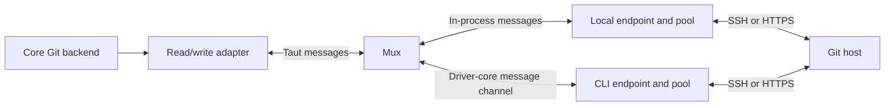

# GWZ Remote Transport Design

Status: design draft, 2026-09-19; implements the accepted direction in
[GwzRemoteTransportRequirements.md](GwzRemoteTransportRequirements.md).
Review status: **accepted at gwz-core
`05842b38e55f109ed3663555680751811a72eb9b` after the original Consistency and
Safety reviewers both reported GO; this accepts the design draft for
implementation planning only**. Reports are filed in the workspace root as
`dev-docs/GwzRemoteTransportDesign-ReviewConsistency-2.md` and
`dev-docs/GwzRemoteTransportDesign-ReviewSafety-2.md` (2026-09-19).
No code, schema tags, library qualification or performance result is claimed by
this document. Policy decisions are recorded there as D1–D15. This document
makes the implementation concrete; library selection and tuning proposals are
called out in §12. [GWZDesign.md](GWZDesign.md) incorporates the direction as a
planned transport amendment.

## 1. Boundary and outcome

SSH and HTTPS Git network work uses a transport endpoint through one taut
message API. Existing local-only HTTP and git transports have the explicit
compatibility disposition in §3.2; they are not claimed as pooled endpoints.
Opening a virtual stream asks a mux to select the endpoint, acquire an eligible
connection and start a Git exchange. Closing releases the connection after
cleanup. Successive repository operations reuse endpoint-owned connections.

The initial endpoint can execute inside core or at gwz-cli. The latter owns the
SSH/HTTPS connection and uses its own credentials and trust configuration; Git
protocol data crosses the driver–core channel. Core still owns repository data,
Git negotiation and operation semantics. Endpoint placement does not move the
workspace or execute the entire fetch/push operation at the driver.

A future iroh carrier can connect the mux to another instance of the same
endpoint service. Discovery, permissions, multi-hop forwarding and signing
services are not part of this implementation. There is no required daemon.

## 2. Components and ownership

| Component | Owns | Does not own |
|---|---|---|
| GWZ backend adapter | Captured effective URL, Git service, selected identity policy, per-operation observations; conversion to libgit2 reads/writes | Keys, remote endpoint files, endpoint selection defaults |
| Mux | Endpoint bindings, route validation, stream ownership and capability checks | SSH/HTTP implementation, Git repositories |
| Message-stream runtime | Taut envelopes, bounded queues, timers, flow control and terminal transitions | Workspace policy or repository-specific authorisation |
| Carrier adapter | Ordered delivery, framing for a link, disconnect notification | Reconnect/replay of an active Git exchange |
| Endpoint pool | Connection reservations, leases, eligibility, idle expiry and disposal | Operation-level success or Git retry policy |
| SSH/HTTPS adapter | Local authentication/trust, network I/O, protocol cleanup and reusable-health decision | Driver/core placement decisions |
| Driver | Explicit endpoint policy, installation of channel bindings, user-facing diagnostics | A duplicate implementation of core Git operations |

Proposed packaging is a reusable Rust crate for message-stream and generic pool
mechanics, with transport-specific adapters above it and a thin GWZ binding.
Its taut schema is authored once and generated for consumers. The crate must
not depend on gwz-core or gwz-cli. Core must remain independent of gwz-cli.
Repository/name selection is a packaging task; this design creates neither a
new member nor a dependency. A later extraction must use workspace tooling.

In-process delivery may pass generated message values directly and avoid an
encode/decode round trip. It must still enforce the same ordering, size bounds,
lifecycle and flow-control contract as a serialized carrier. Test both forms.

## 3. Endpoint binding and policy

At runtime construction the host installs a local endpoint and, when available,
a driver endpoint binding. A binding identifies a concrete endpoint instance
and carrier session, not a freely dialled network address. The driver selects
an endpoint through an additive typed transport option; omission means local.
Core validates that binding and negotiated support before opening any stream.
Missing or unsupported explicit placement returns a typed unsupported/unavailable
error. There is no automatic fallback or rerouting after an open.

A new carrier session gets a new session identifier. Each open carries an
operation identifier and a stream identifier unique within that session.
The mux binds that stream to its endpoint until terminal. Late messages from
an old session cannot reopen it or release another stream's lease.

The endpoint owns its pool across operations. Operation-scoped backend clones
share the endpoint handle but retain separate identity selections, errors and
observations. A driver endpoint can be hosted in the same process today; the
same contract must also pass a real channel test between separate processes.
An existing one-way operation-event stream is not sufficient for this binding:
the carrier must pump traffic in both directions while the operation runs.

### 3.0 Binding before network effects

Binding is a session-level taut conversation, separate from per-stream `Open`.
It performs no Git-host connection, credential lookup or helper invocation.

| Message | Direction | Required contents |
|---|---|---|
| `Bind` | Mux → endpoint | Fresh carrier session id, requested endpoint role, supported conversation versions, schemes and authentication policies, offered receive/encoded-frame/data/metadata/depth/queue bounds |
| `Bound` | Endpoint → mux | Echoed session id and endpoint instance id; one common version; intersection of supported roles/schemes/policies; limits no larger than either side's offered/local bounds; endpoint identity/trust owner |
| `BindRejected` | Endpoint → mux | Bounded typed unsupported-version/capability/limit error; no endpoint handle installed |

These bootstrap messages have a fixed version-1 taut envelope and hard ingress
limits from §4.2, known before negotiation. No common version or unusable bound
returns `BindRejected`; there is no speculative `Open`. The endpoint marks a
successful binding ready before sending `Bound`; the mux installs it only after
validating that acknowledgement. `Open` references that binding's session and
endpoint id. The endpoint independently checks each requested scheme/policy
against the bound intersection before allocating a lease or reading credentials.

Negotiate numeric upper bounds by the minimum of both offers and the local
hard limit; reject values below the adapter's required minimum. Receive windows
are direction-specific. `Open` may request a smaller receive window and `Opened`
may confirm smaller per-stream limits, never enlarge the bound maxima. Pool
capacity is endpoint policy, not a peer request to raise it.

Capabilities are immutable for this session. Disconnect invalidates the binding
and all its owned streams. Reconnect uses a fresh session id and repeats binding;
old `Bound`/`Open` messages cannot create a new binding. The local adapter installs
the same generated Bind/Bound values under the same checks before its first open.
The public core `transport_capabilities` service advertises core support for this
protocol and registered local support; it does not establish or vouch for a
remote endpoint. The driver must both negotiate core support and complete this
endpoint handshake before requesting a nonlocal route.

### 3.1 Authentication and path interpretation

Core preserves the current selection order: invocation per-remote identity,
invocation default, repository-local identity setting, then ambient endpoint
authentication. It passes only the winning selection and its source. Repository
names remain relevant to selection and reporting, not to pool partitioning.

The selected endpoint resolves and checks that identity. Absolute paths refer
to its filesystem; `~/` refers to its account home; relative paths use an
explicit endpoint-local base captured by the driver/runtime. For local core
placement this is the existing invocation base. For CLI placement it is the
CLI's captured base, not core's workspace path or its current working directory.
Missing context refuses rather than guessing. Existing repository-local absolute
identity settings are interpreted literally at the selected endpoint and may
need an invocation override when that endpoint changes.

Existing `remote_identity` configuration writes remain local configuration
operations with their current validation. They do not become remote file
management. Remote placement can use invocation overrides; no setting is
silently translated to a different machine. Attribution `credential_ref`
remains descriptive and is not an authentication selector.

The SSH adapter verifies host keys locally and retains current explicit-key
failure behaviour. It does not add OpenSSH configuration parsing. The HTTPS
adapter invokes only `gh` for authentication and never passes the token to core
or to the generic stream runtime. Anonymous HTTPS is allowed. Missing login or
an unsupported authentication provider produces an actionable error. Login is
not started implicitly. Endpoint management and authority-grant policy remain
outside this service.

### 3.2 Complete route disposition

Resolve the effective URL using existing policy first, then classify and validate
it before any network effect. Use the validated structured destination for the
endpoint; retain only redacted original spelling for diagnostics.

| URL family | Local/default placement | Explicit CLI placement | Pool scheme |
|---|---|---|---|
| SCP syntax (`user@host:path`, including omitted user where currently supported) | SSH endpoint | CLI SSH endpoint | `ssh` |
| `ssh://`, `ssh+git://`, `git+ssh://` | SSH endpoint | CLI SSH endpoint | `ssh` |
| `https://` | HTTPS endpoint | CLI HTTPS endpoint | `https` |
| `http://` | Retain current native local transport and policy | `UnsupportedOperation` before core socket/helper access | No new endpoint pool |
| `git://` | Retain current native local transport | `UnsupportedOperation` before core socket access | No new endpoint pool |
| File/local-family paths and `file://` | Existing local credential-free path | Local-only operation policy; nonempty endpoint override refuses as inapplicable | None |
| Unknown/unsupported network scheme | Existing typed unsupported outcome | Same refusal before effects | None |

The SSH aliases are URL spellings, not OpenSSH host aliases; full ssh_config
parsing is still deferred. All supported spellings reach the per-remote callback
in §8; none can fall through based on a missing prefix registration. HTTP/git
are intentional local-only compatibility exceptions to the endpoint programme,
not silent fallback for a requested driver route. Retained native observations
identify local execution without inventing an endpoint connection id. Redirects
from an endpoint HTTPS exchange to HTTP or another unsupported scheme refuse;
they cannot escape the selected route into a built-in local transport.

### 3.3 Credential-free destinations

For HTTPS, reject all URL userinfo (including username-only userinfo), query and
fragment components before an `Open` is encoded, before helper invocation and
before any network effect. This deliberately excludes URL-embedded/signed-token
credentials from the gh-only policy. Apply validation after effective-URL
rewriting and again at the endpoint; reject redirects with the same components
before following them. Errors are typed `InvalidRequest` with a fixed redacted
reason and never echo the supplied URL or rejected component.

The taut destination is structured: canonical scheme, validated host, effective
port, repository path, and SSH login username for SSH only. It has no password,
HTTP userinfo, Authorization header, query or fragment slot. SSH password-bearing
URLs also refuse. Parse before constructing a message; do not serialize the raw
URL as an extra debugging field. Percent encoding must not permit delimiters to
be reinterpreted as userinfo/headers when rebuilding a request. The endpoint
constructs HTTP requests through a structured URL API from those validated
fields; it never infers credentials from URL syntax. On redirects it validates
the resolved destination before calling gh for its host, and never copies an
Authorization header across origins. Ordinary repository paths remain data;
this rule does not claim to detect arbitrary secrets placed in a path by a caller.

## 4. Taut contract

This is a field/behaviour inventory for the implementation schema, not a second
handwritten wire format. Exact tags and generated API spelling are assigned
when the schema is authored. Use taut `BYTES` for payloads; do not JSON/base64
encode binary data in the transport. All enums, metadata and errors are also
taut-defined. GWZ imports or wraps generated generic types instead of copying
the message vocabulary into a shadow schema.

The session binding messages in §3.0 precede this stream inventory.
The conversation is bidirectional. Both directions carry data and control
messages. A common envelope contains protocol version, carrier session id,
stream id and a discriminated message body. Open also carries operation id.
No separate raw-byte side channel exists.

| Message | Direction | Essential fields and meaning |
|---|---|---|
| `Open` | Initiator → endpoint | Operation id; bound endpoint/session id; validated structured destination and Git service; identity selection and endpoint-local path base; deadlines; caller's receive-window size. Requests a lease and exchange. |
| `Opened` | Endpoint → initiator | Connection id, reuse flag, endpoint/trust identity, authentication facts, endpoint receive-window size and negotiated maximum payload. Sent after lease and service setup succeed. |
| `OpenFailed` | Endpoint → initiator | Typed failure before an active stream is available; releases opening reservations. |
| `Data` | Either | Direction-local byte offset and variable-length `BYTES` payload; offsets start at zero and advance by payload length. |
| `Window` | Either | Absolute maximum byte offset the peer may send in this direction, increased as bounded receive storage becomes available. |
| `Flush` / `Flushed` | Either | Barrier id and byte offset; acknowledges that preceding payload has been handed to the receiving adapter's sink, not that Git accepted a push. |
| `EndWrite` | Either | Final byte offset; no further data in this direction. Peer may continue sending in the other direction. |
| `Close` | Initiator → endpoint | Final write offset; ordered after EndWrite; drain unread reverse traffic for bounded cleanup, then release. |
| `Closed` | Endpoint → initiator | Terminal exchange result, reusable/discarded disposition, unread-response-discarded flag and final transport facts. Never Git success. |
| `Cancel` | Either | Abandon opening/active exchange; do not flush previously unsent application data merely to close. |
| `Failed` | Either | Typed stream failure; terminal, wakes all waiters, triggers cleanup and forbids reuse until qualified healthy. |

Open's transport descriptor contains the validated fields in §3.3 and a typed Git service
(upload-pack advertisement/exchange or receive-pack advertisement/exchange).
The SSH adapter maps these to the two Git commands with properly quoted
repository operands, not a caller-supplied arbitrary shell command. The HTTP
adapter derives Git smart-HTTP requests from the descriptor. Core does not
send Authorization headers or raw TLS instructions to the endpoint.

Status fields needed by the Git adapter, such as an HTTP refusal or SSH service
exit status, use typed metadata/errors. Diagnostics are bounded and redact
credential-bearing URLs and helper output. Connection/stream ids contain no
secret and are correlation identifiers, not persistent credentials.

### 4.1 Delivery semantics and taut shapes

The carrier supplies reliable ordered delivery for an established session.
Each virtual direction is ordered; there is no ordering dependency between
different streams. Duplicate/gapped data offsets, data beyond granted credit,
oversized messages and incompatible versions fail the affected conversation
rather than being repaired by guessing. A malformed shared envelope can require
failing the carrier. Repeated close/cancel notifications have idempotent cleanup.

The existing taut `stream` shape is intentionally a bounded, lossy ring: slow
readers are dropped and late joins miss previous records. See the workspace
[stream decision](../../taut-shape/dev-docs/TautShapeStreamDecision.md). That
contract must not be silently changed. This design uses a reliable conversation
adapter around taut-generated messages. It is not a claim that a suitable
reliable duplex shape already ships. Reusing a delivery-shape engine is allowed
only if the adapter establishes readers before data, prevents overflow with
flow control and treats any loss as terminal; conformance must prove this.
No log persistence, replay or stream resumption is required.

### 4.2 Bounds before decoding

Every serialized carrier must reject an oversized frame before allocating or
reading its declared body. Length-delimited carriers check the bounded length
header first; message-oriented carriers configure an equivalent receive cap in
the underlying transport. Never receive an unbounded websocket/message and only
then inspect its length. Reject an excessive declaration without draining that
untrusted body; terminate the carrier with a bounded local `FrameTooLarge` error,
wake its waiters and clean up its leases. No wire error reply is required if it
cannot be sent within the bounded control budget.

Bootstrap Bind/Bound decoding uses fixed hard limits: at most 64 KiB encoded,
16 nesting levels, 256 total collection entries, 16 KiB per string/metadata byte
field and 256 KiB total decode allocation. These are draft starting caps, not
unmeasured performance claims. Stream negotiation cannot raise local hard caps.
The initial stream proposal is at most 128 KiB encoded per frame with at most
64 KiB Data payload, the same depth/collection/string bounds, and at most
512 KiB decode allocation per frame. Tuning can lower or revise these declared
finite limits before schema freeze; no unbounded mode is supported.

Use a budgeted decoder or bounded nonallocating preflight scanner before the
generic allocating decoder. Check declared container lengths, total node count,
string/byte lengths, integer arithmetic and nesting before allocation/descent,
including unknown fields. Charge encoded storage, decode scratch, decoded copies
and queued output concurrently against the carrier's aggregate byte budget.
Reserve worst-case decode budget before accepting a frame and release unused
reservation after decoding. An aggregate frame-count cap also applies. Both
budget exhaustion and malformed/deep input yield typed failure without process
abort or unbounded recursive descent. Local construction rejects oversized
values before queuing or copying them and applies equivalent field/count/depth
bounds; it cannot constrain memory the caller allocated before invoking the API.

A well-framed typed message that violates only its stream's negotiated limit
fails that stream; malformed framing or an envelope that cannot be decoded
safely fails the carrier. Unrelated carriers remain alive. Ordinary slow-peer
pressure pauses reads under finite budgets while reserved control capacity still
allows progress. Decoder/frame limits apply to bootstrap, Open, metadata and
errors as well as Data. The implementation qualification must prove these limits
at ingress; the existing generic GWZ CBOR decoder alone is not that proof.

## 5. Buffering, flush and backpressure

A write accepts bytes into a bounded outgoing buffer and returns the accepted
count. Large writes may be split; the libgit2 adapter handles partial writes.
Zero-length writes neither start timers nor create data messages.

1. The first byte in an empty batch arms `write_coalesce_delay`.
2. Later writes append without restarting the timer.
3. A full payload is eligible for immediate sending, subject to available credit.
4. Timer expiry makes a partial payload eligible for sending.
5. Explicit flush or graceful end-of-write bypasses the timer.
6. When an eligible payload cannot be sent, bounded buffering applies
   backpressure to the caller; expiry never licenses an unbounded queue.

Evaluate a 100 ms coalescing delay initially. It is a maximum batching delay
when the carrier is writable, not an extra network deadline and not a guarantee
of delivery within 100 ms under backpressure. Buffer size, receive window and
carrier queue limits are construction settings with validated finite bounds.

Receivers join payloads in order and satisfy read calls without exposing data
message boundaries. Returning zero from a nonempty read means end-of-direction;
a temporary empty queue blocks or reports would-block, never false EOF. A
terminal error must remain observable after any already-delivered prefix; it
must not become a successful EOF.

Credit is measured in payload bytes, independently in each direction. `Open`
and `Opened` advertise each receiver's initial window; `Window` grants a
monotonically increasing absolute limit. Credit is replenished only when bytes
are consumed or moved into another explicitly bounded sink budget, not merely
when a message is decoded. Bound message overhead/count as well as payload
bytes so a stream of tiny messages cannot consume unbounded memory.

The carrier has a bounded aggregate budget across streams and fairly schedules
ready data. Reserve processing/queue capacity for window updates, cancellation
and terminal control so data saturation cannot deadlock teardown. Data, flush
barriers and `EndWrite` retain their direction's ordering; cancellation can
interrupt that order because it abandons unsent bytes.

A flush drains the local batch and waits for its barrier acknowledgement or
failure. At the endpoint this acknowledges handing the bytes to the SSH channel
or HTTP request-body writer, not a remote commit. It does not end an HTTP body;
`EndWrite` does. The reverse-direction barrier is acknowledged when preceding
data has been made available to the bounded read adapter, not when the Git
application has necessarily consumed it. Blocking reads first make any local
pending writes eligible for immediate send; they do not wait on a remote flush
barrier that could deadlock a full-duplex exchange.

The pinned git2 binding's C write callback invokes `write_all`, not `flush`.
Therefore timers must run independently of the caller, and the implementation
must not rely on libgit2 invoking flush to make progress. The Git-specific
adapter can force emission at a known protocol handoff. Validate that a small
request followed by a read does not pay unnecessary repeated 100 ms delays.

## 6. Stream lifecycle and failure

| State | Transition | Effect |
|---|---|---|
| Opening/queued | Lease + service setup succeed | Send `Opened`; enter active |
| Opening/queued | Cancel, deadline, setup failure or carrier loss | Remove queue/reservation, clean up any raced allocation; report failure |
| Active | `Data`, `Window`, flush | Exchange bytes under both budgets |
| Active | One side sends `EndWrite` | Close only that writing direction after its prefix; retain the reverse direction |
| Active/half-closed | API graceful close | Begin deadline; flush pending writes, emit EndWrite if needed, then wire Close with the same final offset |
| Local write ended | Ordered wire `Close` | Enter closing; bounded reverse drain and backend cleanup |
| Closing | Cleanup complete | Release healthy connection or discard; send `Closed`; terminal |
| Any nonterminal | Cancel, failure or carrier loss | Wake waiters, stop I/O, perform bounded cleanup; terminal |

API close from active, local-half-closed, remote-half-closed or fully ended
states has one rule: start the close deadline immediately, stop accepting new
writes, emit remaining Data under credit, then EndWrite(final_offset) if not
already sent, then Close(final_offset). Already-ended directions retain their
original final offset; no second EndWrite with a different offset is allowed.
Exhausted credit cannot extend the deadline: cancel/discard on expiry. A wire
Close received before its EndWrite or with an inconsistent final offset is a
typed protocol failure, never an implicit HTTP body completion.

Once the application requests graceful close, it gives up delivery of any unread
reverse bytes. The read adapter switches to a bounded drain/discard sink and
returns credit as those bytes are discarded; the endpoint drains network output
to reverse EndWrite/EOF within the same deadline. A successful Closed follows
that ordered drain and channel/body cleanup. It records whether unread response
bytes were discarded, so the caller cannot mistake cleanup for complete response
consumption or Git success. Drain failure yields Failed and discards the physical
connection. Cancel instead abandons unsent forward data immediately and never
waits for a graceful drain. Concurrent terminal paths release one lease only.
This lets completed advertisement readers release a channel by sending EOF and
draining its tail, without making channel reuse depend on full Git publication.

There is one lease owner. Cancellation racing with allocation or completion
must release it exactly once. Terminal streams cannot be reopened by late data.
The mux retains bounded terminal bookkeeping or monotonically allocated ids to
reject late frames without growing a permanent tombstone set.

Graceful close is distinct from simply dropping a language handle. Explicit
close can flush and report errors. Dropping the final owner requests cancellation
without blocking indefinitely or publishing queued writes. If handles can be
cloned, they refer to the same logical stream; only the final ownership release
cancels it, and data access remains serialized. Cloning never creates a second
consumer or a new Git exchange implicitly.

Closing an SSH channel after a read-only advertisement is a normal early end:
it need not force a physical disconnect if channel cleanup proves the session
usable. Unknown state, transport failure or a cleanup deadline discards the
connection. For HTTP, unread response bytes must be fully drained within bounds
or the connection closed before reuse. Returning a connection to idle before
that cleanup finishes is forbidden.

A carrier disconnect is a runtime event, not a peer message. It cancels every
queued or active stream owned by that carrier, wakes blocked callers and tears
down their allocations. Conservatively discard active connections after lost
ownership; unrelated streams and already-idle endpoint connections keep their
normal lifetime. A new carrier creates new streams only. For a future network
carrier, disconnect/liveness detection must be supplied by that carrier; taut
message types alone cannot detect a silent network partition.

A stale idle connection may be replaced only before sending the new Git service
request. Once a command/request could have reached the Git host, surface failure
without replay. A lost push response can mean an uncertain remote outcome; the
operation layer retains its existing verification/recovery responsibility.
`Closed` or a flush acknowledgement never proves Git publication succeeded.

## 7. Endpoint pool

### 7.1 Keys and compatibility

Pools are owned by an endpoint instance and local account context. The lookup
key is scheme, SSH login username, host and effective port (22 for SSH, 443 for
HTTPS unless specified). Host normalization must preserve meaningful configured
destinations; do not merge addresses merely because DNS resolves them equally.
Repository paths and remote names are not pool-key components.

An SSH connection records how it authenticated, including proven key identity
where available. Explicit identity selection is resolved before reuse and
checked against that record. A different explicit key requires another eligible
connection; if compatibility cannot be proved, do not reuse. At capacity, retire
an incompatible idle connection to make room rather than waiting forever behind
it. An unavailable or changed explicitly selected file must not succeed merely
because an older authenticated connection remains cached. Ambient requests use
the endpoint's ambient pool context rather than borrowing a connection created
for an unrelated explicit override. These are eligibility checks within the
same user/host pool, not a per-repository pool or a new identity namespace.

Already-authenticated connections remain sessions until discarded or expired.
They do not reauthenticate or re-read known_hosts on every lease. Endpoint
shutdown/reconfiguration clears the pool; distributed revocation semantics are
not introduced. HTTP applies endpoint-local `gh` authentication to each request;
a TLS connection by itself is not proof of an authenticated account.

### 7.2 Capacity and allocation

The design starting value is eight physical connections per user/host, with an
aggregate endpoint ceiling of eight per host across users, ports and schemes.
These are configurable endpoint construction values; the aggregate default
preserves the current per-host default. Opening, idle, allocated and closing
connections all count. A physical connection is never allocated twice.

Existing `OperationPolicy.max_connections_per_host` continues to bound that
operation's fan-out through `par_map_per_host`. It is not reinterpreted as a
process-global mutable setting. The endpoint ceiling is an additional bound
across operations; a request cannot raise it. Setting a lower operation limit
does not evict another operation's connections. This distinguishes today's
concurrent-work limit from new persistent physical-pool capacity explicitly.

Allocation under a single pool-state decision:

1. Remove expired/broken idle entries; reserve an eligible idle connection.
2. Otherwise reserve a creation slot under user/host and host-wide capacity.
3. Where idle entries prevent useful allocation, retire an idle entry first.
4. If all capacity is allocated/opening/closing, enter a bounded cancellable
   wait queue. Queue exhaustion returns a typed capacity error.
5. Connect outside the pool lock. Setup failure or cancellation releases its
   reservation and wakes waiters; success transfers ownership to the lease.

Waiting is fair among eligible requests; an incompatible head request must not
block reuse by every other waiter. No network call, credential helper, user
prompt or blocked channel write holds the pool-state lock. An allocated but
quiet connection is never reclaimed as idle.

### 7.3 Idle time and shutdown

A successful release records a monotonic `idle_since` after cleanup and arms
expiry for `connection_idle_timeout`, default 60 seconds. Checkout atomically
removes idle status. Timer generations make a stale expiry harmless after
checkout or re-release. Reaping runs without new allocation traffic; no polling
loop dependent on the next GWZ command is sufficient.

Shutdown refuses new opens, cancels waiters, closes idle entries and terminates
active exchanges within a bounded cleanup period. No connection survives its
owning endpoint process. An ordinary CLI process exit therefore ends its pool;
a long-lived embedding can benefit across operations without requiring a daemon.

## 8. SSH adapter and libgit2 integration

Propose `ssh2` over the existing libssh2 stack. It offers the closest route from
the measured prototype to the native backend, but platform/key/trust parity and
cancellation must be qualified. Do not replace Git operations with Git CLI
commands or introduce an OpenSSH ControlMaster dependency.

One connection serves one active command channel at a time initially. That does
not mean a blocking read may prevent writes or cancellation. A single session
owner must pump both directions with bounded/nonblocking socket work and wakeups;
never drive the same libssh2 session concurrently from independent threads.
An exclusive pool avoids multi-channel scheduling on a shared session, while
still permitting multiple pooled connections to operate concurrently.

The GWZ adapter implements git2's smart-subtransport read/write interface.
For SSH use stateful mode: advertisement and subsequent upload-pack or
receive-pack negotiation retain the same channel. Do not release/reopen a
channel between those natural service transitions. Reuse the physical connection
only after the channel's complete lifecycle.

Use libgit2's per-remote `git_remote_callbacks.transport` hook, with an owned
context for that remote's operation, endpoint binding, identity selection and
observations. The native callback constructs the smart subtransport only for
that explicitly configured GWZ remote. GWZ must not call process-global
`git2::transport::register`, register synthetic schemes, replace standard-prefix
factories, or use a thread-local current-operation lookup. Unrelated libgit2
operations retain their existing registered/built-in transports at all times.

The C API has this callback, but pinned git2 0.21.0 does not expose a safe setter
for it. A narrowly scoped safe-binding extension (upstream or a qualified pinned
binding patch) is therefore a delivery dependency. It must own callback payloads
through construction and subtransport lifetime, preserve other remote callbacks,
handle clone-created/anonymous/named remotes, and translate panic/error safely.
No private Rust layout casts or URL rewriting are permitted to evade this gap.
If the required binding is unavailable, the new endpoint implementation cannot
be enabled or advertised; do not substitute global registration. The old
implementation remains the baseline until this prerequisite is delivered.

Qualify normal/custom foreign transports before, during and after GWZ runtime
creation and teardown, plus concurrent and nested GWZ calls with different
identities/routes. Runtime teardown releases only its owned endpoints/callbacks;
there is no registry to restore and no external creation lock to acquire.

Current integration points in gwz-core:

- `src/git/gitbackend/transport.rs` and `refs.rs`: clone, fetch, push and remote
  advertisement operations; preserve prepared destination/source semantics.
- `src/git/gitbackend/transport_support.rs` and its `identity.rs`: separate
  selection precedence from endpoint-local resolution/authentication; retain
  native timeout and failure contracts.
- `src/git/gitbackend/backend.rs`: operation-scoped adapter state plus shared
  endpoint handle, not a fresh pool per backend clone.
- `src/git/gitbackend/transport_observations.rs`: collect stream-specific facts
  into the existing per-operation result/error paths.
- `src/operation/par_map_per_host.rs`: retain the common work scheduler. Pooling
  is underneath it; no fetch-specific transport or separate fan-out is added.

Cover every network entry, including workspace bootstrap clone, advertisement
reads, materialize, fetch, tags, pull and push verification. File/local-family
transports remain on their existing credential-free path.

## 9. HTTPS adapter

Both placements require an endpoint-owned HTTPS adapter; merely tunnelling TCP
would leave TLS and bearer authentication at core. Core's smart subtransport
uses RPC mode. The endpoint maps service discovery to the smart-HTTP GET and
exchanges to POST requests, including correct content types and response status.
The HTTP client performs TLS verification and connection management locally.

For each RPC request, `Data` carries the request body and `EndWrite` terminates
it. Response `Data` and `EndWrite` describe its body. For the pinned synchronous
Git RPC interface, the adapter must map the transition from request writes to
response reads to body completion; a batching timeout or `Flush` is never an
HTTP end-of-body signal. Test multi-round fetch and large push, not just GET
advertisements. Stream large bodies under backpressure instead of collecting
whole packs into memory.

The endpoint obtains credentials via `gh` for the request's host; no general Git
credential-helper chain or caller-provided bearer token is accepted. Respect an
explicit credentials-disabled policy. Helper cancellation and bounded errors
are part of the endpoint. Token values stay inside the HTTP adapter; no separate
long-lived application token cache is required for the first delivery.

The concrete HTTP library remains a qualification choice. Before supporting the
new path, prove CA/TLS trust, proxies, redirects, content types, streaming bodies,
error mapping and `gh` host/account handling. Redirects must not copy an
Authorization header to a different origin; resolve authentication for the new
origin through the same endpoint policy. Do not automatically replay POST bodies
after a network failure or an authentication challenge once publication could
have started. Unsupported behaviour fails explicitly rather than falling back
to a differently placed transport or credential provider. TLS connection reuse
must not be reported as authenticated-account reuse.

## 10. Compatibility, observations and deadlines

Use §3.0 Bind/Bound for endpoint facts and session readiness. Extend the core
taut capabilities service additively with the supported message protocol version,
placements, SSH/HTTPS support, `gh`-only authentication policy and stream limits.
Negotiate core support and the selected endpoint's support; a core version alone
does not prove a driver can host an endpoint. Missing fields mean unsupported,
not "assume latest". Keep existing field tags and methods stable.

Old drivers can make ordinary local requests to a new core. A new driver talking
to an old core can use only features that core advertises. It must refuse an
explicit driver-endpoint request rather than send an unknown option and hope.
Likewise, a driver requiring the new `gh`-only policy must not claim enforcement
by an old core that permits arbitrary helpers. The restriction intentionally
changes authenticated HTTPS behaviour on the new implementation; release notes
must distinguish that policy change from wire compatibility.

Add optional endpoint, connection id, stream id and reused fields to transport
observations. On reuse, `credential_offered` remains false for this attempt;
proven authentication facts come from the connection record with explicit reuse
context. Do not copy an earlier operation's entire observation row. Associate
every fact with the current repository, remote and operation, and preserve it
through success, streamed results and early errors. The legacy nullable
`authenticated` field must not be forced true where proof is unavailable.

Keep these timeout domains separate:

| Domain | Meaning |
|---|---|
| Allocation wait | Time waiting for capacity; cancellable, no Git request sent |
| Connect/auth network | Socket setup and protocol progress; preserve configured native timeout semantics |
| Active I/O | Peer network progress, not idle-pool lifetime; report deliberate local backpressure distinctly |
| Write coalescing | Maximum avoidable batching delay while writable |
| User interaction | If supported, visible and cancellable; excluded from network timeout accounting |
| Close cleanup | Bounded channel/body disposal before reuse or physical close |
| Pool idle | 60 seconds since return of an unallocated, healthy connection |

Current startup network settings remain frozen before backend work. Endpoint
construction captures its own equivalent settings; per-operation requests cannot
race to change global timeout or pool policy. Values beyond the agreed idle
and evaluation coalescing delays are tuned and qualified before rollout.

## 11. Acceptance matrix

Implement TDD-first. Use deterministic clocks and fake carriers/transports for
lifecycle and pool tests, then controlled SSH/HTTPS fixtures for adapter parity.
These tests are specifications for future work, not a claim they have run.

| Area | Required evidence |
|---|---|
| Byte/message adaptation | Arbitrary write/read chunking, binary/NUL payloads, empty writes and ordering preserve the exact byte sequence |
| Batching | Full buffer sends immediately; first-byte timer sends a partial buffer; trickle cannot postpone it; flush/end-write bypass delay |
| Flow control | Paused consumers and tiny messages remain within byte and message budgets; both directions progress; cancel/window control cannot deadlock |
| Lifecycle | Close from all four half-states with pending data, exhausted credit and unread reverse data; ordered EndWrite/final offsets; bounded drain with discarded-data reporting; racing Cancel and final-handle drop release once |
| Carrier loss | Disconnect during queued open, connect, read, write and close fails all owned streams; stale session messages cannot reattach |
| Pool | Multiple repositories/phases/operations reuse; exclusive leases; concurrent opens respect both caps; incompatible idle eviction; no starvation or count leaks |
| Idle/shutdown | 60-second expiry without new calls; checkout/timer races; busy-but-quiet lease survives; shutdown wakes waiters and closes resources |
| Identity/trust | Same user/host and different explicit keys cannot cross; unavailable/changed selected key refuses; endpoint-local path bases and known_hosts; no fallback |
| HTTPS | Anonymous access; `gh` auth; other helpers rejected; login failure; redirect-origin isolation; streaming POST, proxy/TLS parity and bounded cleanup |
| Git semantics | Discovery-only reads, stateful SSH negotiation, multi-round HTTP fetch, large clone/push, rejection/uncertain push, post-push reads and publication ordering |
| Context isolation | Per-remote callback lifetime/error/unwind; concurrent/nested GWZ routes; pre-existing custom and normal foreign libgit2 traffic before/during/after runtime construction; no process-global registry write |
| Compatibility/reporting | Bind/Bound version and scheme intersections, minimum limits, stale sessions, absent binding and unsupported route with zero socket/helper calls; old local requests; offered/authenticated/reused facts and private-member suppression |
| URL routing/credentials | SCP plus every SSH scheme alias in local/carried forms, canonical ssh pool keys, retained local HTTP/git, unsupported nonlocal schemes before effects; HTTPS username/password/query/fragment sentinel refusals including redirects, with no secret in messages/errors |
| Ingress bounds | Oversized Data/metadata, huge declared truncated frame, deep/large unknown collections, tiny-message storm; encoded+decoded peak storage and nesting stay bounded, typed failure wakes affected waiters and releases leases |
| Platforms | Windows/macOS/Linux trust and agent fixtures; exact-agent support remains false until separately proven |
| Performance | Cold versus warm SSH, connection/channel counts, large-pack throughput, control latency and memory under backpressure; local and carried endpoints |

Fetch is the first clear N+1 read benchmark. Also measure push plus post-push
reads and multiple operations in a long-lived embedding. Compare coalescing
settings including 100 ms and immediate emission; report counts as well as wall
time so concurrency does not conceal extra connects. Preserve Git results while
measuring. Follow workspace `EVIDENCE.md` for raw runs and campaign-only runners;
public CI tests/fixtures must not depend on private evidence repositories.

## 12. Qualification and delivery boundaries

The accepted architecture is settled enough to implement. The following items
must be resolved by focused adapter/contract work, not hidden as assumptions:

| Item | Design starting point | Completion condition |
|---|---|---|
| Reliable message delivery | Taut-generated bidirectional conversation adapter | Lossless bounded lifecycle oracle in-process and over a real channel; do not alter the frozen lossy stream shape |
| SSH library | `ssh2`/libssh2, exclusive lease with a single I/O owner | Cross-platform trust/key parity, full-duplex progress and bounded cancellation |
| Native context binding | Safe extension for per-remote libgit2 transport callback; no global registration | Callback ownership/error isolation and foreign transport coexistence proven before advertising support |
| HTTPS client | Endpoint-owned streaming HTTP adapter | Required TLS/proxy/redirect/auth and Git RPC parity proven before advertising support |
| Tuning | 60 s idle; evaluate 100 ms coalescing; initial pool caps 8 | Choose bounded payload/window/queue sizes and wait/cleanup deadlines from fixtures and measurements |
| Packaging | Separate reusable crate | One taut schema owner, generated consumer types, no reverse dependency on GWZ drivers |

A subsequent implementation plan should deliver the deterministic contract and
pool, the local SSH vertical slice, the CLI carrier/endpoint slice, and the
HTTPS adapter with capability/reporting parity. Local SSH can be measured before
HTTPS is complete, but the programme is not complete with pooling alone. Never
advertise an unimplemented placement or protocol. No schema regeneration,
repository creation, experiment or source change is performed by this design
revision.

## 13. Source anchors and traceability

- [Transport requirements and D1–D15](GwzRemoteTransportRequirements.md): accepted
  direction, historical prototype evidence and scope.
- [Authoritative core design](GWZDesign.md) and
  [baseline requirements](GWZRequirements.md): independence, identity,
  observations and compatibility constraints.
- [GWZ taut schema](../protocol/gwz.taut.py): existing transport options,
  capabilities, runtime settings and observation fields; new tags are not yet
  allocated.
- [Native support](../src/git/gitbackend/transport_support.rs),
  [identity resolver](../src/git/gitbackend/transport_support/identity.rs),
  [native operations](../src/git/gitbackend/transport.rs), and
  [host scheduler](../src/operation/par_map_per_host.rs): current integration seams.
- [Fetch plan](../../gwz-cli/dev-docs/GwzFetchPlan.md): Phase 3 consumes this
  programme; earlier fetch correctness does not depend on it.
- [Taut stream decision](../../taut-shape/dev-docs/TautShapeStreamDecision.md):
  existing loss/late-join policy that this adapter must not silently reinterpret.
- Pinned local git2 0.21.0, `src/transport.rs`: `SmartSubtransport`,
  `Transport::smart`, unsafe process-wide `register` (rejected for this design),
  stateful stream continuation and
  `stream_write` calling `write_all`. These are version-specific integration
  facts to recheck if the dependency changes. The libgit2 1.9.7
  `include/git2/remote.h` callback struct supplies the per-remote transport hook;
  adding its safe Rust binding is a prerequisite, not completed work.
