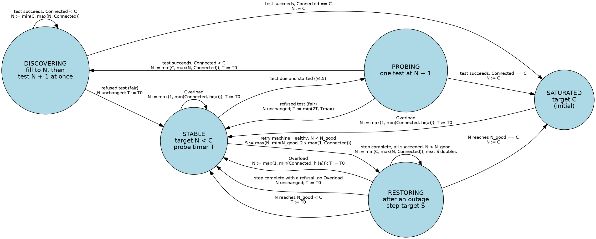
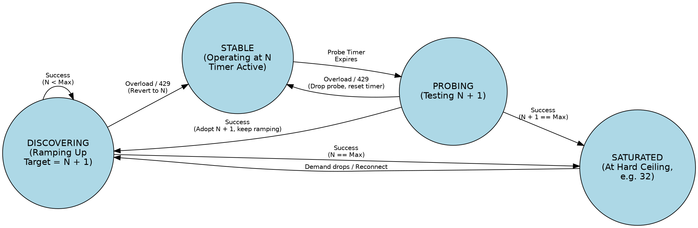

# GWZ transport adaptive per-host concurrency — design

Date: 2026-10-06; revision 1, 2026-10-07; revision 2, 2026-10-07; revision 3, 2026-10-07; revision 4, 2026-10-07; revision 5, 2026-10-07; revision 6, 2026-10-07; revision 7, 2026-10-07; revision 8, 2026-10-07; revision 9, 2026-10-07; revision 10, 2026-10-07; revision 11, 2026-10-07. Status: **DRAFT, 2026-10-07, under review.** It authorizes no implementation, commit, tag, push or publish. Revision 2 was reviewed on three axes, Consistency, Safety and an independent State review the operator asked for ("have a another independent reviewer perhaps a fable reviewer look through it as well"); all three were NO-GO (`GwzTransportAdaptiveConcurrencyDesign-Review{Consistency,Safety,State}.md`). Revision 3 (`-RemPlan.md`) closed every round-1 finding; its re-verdicts were NO-GO on new findings, none architectural (`-Review{Consistency,Safety,State}-2.md`). Revision 4 was the second and last remediation round under the two-round cap (`-RemPlan-2.md`); its re-verdicts (`-Review{Consistency,Safety,State}-3.md`) were GO from Consistency and State and NO-GO from Safety on one new P2, none architectural. Revision 5 was the narrow correction of that P2 and of the round-3 P3s (`-RemPlan-3.md`); its focused re-checks (`-Review{Consistency,Safety,State}-4.md`) were **GO on all three axes**, with three P3s. Revision 6 applied those three P3s as corrections cleared without a further round. The operator's decisions on all open questions are recorded (revisions 7 and 8). The Surface review of revision 8 (`-ReviewSurface.md`, on the extract `-SurfaceExcerpt.md`) was NO-GO on two P2s, both names; revision 9 fixed them and the six P3s; its re-check (`-ReviewSurface-2.md`) closed both and found one new P2 (the throttle-evidence rule stated three ways), which revision 10 fixed with one rule, with the six re-check P3s. **The final Surface re-check (`-ReviewSurface-3.md`) is GO**, with six P3s recorded in §9 for the implementation's wording and docs. All four axes, Consistency, Safety, State and Surface, have reported GO; the operator has decided every open question (§13). Remaining before the design governs code: amendment 2's next revision records §14 (OQ12), and the plan. **A Surface review is also required before acceptance:** the note (§9) and the final error (§5.3) changed in revision 2.

- **The operator's direction (2026-10-06, verbatim):** "so "Capacity" failures should be the throttle, not an error, hence setting 32 gets limited to 8 dynamically which means it needs to be tested to see if it was a different issue so you dynamically detect the actual limit, it could be for another client running elsewere." Earlier the same day: "It may be that github finally started throttling connections - so now we have a signal at to the max number of concurrent connections allowed (per user I suspect, I hope not per IP addr)."
- **The operator's rejection of revision 0 (2026-10-06, verbatim):** "I don't think this will work, as I mentioned you need to test the limit as it may have been temporary. nothing here mentions testing."
- **The operator's direction for revision 2 (2026-10-07, verbatim):**
  - On the retry machine: "We discussed the need to test the retry, or rather test the throttling to see if it was a temporary retriable failure so that a transient failure doesn't turn into a permanent degrading".
  - With a limit-discovery state machine (Appendix A, verbatim): "This FSM is only for discovering the current max no of allowed connections - not determining the connection state. actions not specified is when to set N - some will set N some will increment N. We do need to establish the number of active "connected" connections and maintain that number as the current N. We also need to decide the probe timer periods."
  - On races: "Consider all inputs and possible races - i.e. Consider a state where you have connection N A and N B and N A is commenced and N B has shut down. And you've issued an N A first and then you've received an N B before you've actually restored or started NA in the background. So you actually don't know visibility at that point whether the failure that comes back from NA was because you've got N plus one connections or something else because NB was in the process of being shut down. So there's a bit of lag there that we need to account for."
- **Authority.** [Retry plan](GwzRemoteTransportRetryPlan.md) §§4–6 and §10 (the closed retriable set, the per-key machine, the pool's caps, the out-of-scope learned cap), as amended by [amendment 2](GwzTransportReleasePlanAmendment-2.md) §3.20 (OD18, the cold start's first wave). [HTTPS endpoint design](GwzRemoteTransportHttpsDesign.md) §2 (amended 2026-10-06: capacity is a throttle, not an error, and "Adaptive limits are designed separately", which this is), §6 and §7's response table. [Connection reuse design](../../dev-docs/GwzConnectionReuseDesign.md) §5 and §9, and the [core session plan](../../dev-docs/GwzCoreSessionPlan.md)'s CS7.23. [Transport setting design](GwzTransportOffSwitchDesign.md) (`--transport native`). The pending connection-statistics proposal TR2.24 ([revision 1](../../dev-docs/history/transport-handoff-2026-10-02/designs/GwzTransportConnectionStatsDesign-rev1.md)) is mentioned in §9 only.
- **This design changes accepted text.** §14 quotes every clause of the retry plan, amendment 2, the HTTPS design, the reuse design and the session plan that it would change, with the replacement. It does not amend them: if the operator accepts it (OQ12), amendment 2's next revision records the changes, with the dual review an amendment to a frozen contract takes.
- **Code lines.** §2.1 to §2.4 and §7 are at gwz-core `279860c1`, as in revision 1. Everything else is at gwz-core `db0f8447` and gwz-transport `ff6083b5`. Paths under `src/` are gwz-core's, and under `pool/` are `gwz-transport/src/pool/`. Evidence lines are from `gwz-core-evidence/campaigns/transport-qualification/runs/2026-10-06-tr8-1-linux` and `…/2026-10-06-tr8-1-macos-https` (their READMEs).
- This is a design. It has no phases and no steps; the operator takes it to a plan separately.

## 1. Outcome

Any capacity signal, local or from a server, slows the command down. None of them fails a member while budget remains. `--max-per-host` is a ceiling `C`. The concurrency actually used per host is a believed limit `N`, which the transport **sets only from what it has observed** and **keeps testing for the whole command**: it can be lower than the ceiling because another client, on the same account or the same address, holds part of the server's budget, or because of nothing at all (a burst, a restart, a local fault that looked like a refusal). A refusal lowers `N` only when it is judged against the target its attempt started under and cannot be explained by the client's own connections still being counted by the server (§4.4); a test one above `N` checks it on a backed-off timer (§4.7). Separately, a host that is down is not closed for the rest of the command: members that select it wait for its next retest (at most 30 s) and share its result, a member retests it at most once per 30 s, and only after two retests in a row have failed do members that select it fail at once (§5.5).

Decisions, each argued below:

| # | Decision | Section |
|---|---|---|
| D1 | Every failure is classed **Queue** (local capacity), **Throttle** (the server said slow down), **Suspect** (looks like a limit, may be something else), **Transient** or **Permanent**. Queue can never move the believed limit, by construction. A Suspect moves it only after a confirming test at the concurrency the server is visibly holding. | §3, §4.5 |
| D2 | **The operator's machine** (Appendix A), per (scheme, host, port) per command: DISCOVERING, STABLE, PROBING, SATURATED, starting in SATURATED so the first wave is parallel (OD18). It decides the believed limit only; connection state stays with the endpoint and the retry machine. | §4.6 |
| D3 | **`N` is set, never incremented.** It rises only to the number of connections that are connected at the same moment (`N := min(C, max(N, Connected))` on every success) and falls on an overload only to what was proven, never counting the refused attempt's own connection (`N := max(1, min(Connected, hi(a)))`). "`N + 1`" is only the admission target of the one test. | §4.2 |
| D4 | **The server's count is a range.** Each attempt records the fewest and the most connections the server may have held while it decided (`lo`, `hi`), and is judged against its own admission target: an ordinary start is conclusive iff `hi < N`; a test is fair iff `lo` equals its base. An unfair or inconclusive result moves neither `N` nor the timer. | §4.3, §4.4 |
| D5 | **The client does not create the overlap.** Below the ceiling, admission counts every connection the server may still count, including those closed by the client within a settle time `Ts`; the pool holds a freed slot for `Ts`; a test starts only on a quiet key, and a due test holds new starts until the key is quiet. At the ceiling (SATURATED) no settle wait is paid; the window still counts settling connections, so a race there is inconclusive when the key is full, and otherwise costs at most one decrease that the first test repairs (§4.4 R1). | §4.5 |
| D6 | **The probe timer:** `T0 = 500 ms` with ±20% jitter after an overload, doubling on each fair refused test to `Tmax = 30 s`, any `Retry-After` its floor, reset on a success. A test is a real member's new connection; none is opened only to test. | §4.7 |
| D7 | A refused attempt is **requeued**, not failed. It counts as one of that member's `--max-retries + 1` attempts. A probe test is never a member's final attempt; a confirming test is, only when no other member can carry it (§4.7). A limit refusal does not count against the key's retry machine. | §5 |
| D8 | **The retry machine closes a key only on a Permanent failure.** Exhaustion of the retriable budget puts the key in **Down**: its queued members finish as today; members that select it wait for the next retest, at most 30 s, and share its result; after two failed retests in a row, members that select it fail at once, while a member that selects it after each 30 s still carries a retest (the operator's choice, 2026-10-07: "Park, give up after 2"; OQ13(e)). A decrease of `N` taken during an outage is restored, by judged doubling steps, when the host returns. | §5.5 |
| D9 | The believed limit lives for one command. What a 1.2.0 session keeps is the reuse design's to decide; this design's input is a starting point of at most 10 s, tested at once (OQ5, decided). | §6 |
| D10 | The local 64-caps stop failing members. Two are removed, one is made a wait with release at the end of the member's work, and the rest are already waits that need their expiry reported as a local throttle. | §7 |
| D11 | The pool (gwz-transport) gains a numeric limit per (scheme, host, port), set to the machine's admission target, a numeric settle hold, and one bulk discard of a key's idle connections; it learns nothing about error codes. Classification, the evidence filter and the machine live in gwz-core beside the retry machine. | §4.9 |
| D12 | A throttled member that runs out of budget fails with `Capacity` plus an optional `capacity` detail whose `cause` says server throttle, long `Retry-After` or local capacity; a refusal with no throttle evidence keeps the code it has today (revision 1's D4, restored and narrowed). | §5.3 |

## 2. What the code does today

### 2.1 Where capacity and limits are enforced

- **Pool ceilings, installed per operation** from the resolved `--jobs` and `--max-per-host` (retry plan §6): `per_user_host` and `per_host` are the resolved `--max-per-host` (default 32), `total` is `max(256, jobs)`, `max_requests` `max(1024, jobs)` (`pool/mod.rs:36-47`). `schedule()` creates a connection only while the host's and user-host's counts, idle and closing included, are under the caps (`pool/allocation.rs:53-56`), evicting the oldest idle connection to make room (`pool/allocation.rs:101-134`). A waiting request stays `Waiting`; a connect failure reaches only the request that owns that `Opening` connection, as `RequestState::Failed(ConnectFailed{code, effect, setup_cause})` (`pool/allocation.rs:236-246`). Nothing else waiting hears of it. `request_until` is the one pool refusal, `Capacity`, at `max_requests` pending requests (`pool/machine.rs:195`), which one operation cannot reach because members in flight never exceed `--jobs`.
- **Endpoint admission, ahead of the pool.** Both endpoints queue an open and start it only while the opens in flight on its host are under the pool's per-host and per-user caps: SSH in `admits_open` (`src/git/endpoint/placement_endpoint/admission.rs:397-409`, with `queued_opens` at `:203,214`), HTTPS in `admits_attempt` (`src/transport_host/https_endpoint/retry.rs:217-226`, with `Held`). SSH also caps opens across all hosts at `open_ceiling`, the least of the pool total, `MAX_REQUESTS` (64, `placement_endpoint.rs:36`) and half the 64-job budget, so 32 (`placement_endpoint.rs:238-244`). An open held by these limits has its allocation clock running; a key the retry machine holds stops it (`admission.rs:178-215`, `retry.rs:188-215`). The member scheduler also limits members per hostname by the same number (`operation/par_map_per_host.rs`), so a held open is in practice one behind a limit lower than the configured one, which today means a local one.
- **HTTPS setup slots** (279860c). The connector holds 8 slots for the blocking resolver and TLS-configuration jobs. A connection past them now waits for a slot inside its connect deadline (`src/git/endpoint/https_connection.rs:240-262`). It no longer fails with `Capacity`; the 32-member HTTPS fetch at defaults was clean in 47 of 47 runs (commit message).
- **The retry machine** (`src/git/endpoint/setup_retry/machine.rs`): per operation, per pool key (SSH: and identity), states Cold (first wave parallel, OD18), Healthy, Degraded (one probe at a time), Waiting, Closed. A retriable setup failure counts one attempt **for the key**; a budget of `R + 1` (default 4) closes the key for the rest of the operation and finishes every member on it, including members that arrive later, with the recorded failure (`Machine::decide` returns `Decision::Finish` in `State::Closed`). Waits are `min(30 s, 1 s x 2^(n-1))` plus 0 to 250 ms jitter (`setup_retry/backoff.rs`). A failure from a generation the key has left is not counted, and its member is requeued.
- **The classifier** (`src/git/endpoint/setup_retry.rs:55-72`): Retry for a setup-phase `Io`, `CarrierLost`, a stall or aggregate `Timeout`, or `Unavailable` caused by a refused connection; **Return** (the member's own result, the key does not move) for `Capacity`, `Cancelled` and an allocation `Timeout`; Close for everything else in setup. Only a failure of a *connect* (`FirstConnect::Failed`) is `Phase::Setup`; anything after the first request byte is `Phase::Other`, so Return (`https_endpoint/retry.rs:107-113`).

### 2.2 Which local limits still fail a member with `Capacity`

| Limit | Where | What reaches the member today |
|---|---|---|
| Supervised-job budget, 64 process-wide (`static COUNT`) | `src/git/endpoint/agent_job.rs:13,254-258,365-369` | `Job::start` returns `WouldBlock`; SSH maps it to `Capacity` (`ssh_setup.rs:441`, `ssh_worker/open_request.rs:77-79,93`), HTTPS likewise (`https_connection.rs:279`). Classified Return: the member fails. |
| Concurrent HTTPS operations per endpoint, 64 | `src/git/endpoint/https_operation.rs:38` (`Operations::acquire`) | `Capacity`, mapped at `src/transport_host/https_endpoint.rs:239-243`. A count of concurrent *commands*, not of repositories. |
| Live HTTPS streams and requests per endpoint, 64 | `src/transport_host/https_endpoint.rs:220,234` | `WouldBlock`, which the driver already waits on and retries until the allocation deadline (`session/driver/opening.rs:228-235`). |
| Distinct HTTPS repositories per request, 64, never released | `src/transport_host/request.rs:19,115-118` (`https_routes`) | `Capacity` on the 65th distinct canonical URL of one request. 1.0.17 has no such limit. |
| Route table, 64 routes per endpoint | `src/git/endpoint/https_policy.rs:85` (`Routes::admit`), built at `src/git/endpoint/https_worker.rs:88` | `Capacity` on the 65th (operation, URL, receive) route; routes are released only when the operation is sealed (`https_operation.rs:51-74`, `https_policy.rs:121-124`). |
| Credential answers per route, 6 | `src/git/endpoint/https_worker/credentials.rs:69` | `Capacity` on a 7th destination for one route. |
| Shared SSH/HTTPS reservation | `src/git/endpoint/shared_reservation.rs:83,111` | `Capacity` when the endpoint-wide reservation is full. |

A workspace with more than 64 HTTPS members fails every fetch past the 64th at `request.rs:116`, whatever the server allows. That is a defect on its own, and §7 fixes it.

### 2.3 How server signals are handled today

- **HTTPS status.** `https_policy::classify` maps 401 and 407 to `Authentication`, 403 and 404 on discovery to `RepositoryRefused`, and every other 4xx and 5xx to `Io` (`src/git/endpoint/https_policy.rs:44-52`). The design's table says "no Retry-After sleep or retry" (HTTPS design §7, line 322). No code reads `Retry-After`; a search of `src/` for `429`, `Retry-After` and `503` outside tests finds nothing. The status survives in `facts.http_status` (`https_worker/prepare.rs:352-353`). A 429 on discovery is then Phase `Other`, so Return: the member fails with `Io`, status 429.
- **HTTPS connect.** A refused, reset or timed-out connect, a TLS EOF, is a `Phase::Setup` failure with `Io`, `CarrierLost`, `Unavailable`+ConnectionRefused or a stall/aggregate `Timeout`, all Retry.
- **SSH.** A server's `MaxStartups` drop reaches the handshake as a reset or an end of stream, which libssh2 reports as its own error and `ssh2` as `ErrorKind::Other`; `ssh_setup` maps it to `Io`, which is Retry (`src/git/endpoint/ssh_tests/max_startups.rs`, header and `assert_dropped`). The test pins macOS and Linux only. `ssh_setup.rs:437` maps `ConnectionAborted` to `Cancelled`, which is **Return**, and the file is `cfg(unix)` throughout, so what Windows reports for the same drop is unpinned (§12, fact F3).
- **Pre-banner text.** OpenSSH writes one line before closing ("Not allowed at this time", OpenSSH 10.3; "Exceeded MaxStartups", 9.6p1; `max_startups.rs` header). The client does not surface it: the setup closure gets an error kind, not the line.

### 2.4 What the evidence shows about GitHub

Kept to what the runs recorded.

- **HTTPS, anonymous, public repositories, one macOS network path and one Linux (Raspberry Pi 5) path:** 1.0.17 opened one connection per member, 32 of 32 and 16 of 16, whatever `--max-per-host` said, with no failed member in any run (macOS README, Results; Linux README, row "32 members, `--max-per-host 32`", 0.37 s, 32 conns, 0 failed). The candidate's 24 failed members of 32 were its own 8-slot refusal, "a limit in the endpoint's connection pool", deterministic and not a network effect (Linux README, Defect 1). **So the evidence shows no GitHub limit on 32 concurrent HTTPS connections from one address.** Whether GitHub started throttling is not shown by these runs, and the operator's hypothesis ("so now we have a signal") is not supported by them: the signal was local.
- **SSH:** 1.0.17 returned a partial result in 9 of 54 SSH runs, each `failed to connect to github.com: Operation timed out`; the candidate's own transport had none in 54 (Linux README, Outcome and Defect 3). The README attributes this to GitHub's slow-login tail against the SSH library's per-step timeout. That is an ambiguous failure: a timeout under load is indistinguishable, at the client, from a refusal by a limit. §4.5's confirming test exists for it.
- **Assumptions to verify, none shown by the repository:** (a) GitHub documents secondary rate limits for its REST and GraphQL APIs, including a concurrency limit, with 403 or 429 and `Retry-After`; whether the git smart-HTTP endpoints enforce a similar limit, and with which status, is unverified. (b) Whether a limit on `github.com:22` is per account, per address or global is unverified. (c) Whether OpenSSH's `PerSourcePenalties` (the fixture turns it off, `ssh_tests/max_startups.rs` fixture config) penalises a client that keeps dropping out before authentication, so that retrying into a `MaxStartups` drop prolongs it, is unverified. (d) **How long a server keeps counting a connection after the client has closed it** (its accounting lag) is unmeasured, for GitHub and in general. §10.3 is the live check.

### 2.5 Where the client's count and the server's count part

- **The pool frees a slot when the host has disposed of the connection locally.** `Pool::closed` removes the entry ("The host has actually disposed the physical resource. A close command or timeout by itself never frees a capacity slot.", `pool/lifecycle.rs:185-198`) and calls `schedule()` at once. The SSH and HTTPS hosts share `PoolHost`, which reports it after `poll_dispose` returns ("Destruction precedes the capacity acknowledgement.", `src/git/endpoint/ssh_pool.rs:209-220`). SSH disposal ends in `SshConnection::terminate`, a `shutdown(Shutdown::Both)` of the socket (`src/git/endpoint/ssh_connection.rs:36-44`), which waits for nothing from the server. HTTPS disposal cancels and joins its own tasks (`src/git/endpoint/https_connection.rs:344-360`); it also waits for nothing from the server.
- **So the slot is free before the server has seen the close.** The server learns of it when the FIN arrives and its own accounting runs, which takes at least half a round trip and, behind a proxy or load balancer, an unknown time more (§2.4(d)).
- **Idle eviction opens the replacement as soon as the victim is gone.** A waiting request that needs room marks the oldest idle connection `Closing` and records it as its `eviction`; it is skipped only while the victim's entry exists (`pool/allocation.rs:95-102`), and created on the first `schedule()` after `closed()` removes it (creation at `:47-95`, eviction at `:104-129`). That is exactly the operator's race: connection Y is shut down locally, connection X is started, and X's result arrives while the server may still count Y.
- **A failed setup is acknowledged and forgotten at once.** `connected(id, Err(failure))` is reported after local disposal and removes the entry (`ssh_pool.rs:207-220`, `pool/allocation.rs:136` onward). For a setup the server refused, the server has already dropped it. For a connect the client cancelled (`CancelConnect`, `AbortConnect`, `ssh_pool.rs:314-332`), the server may still count it.
- **No host reports an idle connection the server has closed.** The pool has `idle_closed` (`pool/lifecycle.rs:200-214`), but no gwz-core host calls it; idle sockets are not read. An idle connection the server closed is found only when it is next leased and used: the exchange fails, the lease is released `Discarded`, and the connection goes `Closing`, then `closed()`, like a client close.
- **The SSH and HTTPS pools are separate `PoolMachine`s**, each counting its own entries (`install_capacity_pair`); they do not share a per-host cap.
- **The endpoints' admission does not count what the pool does not.** `admits_open` and `admits_attempt` (§2.1) count opens in flight against the caps; neither knows about a connection disposed of a moment ago. The pool's state moves under its own mutex on whichever thread releases or drives it; the endpoints see `connected` and `closed` only when the `PoolHost` steps.

## 3. Throttle signals

### 3.1 The classes

- **Queue.** A limit this process imposes on itself and knows in advance: the 8 setup slots, the 64-job budget, the 64-caps. The right response is to wait for the slot. It is no evidence about the server, **can never move the believed limit** (the evidence filter has no input for it, §4.8), never counts as a retry, a strike, a test or a probe, and never becomes a failure while the wait is within its bound (§5.2).
- **Throttle.** The server said so in a form that cannot mean anything else: a 429, a 503 with `Retry-After`, the `MaxStartups` pre-banner line if it is ever surfaced (F2). A conclusive Throttle is an overload at once (§4.5).
- **Suspect.** A failure that is what a limit looks like and also what a flaky network, a server restart, a slow login or a local fault looks like. A conclusive Suspect is an overload only after a confirming test, one above what the server is visibly holding, is refused fairly (§4.5). An SSH drop before authentication is the setup limit's (§4.10).
- **Transient.** A failure that is not about concurrency. Retried by the retry machine, never moves the limit.
- **Permanent.** Not retried: authentication, trust, protocol, invalid request, repository refused, missing agent or `known_hosts`, `AddrNotAvailable`, cancellation. Unchanged (retry plan §4). The only failures that close a key (§5.5).

### 3.2 Per protocol

| Signal | Class | How it is recognised | Today |
|---|---|---|---|
| Setup slots full (HTTPS, 8) | Queue | The connector's semaphore is not available | Already a wait (279860c). On expiry it reports a **server** `Timeout` with `SetupFailureCause::Aggregate` (`https_connection.rs:246-250`), which the classifier retries as a server stall: a local wait indistinguishable from a server's. Must become a local expiry (§7.5). |
| Job budget full (64) | Queue | `Job::start` -> `WouldBlock` | `Capacity`, Return: a member fails. Becomes a wait. |
| `open_ceiling` (32), per-host and per-user caps, the believed limit `N` | Queue | `admits_open`, `admits_attempt` return false | Already a wait. |
| The 64-caps in §2.2 | Queue, or removed | §7 | `Capacity`. |
| HTTP **429** on discovery | Throttle | Status 429 on the open's discovery GET, before any Git byte is delivered, `Effect::None` | `Io`, Return: the member fails. |
| HTTP **503 with `Retry-After`** on discovery | Throttle | Status 503 and a parseable `Retry-After` (delta-seconds or HTTP-date) | `Io`, Return. |
| HTTP 503 without `Retry-After`; 500, 502, 504 | Suspect | Status | `Io`, Return. |
| HTTP 429 or 503 on a **POST** (upload-pack or receive-pack exchange) | Throttle, as evidence; **not requeued** | Status on an exchange whose request body was handed to the network | `Io`, Return. §5.4: the member reports the throttled error once; the refusal is still evidence for the key. |
| HTTP 403 | Permanent (`RepositoryRefused`, unchanged), **unless it carries `Retry-After`, which makes it a Throttle** (OQ4, decided) | Status 403 with a parseable `Retry-After` on discovery; without one, a 403 is never throttle evidence, so a private or missing repository is not misread as throttled | `RepositoryRefused`. |
| TCP connect refused (`ECONNREFUSED`) | Suspect | `Unavailable` + `ConnectionRefused` in setup | Retry. |
| TCP reset, TLS EOF, peer close during connect or TLS | Suspect | `Io` or `CarrierLost` in `Phase::Setup` | Retry. |
| Connect stall or aggregate timeout (a full accept backlog drops SYNs, which looks like this) | Suspect | `Timeout` with cause Stall or Aggregate, **not** a local wait expiry (§7.5) | Retry. |
| SSH drop at banner or key exchange (`MaxStartups`-style) | Suspect, for the **setup limit** (§4.10) | `Io` raised by `ssh_network::establish` (TCP, banner, key exchange: `ssh_network.rs:48-78`), as `ErrorKind::Other`, `ConnectionReset` or `UnexpectedEof`, **before authentication**. The pre-banner line, if later surfaced, makes it a Throttle (§12 F2). | Retry. |
| SSH refused connection | Suspect | `Unavailable` + `ConnectionRefused` | Retry. |
| SSH failure after key exchange | Transient or Permanent | Authentication phase (`ssh_local.rs:80-123`): `Authentication` is Permanent; other errors keep today's class | unchanged |
| SSH `ConnectionAborted` | Today: `Cancelled`, Return | A drop mapped to `Cancelled` ends the member (§2.3). Where a platform reports a `MaxStartups` drop this way, it must be Suspect. Pin per platform (§12 F3). | Return |

An abandoned setup (a timed-out job whose thread has not returned) still holds its socket, so it is counted as a connection the server may hold until the job retires and its settle time has passed (§4.1, §4.5; `agent_job.rs`: the permit is held until the result is taken or disposed).

Origin matters as much as class. A failure raised before a byte left this host, or by a local resource (our own slots and budgets, a local `EMFILE`, `ENFILE` or `ENOBUFS`), has **Local** origin: it is Queue or Transient, never Suspect, and never reaches the evidence filter (§4.8). Where each local errno surfaces in the endpoints today is not mapped in this design; that mapping is a precondition of the plan (§12 F9).

## 4. Limit discovery

The operator's machine (Appendix A) decides one number per key, the believed limit `N`. It does not decide whether a connection is up; the endpoint and the retry machine do (§5.5). This section says what feeds the machine (§4.3 to §4.5), what each transition does to `N` (§4.2, §4.6), when it tests (§4.7), and how the races the operator named are handled (§4.4, §4.5).

### 4.1 Quantities

One machine per (scheme, host, port) per operation, created with the retry machines and dropped with them (`Retries::remove`, `src/transport_host/https_endpoint.rs:392` at `db0f8447`). Usernames share it: a `MaxStartups` limit and a connection limit are enforced before the server knows the user. SSH and HTTPS on one host are two machines, over two pools (§2.5).

- `C`, the ceiling: the pool's `min(per_host, per_user_host)` for the operation, then any local ceiling that applies (`open_ceiling`). It never moves during a command.
- `N`, the **believed limit**, `1 <= N <= C`, starting at `C`. **The floor is 1.** A member that cannot get through at 1 fails by its own budget (§5.3), not by a limit of 0.
- Every connection to the key is in one of these states, which say whether the server counts it:

  | State | Meaning | Server counts it |
  |---|---|---|
  | **Setting up** | Socket connect begun, setup not complete. For SSH, complete is authenticated (the session is reusable); **for HTTPS, complete is the first exchange answered with a status other than 429 or 503**, so a TLS-up connection whose discovery is throttled was never Connected | Maybe (a `MaxStartups` limit counts it; a session limit may not) |
  | **Connected** | Setup complete (as above), not closing, not known lost; leased or idle. The retry machine's own "connected" (`FirstConnect::Connected`, at TLS for HTTPS) is a different moment and is unchanged | Yes, unless the server has closed it silently (an idle connection, §2.5) |
  | **Closing** | The client has begun to close it, or found it dead on use, and has not disposed of it | Maybe |
  | **Settling** | Disposed of by the client less than `Ts` ago: a close, a discard, an abandoned setup whose job has retired, or a connect the client cancelled | Maybe |
  | **Gone** | Refused or dropped by the server during setup (its RST, EOF or error ended it), or settled | No |

- `Connected`, the number in **Connected** at this moment. Except for idle connections the server has closed and the client has not yet found (§2.5), all of them are counted by the server now, so **the server's limit is at least the number of live Connected connections**. The exception makes `Connected` too high, never too low: a dead idle connection holds one of the client's own slots, so it never lets the client exceed the server's limit; it costs one refused attempt when its slot is next refilled (§4.4 R7).
- `Possible`, the number in **Setting up, Connected, Closing or Settling**.
- `Ts`, the **settle time**: `max(250 ms, 2 x SRTT + 100 ms)`, `SRTT` the smoothed TCP connect time measured on this key in this command (250 ms until a connect has been measured).
- The **test slot**: at most one test (§4.4) per key at any time.

### 4.2 Setting `N`: the actions

The operator asked which actions set `N` and which increment it. **None increments it.** `N` is only ever assigned from an observation:

- **On every successful setup, in every state:** `N := min(C, max(N, Connected))`, `Connected` counted after the success. A success shows that the server is holding every connection now Connected at once. This is the operator's "establish the number of active "connected" connections and maintain that number as the current N", read as a floor: `N` never falls below what the server is visibly holding, and a success never lowers it.
- **On an overload (§4.5) from attempt `a`:** `N := max(1, min(Connected, hi(a)))`, counted when the overload is accepted. `Connected` is what the server is visibly holding; `hi(a)` is the most it could have held besides `a` when it refused. Taking the smaller never counts the refused attempt's own connection (for an exchange on a leased connection, that connection is Connected; for a new connection it is still Setting up, §4.1) and never counts idle connections beyond what the server could have held. Setups still in flight that succeed afterwards raise `N` again by the first rule, so a decrease taken early in a wave settles at what the wave actually held (§4.4 R3).
- **Never on demand alone.** When a member finishes and its connection closes, `Connected` falls but `N` does not: fewer connections in use is not evidence about the server. OQ13(a) asks the operator to confirm this reading.
- "`N + 1`" in the operator's machine is the **admission target** of the single test (§4.4). Whether the server accepted it is learned only from `Connected`, by the first rule.

Why set and never increment: two setups can complete in either order, a connection can close while a test is in flight, and a late success can arrive from a wave the machine has already moved past. A counter incremented on events double-counts or misses in each of those; a value read from `Connected` cannot exceed what the server is holding.

### 4.3 What a result proves: the window of an attempt

The server decides an attempt at one moment between the attempt's start and its result, and the client cannot see which. So each attempt `a` keeps two sets over its **window** `W(a)`:

- For an attempt that opens a **new connection**, `W(a)` runs from the start of its socket connect to its result.
- For an exchange on a **leased** connection (an HTTPS discovery GET on a reused keep-alive connection, which is where a request-level 429 arrives), `W(a)` runs from the lease to the result, and the leased connection is the attempt's own, in neither set.

The sets:

- `S_lo(a)`: the other connections that were **Connected for the whole window**. It begins as the Connected set at the start; a connection is removed when it leaves Connected (begins closing, or is lost) during the window. Connections that become Connected during the window are never added.
- `S_hi(a)`: the other connections that were **Setting up, Connected, Closing or Settling at any time** during the window. It begins as the Possible set at the start; a connection is added when it enters any of those states during the window. Nothing is ever removed.
- `lo(a) = |S_lo(a)|` and `hi(a) = |S_hi(a)|`. The server held between `lo(a)` and `hi(a)` other connections when it decided `a` (less any dead idle ones, §4.1).

What each result proves, with `limit` the server's limit at that moment:

- **`a` succeeded:** `limit >= lo(a) + 1`. §4.2's success rule uses `Connected` instead, which is at least as strong at the moment of the success and needs no window.
- **`a` was refused by a limit:** the server already held at least `limit` others, so `limit <= hi(a)`.

The sets are kept per in-flight attempt and updated on every state change of a connection on the key. Their size is bounded by the connections on the key, at most `C` plus the settling ones, so the cost is a few small sets per key.

### 4.4 Judging a result against its target, and the races

Every attempt starts under an **admission target**, and is judged against it:

| Attempt | Starts when | Target | Its refusal is |
|---|---|---|---|
| **Ordinary start** | `Possible < N` (SATURATED: the ceiling rule of §4.5) | `N` | **conclusive** iff `hi(a) < N`: the server refused while holding fewer than `N`; otherwise **inconclusive**. |
| **Probe test** | §4.5's test-pending rule: key quiet, `Connected = N`, `T` expired | `N + 1` | **fair** iff `lo(a) = N` (all `N` stayed Connected through the window): a **refused test**. Otherwise (`lo(a) < N`, something left) **unfair**. |
| **Confirming test** | §4.5 rule 3: key quiet, `k = Connected + 1` | `k` | **fair** iff `lo(a) = k - 1`: an Overload. Unfair otherwise. With `k = 1` (nothing Connected) a refusal is not a limit: §4.8. |
| **Restore step start** | §5.5: the retry machine has just become Healthy and `N < N_good` | `S := max(N, min(N_good, 2 x max(1, Connected)))` | **conclusive** iff `hi(a) < S`, routed through the evidence filter (§4.5) like any conclusive refusal; otherwise **inconclusive**. Not a test: no test slot, no quiet requirement. |

- A **conclusive** refusal of an ordinary start goes to the evidence filter (§4.5).
- An **inconclusive** refusal, or an **unfair** test, is no input to the machine. The member is requeued and charged the attempt (§5.3). `N` does not change and the probe timer does not change; an unfair test is re-armed for the next time the key is quiet (§4.5). **The next start on the key waits until every connection that was Closing or Settling in the refused attempt's window has settled**, in SATURATED too, so an inconclusive refusal is never retried into the same overlap.
- A **refused test** (fair) leaves `N` unchanged and backs the timer off (§4.6, §4.7).
- A **successful** attempt of any kind applies §4.2's success rule. A test that succeeds while unfair (`lo < N`) raises nothing (R2).
- Any 429 or 503 carrying `Retry-After` sets the key's hold (§4.5), whatever its judgement.

The operator's race, and the others the model has to survive. Each names the interleaving, what could go wrong, and what the design does:

- **R1. A close overlaps a new setup (the operator's case).** The key is at `N`. Connection Y is closed by the client; connection X is started; X's result arrives after Y has gone locally but perhaps before the server has stopped counting Y. *Risk:* X is refused because the server still counts Y, and the client lowers `N` for a limit that was never lower. *Handling:* outside SATURATED, admission counts Y as Possible while it is Closing and Settling, so X is not started at `N` until `Ts` after Y's disposal (§4.5). In SATURATED no settle wait is paid: if `Possible` was at `C`, `hi(X)` counts Y and reaches `C`, and the refusal is inconclusive; the next start then waits for Y to settle (§4.4). **The residual:** in SATURATED with `Possible` below `C`, a server limit that still counts Y gives a conclusive refusal, and `N := min(Connected, hi(X))` lands one below the true limit (for example 20 against 21). That is one wrong decrease, repaired by the first test at `T0`; §10.2 case 22 pins it.
- **R2. A connection leaves while a test is in flight.** The key is at `N`; the test X starts at `N + 1`; Connected connection Y is closed by the server, or found dead, during X's window; X succeeds. *Risk:* the client believes the server accepted `N + 1` when it held only `N`. *Handling:* `lo(X) < N`, so the test is unfair; and after the success `Connected = N`, so `N := max(N, Connected)` leaves `N` unchanged. The test is re-armed when the key is quiet.
- **R3. A wave refuses many at once.** First wave of 32 against a limit of 8: every attempt starts with `hi = 31`. The first refusal is conclusive (`31 < 32`). As a Throttle it is an overload: `N := max(1, min(Connected, 31))`, perhaps 3 while the others are still setting up (for HTTPS, a throttled discovery's own connection was never Connected, §4.1); every later refusal of the wave has `hi(a) = 31 >= N` and is inconclusive; each later success raises `N` to `Connected`. *Result:* one decrease, `N` ends at the 8 the wave held, and the 24 refused members are requeued. As a Suspect it opens a confirmation, which holds new starts until the wave has resolved and then tests at `Connected + 1 = 9` (§4.5).
- **R4. A late success from before a decrease.** `N` was lowered to 5; a setup that started before the decrease succeeds with `Connected = 7` afterwards. The server is holding 7 now, so `N := 7` is an observation. The decrease was a lower bound taken early, as in R3.
- **R5. Concurrent setups and churn.** Each attempt counts the others in `S_hi` and in no `S_lo`, so a refusal is conclusive only against the most the server could have held. Outside SATURATED, ordinary starts are capped by `Possible < N`, so an ordinary attempt's `hi(a)` stays at most `N - 1` **only while nothing else starts on the key during its window**. Under churn (a connection leaves and settles, and another starts in its place, during a long window), `S_hi(a)` keeps the one that left and adds the one that started, `hi(a)` can reach `N`, and the refusal is inconclusive: one charged attempt and no decrease. A real lower limit is then found by the next refusal whose window had no churn, or by the next test.
- **R6. An abandoned or timed-out setup.** A setup that stalled is abandoned; its thread keeps the socket until it returns (`agent_job.rs`, bounded by the cleanup allowance). It stays Setting up until the job retires, then Settling for `Ts`. A refusal while it lingers counts it in `hi`, and the key is not quiet until it has settled.
- **R7. What the client cannot see.** (a) A server whose own accounting lags longer than `Ts`: a connection the client closed is Gone after `Ts` but still counted, and a refusal then can be conclusive by the model and wrong. The decrease is repaired by the first test that starts after the lag has ended (§4.7: at most the gap in force at that moment plus one setup time later). (b) Idle connections the server has closed silently (§2.5): they are counted Connected, so `N` can be up to that many too high; each costs one refused attempt when its slot is next refilled, and is found dead at its next lease. §10.3 row 4 measures (a); OQ15 and OQ17 decide what to do about each.
- **R8. Another client takes or frees slots.** Invisible to the client. Its taking slots appears as a conclusive refusal below `N` (`N` follows it down); its freeing them appears as a successful test (`N` follows it up). Both are what the operator described ("it could be for another client running elsewere").
- **R9. A host outage at concurrency.** Connections are lost and setups refused together; the refusals are Suspects (refused, reset, stall). The first conclusive one opens a confirmation, which holds every new start until the key is quiet. If some connections survive (a draining load balancer), the confirming test at `Connected + 1` is refused fairly: `N := Connected`, and the limit machine's timer (0.5 s doubling to 30 s) is from then on the key's backoff. If none survive, the confirming test runs at `k = 1`, and its refusal goes to the retry machine (§4.8), whose waits apply (§5.5). When the host returns, a decrease taken during the outage is restored by tested doubling (§5.5).
- **R10. Two signals for one attempt.** An attempt has one result. A 429 that arrives on a connection that was already Connected (an exchange on a leased keep-alive connection) is the result of that exchange's attempt, judged on the leased window (§4.3), and the overload's value excludes that connection (`min(Connected, hi(a))`, §4.2). The connection itself then moves to Closing and Settling like any other the client discards.

### 4.5 Admission, holds and tests

**Admission of ordinary starts.**

- **Outside SATURATED:** an ordinary start is allowed iff `Possible < N` and no hold is in force.
- **In SATURATED:** iff the count of Setting up, Connected and Closing connections is below `C` (the pool's own rule today) and no hold is in force. Settling connections are not waited for: at the ceiling there is no evidence that the server limits, and 1.0.17 pays no such wait. They still count in every window (§4.3), so a refusal they could explain is inconclusive (R1), not a decrease.

**Holds.** Any 429 or 503 carrying `Retry-After` sets the key's hold: until `now + min(Retry-After, 30 s)`, no new connection starts on the key, and no open begins its **first exchange** (its discovery) on a leased connection of the key. **A member already past its discovery is not held** when the hold was set by a discovery response: it continues its own exchanges (an upload-pack or receive-pack POST after its `info/refs`), since the server has admitted that operation and leaving its connection idle for the hold could outlast the server's keep-alive. **When the hold was set by a POST response**, the server has throttled exactly those exchanges, so a continuing member's next POST is held too, before its first byte (`Effect::None`); the discard below means it resumes on a fresh connection. **When a hold longer than 1 s ends, the key's idle connections are discarded rather than leased** (closed, then Settling): a server's keep-alive may have closed them during the hold, and no host notices idle loss (§2.5, F14), so leasing one would fail its member. The discard is the pool's `discard_idle(key)` (§4.9), one step under the pool's lock; **the hold lifts only after it has run**, so no lease on another thread can take a dead idle connection in between, and it runs before test-pending is evaluated. It is no member's attempt. Exchanges already in progress are not interrupted. A `Retry-After` given as an HTTP-date is taken relative to the response's own `Date` header (absent that, the cap applies), so a client clock skew cannot stretch it. A longer `Retry-After` is §5.3's.

**The pool.** Outside SATURATED, a slot freed by `closed()` stays held for `Ts` (§4.9), so idle eviction cannot start the replacement inside the settle window (§2.5). The pool's limit is the machine's admission target (§4.9).

**Test pending.** A test is **due** when the probe timer has expired (STABLE), when DISCOVERING wants its next test, or when a confirmation is open (rule 3 below). While a test is due and a member is queued that may carry it (for a probe test, a member not on its final attempt; for a confirming test, any member, §4.7's exception) and needs a new connection (one that cannot lease an idle connection of its identity):

1. ordinary starts fill only up to the test's base: `Possible < N` for a probe test; none for a confirmation;
2. once the base is reached, nothing new starts on the key and the client closes or evicts nothing on it, until the key is **quiet**: no setup in flight, nothing Closing, nothing Settling. A setup with no clock (`--ssh-timeout 0`, where a setup that never returns is the hang that mode selects) does not keep the key from being quiet: it is counted in every window's `hi`, and nothing else waits for it;
3. then, if the base still holds (`Connected = N` for a probe; any `Connected` for a confirmation), the test starts; if not (connections were lost, or demand fell), nothing is tested, admission resumes and the test stays due.

The wait in step 2 is bounded by the setups' own clocks, the cleanup allowance of an abandoned setup, and `Ts` (§5.2); the pool's own idle expiry (`IdleExpired`, 60 s) and the discard at a hold's end are client closes the hold cannot suppress, and each adds at most one `Ts`. Without this rule, continuous close-and-replace churn at `N` (identities that alternate, discarded connections) would keep the key from ever being quiet, and a limit that lifted would never be tested.

**The evidence filter**, which turns a conclusive refusal of an ordinary start or a restore step start into the machine's `Overload` input:

1. **Inconclusive** (§4.4): no input. Its `Retry-After`, if any, still sets the hold.
2. **Conclusive Throttle:** `Overload` at once. At `--max-retries 0` it is not: no test could ever check the decrease, so it only sets the hold (§5.3).
3. **Conclusive Suspect:** a **confirmation** opens, unless one is open. It holds every new start on the key (no fill). When the key is quiet, `k := Connected + 1`, and one confirming test starts at `k`, carried as §4.7 says. Its result:
   - refused and fair (`lo = k - 1`): `Overload`;
   - refused with `k = 1`: not a limit (nothing else was counted); the failure goes to the retry machine as a counted retriable failure (§4.8), and the confirmation closes;
   - succeeded: the Suspect is **refuted**; the confirmation closes, and nothing changes but §4.2's success rule;
   - unfair, or failed for another reason: re-armed; `k` is taken again from `Connected` when the key is next quiet.

   **Carriers are counted in aggregate:** the members that need a new connection are the queued members of the key less the idle connections their identities can lease. While that count is zero the confirmation stays open and its hold applies only to new setups (leases proceed); it never closes for want of a carrier, so admission never resumes at the width that was just refused. The confirming test is carried by a member not on its final attempt when there is one, and **otherwise by a member on its final attempt**: the one exception to §4.7's carrier rule, since one member risked once is the price of not re-offering the refused width to all of them. The confirmation **is closed by any Overload** (its question is answered: the limit is at most the new `N`), which frees the test slot. Refusals of attempts that started before the confirmation opened (the rest of a wave) are no input; they are bounded by the setups in flight when it opened, at most `C - 1`.
4. **Overload** is taken by the machine (§4.6) with `N := max(1, min(Connected, hi(a)))`, `a` the refusal that produced it (for a confirmation, its test).

Why the confirming test is taken at `Connected + 1`, not at the concurrency of the refusal: a wave's `hi` counts its own co-attempts, so the refused concurrency of a first wave is the wave's size, which a server below it can never let the client reach again. `Connected + 1`, once the wave has resolved, is the next concurrency above what the server is visibly holding; a fair refusal there is the limit.

### 4.6 The machine

The operator's machine (Appendix A), with every action stated. `T` is the probe timer of §4.7.

Every state also takes these, which the diagram leaves out:

- **Any success:** `N := min(C, max(N, Connected))` (§4.2). In SATURATED `N = C` already.
- **An inconclusive refusal, or an unfair test:** no transition; `T` unchanged; an unfair test is re-armed (§4.5).
- **An Overload in DISCOVERING or PROBING** (an ordinary refusal below `N`, from a start admitted before the test was due): as STABLE's Overload, to STABLE; the test in flight, if any, completes and is judged, but cannot raise `N` above its new value except by §4.2's success rule.
- **An Overload while a confirmation is open:** the confirmation closes (§4.5 rule 3).
- **The retry machine becomes Healthy with `N < N_good`** (§5.5): from any state, the machine enters **RESTORING** (drawn above from STABLE), a state in which the probe timer is suspended, test-pending is not entered, and the only test that can run is a confirmation opened by a step's refusal. It runs judged doubling steps (§4.4's restore row) and leaves on any Overload (STABLE, `T := T0`), on a completed step with any refusal and no Overload (STABLE at the current `N`, `T := T0`), or on reaching `N_good` (SATURATED if `N_good = C`, else STABLE with `T := T0`). DISCOVERING's one-per-test climb does not apply while it runs.
- **Both an `N` test and an `Ns` test due** (§4.10): they share the one test slot; the `Ns` test runs only when no `N` test is **startable** (its base holds and the key can be made quiet), so a due probe whose base is unmet yields the slot, and DISCOVERING's "next test at once" yields to a due `Ns` test every other turn.
- **A value of `N` equal to `C`** reached by any route (success, restore, 1.2.0 start): the machine is in SATURATED. STABLE and PROBING are never entered with `N = C`, so nothing ever tests `C + 1`.
- **Cancellation** of the operation: the machine is dropped with the retry machines.

What each state is:

- **SATURATED** (initial): `N = C`. Admission to `C`. Nothing is tested: there is nothing above the ceiling to test. The first wave is parallel, as OD18 requires.
- **STABLE:** admission to `N < C`. The probe timer runs (§4.7).
- **PROBING:** one test at `N + 1` (§4.4), started by §4.5's test-pending rule.
- **DISCOVERING:** after a test succeeded. Ordinary starts fill to `N` in parallel; the next test is due at once, with no timer, so a limit that has lifted is climbed one connection per test. No start below `N` is a test.

The operator's diagram has `SATURATED -> DISCOVERING` on "Demand drops / Reconnect". Revision 2 and this revision leave it out (§4.2: demand is not evidence) and add `SATURATED -> STABLE` on Overload, which the diagram did not have; without it a limit below the ceiling found while saturated would never be learned. OQ13 confirms both.

### 4.7 The probe timer, the carrier, and the bounds

| Event | `T` | Why |
|---|---|---|
| An Overload (entering STABLE), or a refused test in DISCOVERING | `T0 = 500 ms` | About one SSH login (0.5 s to 1 s measured), so a `MaxStartups` slot can clear; short enough that a temporary limit is retested within the same command, as the operator requires. |
| A fair refused test in PROBING | `T := min(2T, Tmax)`: 0.5, 1, 2, 4, 8, 16, then 30 s | A limit that stands is asked less often. |
| `Tmax` | 30 s | The aggregate default; the same cap as the retry machine's waits. A command never goes longer between tests while a member is queued, except while the key cannot be made quiet (§4.5, bounded). |
| A hold (`Retry-After`) | The test is not due before the hold ends | The server's word is the floor. |
| A test succeeded | `T := T0`; DISCOVERING's next test is due at once | A limit that is lifting is followed up without waiting. |
| An unfair test, or an inconclusive refusal | `T` unchanged | It said nothing about the server. |
| `T` expires with no carrier queued | The test waits for the next carrier | **No connection is ever opened only to test.** |

Each expiry is drawn with jitter: the gap in force is multiplied by a factor uniform in 0.8 to 1.2.

**Who carries a test.** A queued member that needs a new connection (one that cannot lease an idle connection of its identity) and is **not on its final attempt**; of those, the one with the most attempts remaining. If there is none, no probe test starts and the key stays at `N`: probing alone can never fail a member. The one exception is a confirming test (§4.5 rule 3), which a member on its final attempt carries when no other can.

**Bounds, per key, per command**, with `C` the ceiling, `L` a steady server limit, and `D` the command's duration after the first overload. With the jitter at its shortest (0.8), refused tests at a steady limit come at most at 0.4, 1.2, 2.8, 6.0, 12.4 and 25.2 s, then every 24 s:

- the first wave: at most `C - L` refused attempts (Cold's first wave is parallel), each requeued and charged;
- a Suspect's confirmation: 1 refused test;
- refused tests at a steady limit: at most 6 in the first 25.2 s and one per 24 s after it, so at most `6 + floor((D - 25.2 s) / 24 s)` for `D > 25.2 s` (7 in 60 s);
- so a steady limit costs at most `(C - L) + 1 + 6` refused attempts in the first 25.2 s (31 at `C = 32`, `L = 8`, Suspect), and at most three a minute after that;
- a limit that falls costs one refused attempt for the overload (two for a Suspect), whatever the size of the fall, because `N` is set to `Connected`, not stepped down;
- a limit that rises costs nothing beyond the tests, and is climbed one connection per test in DISCOVERING: from `L` to `C` in `(C - L)` setup times, plus the quiet waits;
- inconclusive refusals and unfair tests: charged to members (§5.3), never more than each member's `R + 1`;
- per member: no attempt count above `R + 1`, whatever the key does.

### 4.8 Which failures reach the machine

Every setup failure is routed by its class (§3) and its window:

| Failure | Goes to | Effect |
|---|---|---|
| Queue, or Local origin | nothing | The member waits (§5.2). No input to the filter or the retry machine. |
| Throttle or Suspect of an ordinary start or a restore step start with `hi(a) >= 1` | the evidence filter (§4.5) | Requeued. Conclusive ones become an Overload (Throttle) or a confirmation (Suspect). The retry machine is told the attempt ended with no verdict (`abandoned`), so it neither counts nor closes. |
| Throttle or Suspect with `hi(a) = 0`, or a confirming test refused at `k = 1` | the retry machine (§5.5), as a counted retriable failure | Nothing else was, or could have been, counted: not a concurrency limit. A host down, a dead path, or a rate limit on single connections. A `Retry-After` sets the retry machine's next wait to at least it. |
| A refused or unfair probe or confirming test with `k >= 2` | the machine (§4.4) | Requeued. The retry machine is told `abandoned`. |
| SSH drop before authentication | the setup limit (§4.10) | Requeued. The retry machine is told `abandoned`, except at `hi_s = 0` (a single setup), which is the retry machine's. |
| Transient | the retry machine | As today. |
| Permanent | the retry machine | Closes the key (§5.5). |

While some connection on the key stays Connected, a failing host is therefore backed off by the limit machine's timer (§4.7), which is no faster than the retry machine's waits; once nothing is Connected, by the retry machine (§5.5). A refusal is never retried without one of the two waits, except the requeue of a wave's own co-refusals, which are bounded by the wave, and of an inconclusive refusal, whose next start waits only for the connections that made it inconclusive to settle (§4.4).

A local cause can never lower `N`: (1) classification makes it Queue or Local; (2) the filter has no input for either; (3) a local fault misclassified as a Suspect is still one failure, refuted by its confirming test unless that test is refused too, in which case the client cannot tell it from a server's limit, slows down safely, and the timer tests it back.

### 4.9 Where it lives

- **gwz-core**, `src/git/endpoint/setup_retry/` beside `machine.rs`: the connection-state table and the window sets (§4.1, §4.3), the evidence filter (§4.5), the machine (§4.6) and the setup limit (§4.10), each a state machine with an injected clock and jitter, built and tested as `Machine` is (`machine_tests.rs`). Both endpoints consult them where they now consult the per-host cap: `admits_open` and `admits_attempt` read the admission target, ask whether a test is due and who carries it, and report every connection state change on the key.
- **gwz-transport pool**, numbers and one bulk operation, per (scheme, host, port):
  - `set_limit(key, n)`: the machine's **admission target**, honoured in `schedule()` next to `per_host` and `per_user_host` and in idle eviction. It is `N` normally, raised to `N + 1` (or `k`) when a test is admitted, and to `S` for a restore step (§5.5), under the same lock as that admission and before the request reaches the pool, and lowered again on the result or abandonment. A test's pool request is **create-only**: the pool skips idle reuse for it (`schedule()`'s first loop), so a lease released `Reusable` between carrier selection and scheduling cannot turn the test into a lease. Because the limit has room for it, the pool neither evicts nor makes it wait, and §4.5 holds ordinary starts while it runs. In SATURATED it is `C`. The count it is compared with is per (scheme, host, port) and agnostic of username; `counts_for_host` today ignores the port (F16).
  - `set_settle(key, ms)`: outside SATURATED, a slot freed by `closed()` becomes a **settling hold** for `ms`. A hold counts in the per-host and per-user totals until it lapses. A waiting request whose recorded eviction victim has become a settling hold treats the victim as still present: it neither evicts again nor creates until the hold lapses (the guard at `pool/allocation.rs:98-101` is the line this changes; without it, the first `schedule()` after `closed()` would evict the next idle connection, and so on through the key's idle set). **The hold carries its evictor's request id, and when it lapses that request is served first**, so another waiting request cannot take the slot and orphan the evictor's record. `next_deadline()` includes the earliest hold's expiry, so the driver wakes to schedule. `can_install_capacity` (`pool/machine.rs:130-137`) ignores holds: they hold no resource. A connection lost by the server during setup (`connected(Err)` for a server refusal) leaves no hold.
  - `discard_idle(key)`: closes every `Idle` entry of the key at once (`start_closing(Discarded)`, no waiting request involved), each then disposed by the host and acknowledged by `closed()`, which leaves evictor-less settling holds outside SATURATED. It never goes through eviction. Called at the end of a hold longer than 1 s (§4.5), under the pool's lock, before the hold lifts. Today `start_closing` is `pub(super)` (`pool/lifecycle.rs:44`) and no public operation closes a key's idle entries; this is the one non-numeric addition.
  - The pool learns no error codes, as retry plan §5 requires ("`gwz-transport`'s pool keeps granting leases. It does not learn error codes"). No change to the wire protocol.
- **The connection-state reports** the window needs (setup started, Connected, Closing, disposed, cancelled, found dead) come from two lock domains: the endpoint (setup start, results) and the pool (whose state moves under its own mutex on the releasing or driving thread, §2.5). A plan must show, for both endpoints, how they reach the key's machine in the order they happened (F10).

### 4.10 SSH's setup limit

A `MaxStartups` limit counts connections still in setup (before authentication); a limit on sessions counts connected ones. A single confirming test cannot reproduce a setup limit: once a wave has authenticated, its connections no longer count against `MaxStartups`, so a test at `Connected + 1` would succeed and refute a limit that is real. So an SSH drop before authentication (§3.2) feeds a second machine, the **setup limit** `Ns`, and never `N`:

- **Its quantities** are §4.1's with **Setting up** in place of Connected: `lo_s(a)`, `hi_s(a)` are the other setups that were in progress for the whole of `a`'s window, and at any time during it.
- **On a successful setup:** `Ns := min(C, max(Ns, lo_s(a) + 1))`: the server let `a` through while holding at least `lo_s(a)` other setups.
- **On a drop before authentication with `hi_s(a) >= 1`, conclusive iff `hi_s(a) < Ns`:** an overload of the setup limit, with no confirming test (no single test can reproduce it). Its value is taken **when the drop's window has resolved**: on the conclusive drop, record `S_lo_s(a)` and hold new setups on the key, as a confirmation holds starts; when every setup in `S_lo_s(a)` has a result, `Ns := max(1, the number of them that succeeded)`, the co-setups the server actually let through. A setup with no clock (`--ssh-timeout 0`) is not waited for: it counts as not succeeded, and the window resolves when every clocked setup in it has a result. Later drops of the same wave are no input, as co-refusals are. A drop with `hi_s(a) = 0` is the retry machine's (§4.8). **At `--max-retries 0`, a drop never lowers `Ns`** (§5.3).
- **Its machine and timer** are §4.6's and §4.7's, with setups in flight in place of `Possible`: admission requires both `Possible < N` (or SATURATED's rule) and setups in flight `< Ns`, and a setup test admits `Ns + 1` setups in flight when that many are wanted, within `Possible < N`. It is fair iff `lo_s = Ns`. It uses the key's one test slot, and runs only when no `N` test is startable (§4.6).
- `Ns` starts at `C`, so it costs nothing where no such limit exists.
- `MaxStartups` drops probabilistically between its start and full values (`10:30:100` by default), so `Ns` can settle below the start value; that under-admits, which is safe, and the timer tests it back.

## 5. A throttle requeues; it does not fail

### 5.1 The classifier gains a fourth verdict

`classify(failure, phase) -> Verdict` (retry plan §4, `setup_retry.rs:55`) keeps its three verdicts and its one function (retry plan S3.2), and gains a fourth, **Requeue**, together with a throttle evidence answer (`Throttle`, `Suspect` or `None`). The endpoint passes the HTTP status, the parsed `Retry-After` and the response's `Date` it already holds (`prepare.rs:352`), and the SSH endpoint the stage the failure came from (before or after authentication). Both are facts the endpoint knows and gwz-transport does not. §4.8 routes the result by the attempt's window.

| Failure | Retry verdict | Evidence | What the endpoint does |
|---|---|---|---|
| 429, or 503 + `Retry-After`, on discovery, `hi >= 1` | **Requeue** (was Return) | Throttle | Member requeued; the hold is set; the filter decides (§4.5). The retry machine is told `abandoned`. |
| Setup-phase `Io`, `CarrierLost`, refused, stall or aggregate, `hi >= 1` | **Requeue** (was Retry) | Suspect | Member requeued; the filter decides (§4.5). The retry machine is told `abandoned`: its 1 s backoff must not sit in front of a confirming test, and the confirmation's hold is the wait. |
| SSH drop before authentication, `hi_s >= 1` | **Requeue** (was Retry) | Suspect, for `Ns` | §4.10. |
| Any of the above with `hi = 0` (or `hi_s = 0`), or a confirming test refused at `k = 1` | Retry | none | The retry machine (§5.5). |
| Queue | none | none | Member waits (§5.2). |
| Everything else | as today, except §5.5 | none | as today, except §5.5 |

Why a throttle does not enter the retry machine's counter: the counter is the key's `R + 1` budget for a host that does not answer (§5.5). A throttled key is healthy and narrow, not failing. The throttle has its own tests (§4.5, §4.7) and its own per-member bound (§5.3).

### 5.2 Waiting, and what bounds it

A member waits for one of six reasons, each bounded:

- **Behind full slots** (`N` occupied, or the job budget held): the wait ends when an occupant finishes. It is bounded transitively by the occupants' own clocks (network idle, interaction, cleanup). The member's allocation clock **stops** while it waits this way, as it stops while the retry machine holds a key today (`retry.rs:188-196`, `admission.rs:178-186`). Without this, a member parked behind a slot that a long clone holds would fail at 30 s for no fault of its own. Once the member's request is inside the pool, the pool's own allocation deadline applies; §4.9's limit ensures a test's request never waits there.
- **Behind a settle** (§4.5, outside SATURATED): at most `Ts` after the occupant's disposal. The allocation clock stops.
- **In a hold** (`Retry-After`, the retry machine Waiting, or parked on a Down key until its next retest, §5.5): at most 30 s per signal. The allocation clock stops.
- **Behind a due test or a confirmation** (§4.5): at most the in-flight setups' clocks, the cleanup allowance of an abandoned setup, `Ts`, and the test's own setup clocks. A test that stalls resolves at its deadline. The allocation clock stops.
- **Behind a test in flight**: its setup clocks. The allocation clock stops.
- **For a local permit** that is not a slot (the 64-job budget): the wait is on the allocation clock, 30 s. Its expiry is reported as a local throttle (§5.3), not as a server stall.

Queue depth is bounded by structure: members in flight on a hostname never exceed the resolved `--max-per-host` (`par_map_per_host`), so at most that many opens are parked however large the workspace.

### 5.3 The member's budget, and what it finally reports

A member's attempts, retries, throttle requeues and **the tests it carries** together are bounded by `--max-retries + 1`, 4 by default (the operator's rule: requeues count against the existing retry budget). An attempt is a connection the member started (or an exchange on a leased connection that was refused); one that was only held back, and never started, is not an attempt. An inconclusive refusal and an unfair test are attempts. A probe test is never given a member's final attempt; a confirming test is, only when no other member can carry it (§4.7, §4.5 rule 3).

What a member finally reports depends on why it failed, and **one rule decides the code** (Surface reviews P2-1, P2-3): a member fails with `Capacity` **iff its own final failure is a Throttle** (a 429, or a 503 carrying `Retry-After`, §3.2), **a `Retry-After` longer than the 30 s a command holds a host, or a local permit wait that expired**. Every other final failure, a bare 503, a reset, a refused connect or a stall included, keeps the code and message it has today. The rule looks at the member's own final failure only, never at the key's state, and is the same at every `--max-retries`.

| Case | Code | Message (after the existing `member '<id>' at '<path>': ` prefix) | Detail |
|---|---|---|---|
| **Server throttle:** the final failure is a 429, or a 503 with `Retry-After`, and the budget is spent | `Capacity` | `github.com:443 kept refusing connections (using 8 at a time, ceiling 32 from --max-per-host); gave up after 21 s; retry later, or lower --max-per-host` (the parenthesis is omitted when the limit was never lowered) | `capacity` with `cause: "server_throttle"`, and `retry_attempt` |
| **Long `Retry-After`** | `Capacity` | `github.com:443 asked to wait 120 s, longer than the 30 s one command holds a host; retry in 2 min` | `capacity` with `cause: "server_retry_after"` and `retry_after_ms`, and `retry_attempt` |
| **Local capacity:** the wait for a setup slot expired (gwz runs at most 64 connection setups at once, a fixed internal limit, not `--jobs`) | `Capacity` | `gwz's 64 connection-setup slots stayed full for 30 s (setups that stopped answering hold them until they time out); retry later` | `capacity` with `cause: "local"`; no host, no `last_signal` |
| **Any other final failure** (a bare 503, a reset, a refused connect, a stall), at any `--max-retries` | unchanged: the code it reports today | unchanged | unchanged (`retry_attempt` as today) |
| **A Down key's member that made no attempt** (§5.5, after two failed retests) | the recorded failure's code | `not attempted: github.com:22 failed earlier in this run (<the recorded failure's reason>)` | no `retry_attempt`: this member made none |
| **A failed retest** of a Down key | the retest's own failure code | its own message, then `; still failing after a retry about 30 s later` | `retry_attempt` omitted |

- **The attempt count appears once.** The existing suffix `attempt N of M`, rendered from `retry_attempt` (`M` = `--max-retries + 1`), follows the message as it does today, so no message above repeats it. A full human row for the first case: `failed  Capacity: member 'mem_core' at 'gwz-core': github.com:443 kept refusing connections (using 8 at a time, ceiling 32 from --max-per-host); gave up after 21 s; retry later, or lower --max-per-host (attempt 4 of 4)`.
- **`Capacity`** is unchanged as a code name, so an older reader still renders something true. Its mapping is new: a 429 that today reports its current code (an `Io` with status) reports `Capacity` once this ships, which `docs/Releases.md` and `docs/MachineOutput.md` record (§9).
- **The optional detail field is named `capacity`**, after the code it explains, and added to `FailureDetail` beside `retry_attempt` (`gwz-transport/src/protocol.rs:851-857`): `{cause, scheme, host, port, limit_applied, max_per_host, elapsed_ms, last_signal, retry_after_ms}`.
  - `cause`: `server_throttle`, `server_retry_after` or `local`, always first. It is nested under `capacity` and distinct from the failure's existing top-level `setup_cause`.
  - `limit_applied`: the per-host connection limit gwz was using when the member gave up (gwz's adaptive limit, not a number the server stated).
  - `max_per_host`: the ceiling, the resolved `--max-per-host` (default 32), named after the flag.
  - `last_signal`: `http_429` or `http_503`; absent for `cause: "local"`. `retry_after_ms` only with a `Retry-After`.
  - Attempt counts are **not** repeated here: `retry_attempt` carries them once, as `{attempt, attempts}`, where `attempts` is the total allowed (`M`), not the number made.
  - `host` and `port` are the **member's configured** host and port; when the pool key differs (a cross-host redirect, `https_destination.rs:120-153`, `prepare.rs:192`), they are omitted, since HTTPS design §7 never shows a redirect target. Counts and milliseconds only; never a URL, a response body, or a credential. An optional field is additive, where a new `ErrorCode` or `SetupFailureCause` value is not: both decode an unknown value as `DecodeError::UnknownEnum` (`protocol.rs:240-336`), which would break an older peer.
- **`--max-retries 0`:** a refusal fails its member at once, consistent with "zero means the first failure is the member result" (retry plan §4), with the code the rule above gives it. No probe test can ever be carried (every attempt is final), so **no refusal lowers `N` and no pre-authentication drop lowers `Ns`**, and no confirmation opens: a decrease could never be checked, and the operator's direction forbids an untested one. A `Retry-After` still sets the hold. A Queue wait still waits.

The worst-case bound for a member is its `R + 1` attempts, each bounded by its own setup clocks (retry plan §5's `(R + 1) x aggregate`), plus holds of at most 30 s each, plus quiet waits (§5.2), plus settle waits of at most `Ts` each, plus the jitter, plus waits behind occupants whose own clocks bound them. No wait is unbounded.

### 5.4 What is not requeued

A requeue is safe only before the member has delivered a byte of a Git exchange. So:

- **Requeued:** a connect or TLS failure, and a 429 or 503 on the open's **discovery GET**, where no Git byte reached the caller and `Effect::None` (HTTPS design §7's predicate for `RepositoryRefused` uses the same conditions). This widens the retry plan's "the connect that happens before the first request byte" and the HTTPS design's "No transparent retry is permitted, including GET network failures" (§14).
- **Not requeued:** a 429 or 503 on an upload-pack or receive-pack **POST**. The request body was handed to the network and the bridge keeps at most one 16 KiB chunk (HTTPS design §6), so the exchange cannot be replayed; the design forbids transparent retry of a POST and never of an uncertain push (§§6, 7). Such a failure is still evidence for the key, routed by its window like any Throttle (§4.8), and its `Retry-After` sets the hold, which then also holds other members' next POSTs before their first byte (§4.5). The member reports the throttled error once, `Effect::None` for upload-pack and `Effect::Possible` preserved for receive-pack. A fetch's no-op case, which is only discovery, never meets this. A read-only member is not replayed as a whole (OQ3, decided: report once).

### 5.5 The retry machine: a transient failure does not close the key

**The defect.** Today a key's retriable failures are counted for the key, and the `R + 1`-th closes it for the rest of the operation (§2.1): every member queued on it, and every member that selects it later, fails at once, and nothing tests the host again. An outage of about ten seconds (the waits 1, 2 and 4 s plus four attempts) therefore fails the rest of a long command on that host, however soon the host returns. That is a transient failure made permanent, which the operator's direction rules out.

**The change.** The machine keeps its states, its key-level counting, its waits and its generation rule (Cold with OD18's wave, Healthy, Degraded, Waiting; `min(30 s, 1 s x 2^(n-1))` plus jitter; one probe at a time while Degraded). Two things change:

1. **Closed only on a Permanent failure** (the classifier's Close verdict: authentication, trust, protocol, and the rest of §3.1's Permanent class). Closed stays final for the operation, as today, because a Permanent failure does not heal by waiting.
2. **Exhaustion puts the key in a new state, Down**, instead of Closed. On the retriable failure of attempt `R + 1`, every member queued on the key receives that failure, exactly as today (retry plan §5), and the key records it, sets `retest_at := now + 30 s` and its count of failed retests to 0. While Down (the operator's choice, 2026-10-07: "Park, give up after 2"):
   - **while fewer than 2 retests in a row have failed,** a member that selects the key **parks**: it waits for the next retest, with its allocation clock stopped (§5.2), and shares the retest's result;
   - **once 2 retests in a row have failed,** a member that selects the key before `retest_at` is finished at once with the recorded failure, as Closed finishes it today: no handshake;
   - at `retest_at`, the first member waiting or selecting the key **carries one retest**, a fresh setup with fresh clocks; it has made no attempt on this key, so the retest is its first; members that select the key while it runs wait for it;
   - the retest **succeeds**: the key is Healthy, its counter and its failed-retest count return to zero, the parked and waiting members proceed, and the restore below runs;
   - the retest **fails retriably**: its member and every member parked or waiting on it receive that failure, the failed-retest count rises by one, and `retest_at := now + 30 s`;
   - the retest **fails Permanently**: Closed.

   Leasing an idle connection is not a setup (reuse design §9); a Down key's members may lease eligible idle connections, as Cold's may.

**The bound.** The first `R + 1` attempts are unchanged, so the retry plan's per-key bound holds for them (127.75 s network-only at the defaults, `(R + 1) x 125 s` more for the full bound). After them the key makes at most one handshake per 30 s while members select it, and none while none do. So against a dead host the handshakes per key are at most the first wave, plus one confirming handshake when the wave had more than one setup (§4.5 rule 3, `k = 1`), plus `R`, plus `ceil(elapsed / 30 s)`: 36 at the defaults before Down for a wave of 32. A member's own wait is bounded: parked, at most 30 s plus one retest's attempt bound. Under `--jobs 1` against a dead host, the two parked retests cost about 60 s plus their attempts, after which members finish at once except the one that carries each retest; the retry plan's `--jobs 1` rationale ("That stops `--jobs 1` from running a fresh budget for each member") holds. A ten-second outage in a single-host workspace is ridden out: the members that arrive after exhaustion park until the first retest at 30 s, which succeeds, and they proceed.

**The restore of `N` after an outage.** The limit machine keeps `N_good`, the `N` in force at the last success before the retry machine left Cold or Healthy, or `C` if the key had no success yet (an outage during the first wave). When the retry machine next becomes Healthy and `N < N_good`, the restore runs as **steps**, each judged by §4.4's restore row: a step's target is `S := max(N, min(N_good, 2 x max(1, Connected)))`; its starts are admitted in parallel up to `S`, with the pool's limit raised to `S` (§4.9), each start above the current `Connected` carried by a member not on its final attempt; a refusal is conclusive iff `hi(a) < S` and goes through the evidence filter (a Throttle is an Overload at once; a Suspect opens a confirmation, which settles it). A step is complete when every start has a result. If all succeeded, `N` has risen by §4.2 and the next step doubles. **The restore ends** on any Overload (STABLE at the new `N`, `T := T0`), on a completed step with any refusal and no Overload (STABLE at the current `N`, `T := T0`: the remaining distance is the probe timer's), or on reaching `N_good` (SATURATED if `N_good = C`, else STABLE with `T := T0`). Refused attempts per step are at most the step's new starts, the first step with a refusal ends the restore, and none fails a member, since no carrier is on its final attempt. An outage that lost every connection lowers `N` not at all (its confirming test runs at `k = 1` and goes to the retry machine), so no restore runs and the key admits at `N` again when it is Healthy.

**What this changes in accepted text** is listed in §14.

## 6. Scope of the believed limit

The machine belongs to one operation, as the retry machines do. **In 1.1.0 nothing outlives the command:** not on disk, not in the user's configuration, not in a process-wide table.

- The limit is a function of what other clients hold at that moment. A value learned in another command is stale in the direction that costs, and a value from a different network is wrong.
- Rediscovery is cheap: a first wave pays at most `C - L` refused attempts and one decrease (§4.7).
- A file would be global state with an identity and a host in it, which the credential-exposure and "no globals" positions argue against.

**In 1.2.0** a session host shares one pool across overlapping operations, and the reuse design makes limits per binding (its §5) and keeps the retry machine per operation in the binding (its §9, CS7.23). How a per-operation `N` maps onto that shared pool, so that two operations' machines do not overwrite one pool limit or ignore each other's connections, is **the reuse design's decision**, not this design's. This design's input to it (OQ5): a session may keep `N` per key for at most 10 s after the key's last use (OQ5, decided), as a starting point tested at once (the next operation starts in STABLE at that `N`, or SATURATED at `C`, with `T := T0`), never above `C`, never on disk, held by the session that owns the connections.

The key is (scheme, host, port), not the pool key with a username: pre-authentication limits do not see a user, and a post-authentication limit per account binds all of that user's connections to the host in the command anyway. Hostnames that resolve to one address are not grouped; the machine sees names, as `git_host` does (retry plan §6). That is a stated non-goal.

## 7. The 64-caps

A queue works only where something frees entries while a command runs. Where nothing does, a queue would deadlock, and the entry must be released earlier or the cap removed. One lifecycle per cap:

| Cap | What it bounds | Release today | New lifecycle |
|---|---|---|---|
| **7.1** `https_routes`, 64 distinct canonical URLs per request (`request.rs:19,115-118`) | A per-request map from canonical URL to `{mode, resolved}` and the route lock that serialises one repository's discovery and fixes its auth policy (`request.rs:406-417`) | Never; it dies with the `RequestContext` | **Remove the cap.** The entry is a URL key and two enums, held for the request; memory is linear in the workspace's distinct HTTPS URLs and keyed by the caller's original URL, which a server cannot grow. A queue here would deadlock, since nothing frees an entry before the request ends. Eviction would drop `mode`, which guards "policy is fixed for this request/route" (`request.rs:144`). |
| **7.2** `Routes::new(64)` (`https_policy.rs:85`, `https_worker.rs:88`) | Routes of (operation, original URL, receive): the pinned base after redirects, a challenge, the credential answers and native auth state | At the operation's end, when sealed and its last dependent is dropped (`https_operation.rs:51-74`, `https_policy.rs:121-124`) | **Release a route when its last dependent ends**, and make `admit` wait, not fail, when every route has a live dependent. Each route counts its dependents (the remote and streams that admitted it, as `Operations` already counts the operation's, `https_operation.rs:19-50`). At zero it is dropped; a route with dependents is never evicted. When `admit` finds the table full of routes that all have dependents, the open stays queued (as an open held by a limit does) until one frees or its allocation clock expires, which then reports a local throttle (§5.3). This also drops credential material as soon as its repository finishes, instead of holding every repository's until the command ends. **To verify before this is taken up:** `https_operation.rs:1-2` and `https_endpoint.rs:~237` say routes must outlive a dropped remote so that "discovery routes used later by it" survive; the reason is not recorded in the dev-docs. If a later RPC of the same member can find its route only after the remote dropped, release at the request's end and remove the cap as in 7.1 (the credential-exposure window then lasts the command). |
| **7.3** Credential answers per route, 6 (`https_worker/credentials.rs:69`) | Distinct destination bases one route's credential cache holds | With the route | The bases are the original plus redirect targets, and redirects are bounded at 5 hops (`prepare.rs:375`), so the cache cannot exceed 6. It is not reachable by repository count. **Remove it as dead code once proved** (the redirect limit is the bound), or report it as `UnsupportedOperation` like the hop limit if it is kept. It must never present as `Capacity`. |
| **7.4** 64 operations and 64 streams per HTTPS endpoint (`https_operation.rs:38`, `https_endpoint.rs:220,234,239-243`) | Concurrent *commands* and live streams in one endpoint, not repositories | Operations at seal; streams at close | Already released as work finishes. Streams already wait (`WouldBlock`, the driver waits until its allocation deadline). `Operations::acquire` returns `Capacity` instead; it must return the same `WouldBlock`, so the host waits as it does for streams. |
| **7.5** Process-wide 64-job budget (`agent_job.rs:13`) and the endpoint-wide reservation (`shared_reservation.rs:83,111`) | Supervised setup threads, including abandoned ones, and the SSH and HTTPS aggregate caps | When a job's result is taken or disposed; abandoned jobs hold a permit until their thread returns | **A refusal is a wait.** `Job::start` returning `WouldBlock` leaves the open queued, as `admits_open` leaves it, and a permit release wakes it; `try_reserve` failing does the same. `open_ceiling` already holds SSH opens to 32, so under normal limits the budget is not reached. A throttle makes it reachable: stalled setups time out but their threads, and permits, live until the socket returns, and each holds a connection on the server. The machine counts them as Setting up, then Settling, until they retire (§4.4 R6), and the new wait covers the case where the budget is full of them. |

The setup-slot wait (§3.2) is the same kind: **its deadline is the open's allocation, not the connect aggregate**, and its expiry reports a local throttle, so a local wait never reaches the retry machine as a server stall and never becomes evidence.

Result: a fetch over more than 64 HTTPS repositories succeeds, including with `--jobs 100` on one host: opens beyond the effective limit are parked, routes are released as repositories finish, and no local count produces a bare `Capacity`.

## 8. Interactions

- **`--max-per-host`.** It is the ceiling `C`. The machine lowers the limit actually used and never raises it above `C`. An explicit `--max-per-host 4` is still 4, and the machine can take it lower. With no throttle the machine stays in SATURATED for the whole command and adds no wait, no test and no connection: in SATURATED no settle wait is paid (§4.5), no test exists, and admission is the pool's own rule today. TR8.1's criterion (a 32-member fetch at defaults no slower than 1.0.17 at `--max-per-host 32`) is therefore unaffected; §10.3 row 5 checks it, with mixed identities.
- **`--transport native`.** The native route is 1.0.17's libgit2 path, with no endpoint, retry machine or limit machine, so it has no adaptation. It stays as the off switch (transport setting design). The operator rejects native routes as cover for setups the transport does not serve, so adaptation is built into the transport, not offered as a reason to use native. `--max-per-host` still limits members per hostname in the member scheduler there, as in 1.0.17.
- **The member scheduler.** `par_map_per_host` runs up to `--max-per-host` members per hostname, each parked in its open when `N` is lower, which holds a worker thread (`--jobs`). With `--jobs` at 100 and one throttled host, 32 threads are parked and the rest serve other hosts. With a small `--jobs` the parked threads can starve other hosts' members. The remedy is for the scheduler to read the believed limit and start fewer members of that host. Where the endpoint runs in the CLI process and core in another, a read-only limit has to cross the carrier. Endpoint-only queueing is correct without it, and the scheduler link is an optimisation (OQ2).
- **Connection reuse and pooling.** Idle connections are Connected and count toward `N`. An Overload does not close leased connections; it stops new starts above `N`, and the pool closes idle connections above `N` first (its existing `start_closing(Evicted)`, `pool/lifecycle.rs:44`), each then Settling. With a low `N` more requests lease an idle connection, which the pool already does before creating one (`pool/allocation.rs:12-38`). A member that can lease an idle connection is never a test's carrier.
- **The graceful close and option A of the 32-repository gap.** The SSH channel's graceful close (the server's EOF, exit status and close, before the connection is reused) is per channel and does not change the connection's state here. If the close of a connection is moved off the member's path (the gap's option A), the connection stays Closing, then Settling, until its disposal and settle time: the member is not delayed, and the count stays honest.
- **SSH and HTTPS paths.** The same machine, the same classifier, two classification tables (§3.2), two pools (§2.5), and SSH's setup limit (§4.10). The SSH endpoint's `admits_open` and the HTTPS endpoint's `admits_attempt` are the two consulting points. Neither endpoint changes how it sets up a connection, except for reporting connection states (§4.9).
- **gwz-py.** It takes the same per-operation transport entry in 1.1.0 (A2 §3.17, OD14), so the machine, the queueing and the error come with it and need no Python code. The final failure arrives as the message above; the optional `capacity` detail reaches Python only if the response projection exposes it (TR2.24's concern). The note (§9) is a `logging` record on `gwz`, as the transport setting's note is. gwz-py's candidate CI (TR2.21) gains one row (§10.2 case 19).
- **Cancellation.** Cancelling during a hold, a settle, a quiet wait or a test cancels every member queued on the key and starts no test, as retry plan §4 says for a wait.

## 9. What the user sees

- **Notes**, human mode only, on stderr, prefixed `note: ` (the `gwz: ` prefix is reserved for failures: `gwz: <Code>: <message>`). They print whether or not stderr is a terminal; on a terminal with live progress, a note is printed as its own line above the progress block, which is redrawn below it. Only `--json` and `--jsonl` suppress them (no network command has `--quiet`). A note names the host with its port, since SSH and HTTPS to one host are separate limits. One line per event, never per member:
  - **On an Overload** (a conclusive Throttle, or a Suspect confirmed by its test), once per host, with `N` once the wave that caused it has resolved (§4.4 R3): `note: github.com:443 refused extra connections; using 8 at a time (ceiling 32 from --max-per-host); continuing, no action needed`.
  - **When the limit changes later**, coalesced to at most one line per host per 2 s: `note: github.com:443: now using 12 connections`.
  - **When the machine reaches SATURATED again**: `note: github.com:443: back at the ceiling of 32 connections`.
  - **When a `Retry-After` hold longer than 1 s begins**, once per hold: `note: github.com:443 asked gwz to wait 20 s; waiting`.
  - **When a host goes Down and members park** (§5.5), once per Down episode: `note: github.com:22 is not answering; waiting up to 30 s to retry`.
  - An inconclusive refusal, a refuted Suspect, a short hold, a settle and a test print nothing, so a one-off failure never produces a note. A Queue wait prints nothing.
- **The final error** of a member: §5.3's table, one row per cause, each with one remedy.
- **JSON.** A default `--json` payload is unchanged byte for byte. A failed member carries its message in its error row, and the optional `capacity` detail on the failure for consumers that read it (§5.3).
- **Docs that ship with it** (the same change as the code):
  - `--max-per-host` help: "Maximum (ceiling) …" and "gwz may use fewer connections when the host refuses more, and raises the number again when it recovers; a `note:` line says so."
  - `--max-retries` gets its own option entry: its default (3 extra attempts, so 4 in all), that it also bounds the retries of throttled connections, and that `--max-retries 0` turns off the adaptive limit (no refusal lowers it). The `--ssh-timeout` paragraphs that describe retries as "failed setup attempt" waits are updated to match.
  - `docs/Troubleshooting.md` gains a section, "Fewer connections than --max-per-host, or a Capacity error", showing the notes and the §5.3 messages with their remedies and the 64 setup slots; the "SSH Or Credential Failure" advice to lower `--max-per-host` points to it.
  - `docs/MachineOutput.md` documents the `Capacity` code and its one rule, the `capacity` detail with each `cause` and field, and `retry_attempt` (`attempts` is the total allowed) with its "attempt N of M" suffix; `docs/CLI.md` (or `Concepts.md`) states that `note: ` lines on stderr are informational and `gwz: ` lines are failures.
  - `docs/Releases.md` records the mapping change: a 429, or a 503 with `Retry-After`, that today fails with its current code reports `Capacity`.
- **Open Surface P3s** (`-ReviewSurface-3.md`), to be settled in the implementing step's wording and docs, none a wire or code change: P3-1 the unit of `--max-per-host` (per hostname today, `CLI.md`) against notes that name host and port, since the adaptive limit is per (scheme, host, port) under that ceiling; P3-2 coalesce hold notes and word the over-30 s case; P3-3 say for each §5.3 row whether `retry_attempt` is present (omitted for local capacity), and mention `--ssh-timeout` for stuck setup slots; P3-4 wording for a 429 ("was told to slow down") and for `--max-retries 0`; P3-5 document that `Capacity` follows the last failure only, and whether a Down key's recorded failure can be `Capacity`; P3-6 a before-and-after table of `--json` `error.code` in `Releases.md`.
- **TR2.24.** The connection statistics proposal's `meta.transport_diagnostics`, under `--verbose`, is the natural home for per-host `max_per_host`, `limit_applied`, `overloads`, `inconclusive`, `tests` and `held_ms`. This design only names them; it does not design TR2.24's fields or payload.
- **`--verbose` human lines** may show the limit's history. Not designed here.

## 10. Testing

### 10.1 Fixtures

Three layers, all deterministic where they can be. Every test that asserts a time says which layer's clock it uses and what jitter it injects, and every case in §10.2 names the layers that run it.

1. **L1, the window sets, the filter, the machine, the setup limit and the retry machine alone.** Pure state machines with an injected clock and jitter, in the style of `setup_retry/machine_tests.rs`, driven by scripted, ordered sequences of connection state changes (setup started, connected, closing, disposed, cancelled, found dead), results (`Refused{class, retry_after, date}`, `Succeeded`), and clock steps. Exact timings, exact counts, exact `lo`, `hi`, `N`, `Ns`, the state and the test-pending sub-state after every step. No socket, no sleep. A **spy** records every input the filter and the machine receive, to pin that Queue and Local failures never arrive.
2. **L2, a fake connector with a concurrency limit and a scripted server, over the real `PoolMachine`**, at the `ssh_pool::Connector` trait that both endpoints already use, on the same injected clock the endpoint hands the retry machine (to verify, for both endpoints, that one can be injected; if not, this layer is not built until it can). `LimitedConnector { limit, live, max_seen }` accepts a `start` while the server's own count is below `limit` and otherwise fails with a chosen `Failure` (429 with `Retry-After`, reset, refused, stall). The server's count is the fixture's own, **with an accounting lag**: a connection the client disposes of stays counted for `lag` more, so the operator's race (R1) and the residual race (R7a) can be produced on purpose. It adds **`limit_schedule(t, n)`**, **`fail_once_at_concurrency(c, Failure)`**, **`external_client(from, to, held)`**, **`server_close_idle(conn, t)`** (the server drops an idle connection without the client seeing it until the next lease, as §2.5 says production behaves), **`outage(from, to)`** (every connect and every live connection fails), **`force_admit()`** (a test hook that admits one start past the admission rule), and a **log** of every start with its time, its `lo` and `hi`, its outcome and member.
3. **L3, real protocol fixtures**, real clock, asserting counts and loose bounds, never exact times.
   - **L3-H, HTTPS:** extend `https_fixture::Server` (`src/git/endpoint/https_fixture.rs:62`, which already keeps a `connections` counter) into `LimitedServer`: it counts live connections from accept to close, keep-alive idle ones included, optionally keeps counting a closed one for a configured lag, and at its limit either answers the discovery GET 429 with `Retry-After` (on new or reused connections), accepts then resets, closes before the TLS handshake, or stalls. It can redirect to a second host. It records the most connections it ever held at once, the refusals, and the order and timestamps of events.
   - **L3-S, SSH, scripted:** the one-connection `dropping_server` of `ssh_tests/max_startups.rs` generalised to count concurrent pre-authentication connections and drop beyond a limit, reset or end-of-stream, with and without the pre-banner line. It cannot authenticate, so it tests classification and the setup limit `Ns` only.
   - **L3-R, SSH, real:** `SshdFixture::with_startups` (`ssh_fixture.rs:49`) with a `MaxStartups start:rate:full` line, `PerSourcePenalties no` as the existing test sets it. A 100% rate just past `start` makes a deterministic limit (to verify against the OpenSSH on the CI legs). The fixture's default today is `MaxStartups 64` (`ssh_fixture.rs:24-27`).

### 10.2 Cases

Each case asserts the outcome, the maximum concurrent connections the server saw, the refusal count (conclusive, inconclusive and fair refused tests), the overloads, the value of `N` and the machine's state over time, and the elapsed time on the injected clock (L1, L2). L3 asserts the same except exact time. `C` is 32 unless stated, `T` one setup time (50 ms in L1 and L2), jitter 1.0 unless stated.

1. **Limit discovery, HTTPS Throttle.** Server limit 8, 32 members, 429 with `Retry-After: 1`. Layers L1, L2, L3-H. All 32 succeed; exactly one Overload; no start on the key during the hold; `N` ends at 8; the server never saw more than 8 after the wave except during a test (9); each member used at most 3 attempts.
2. **Limit discovery, Suspect.** The same with a reset in place of the 429, with one identity, and run twice: fetches longer than the wave's resolution, and fetches shorter (so the wave's 8 connections are idle before the key is quiet). Layers L1, L2, L3-H. A confirmation opens on the first conclusive refusal; no new setup while it waits for the wave to resolve (leases of idle connections proceed); one confirming test at `Connected + 1 = 9`, refused fairly; `N = 8`; all 32 succeed; each member used at most 3 attempts, in both runs.
3. **SSH setup limit.** Layers L1 (scripted results, a deterministic drop above 10 against a first wave of 32) and L3-R (`MaxStartups 10:100:100`); L3-S, which cannot authenticate, checks the classification of the drop only. Scripted: the first conclusive drop holds new setups until the wave resolves; `Ns := 10` exactly (the co-setups that succeeded); the second wave admits 10 setups and none is dropped; refused setups total `C - 10 = 22`; `N` stays at `C`; no member spends more than 2 attempts. A scripted result order (drops first, logins later) pins that `Ns` is not assigned before the window resolves. Real sshd, probabilistic drop: all members succeed, refused attempts stay within §4.7's bound applied to `Ns`.
4. **Steady limit settles.** Throttle (429, no `Retry-After`), limit 8, 200 members, 60 s on the injected clock. Layers L1 (exact), L2, L3-H (counts). Run at jitter 0.8, 1.0 and 1.2. The server holds at most 8 except during a test (9); at most one test in flight, asserted at every step; refused tests at the gaps §4.7 gives for the injected jitter, and never two closer than the gap in force; total refused attempts `<= (C - 8) + 7 = 31` in the 60 s at jitter 0.8; no member used its final attempt on a test.
5. **A burst, then everything accepted.** Limit 8 for a burst, then unlimited. Layers L1, L2; L3-H for counts. (5a) Burst 20 ms, Suspect: the confirmation waits for the wave to resolve; its test at 9 succeeds after the burst; `N` is never lowered. (5b) Burst 2 s, Throttle: `N := 8` at the overload; tests at +0.5 and +1.5 s refused (inside the burst), the test at +3.5 s succeeds; DISCOVERING then fills to `N` and climbs one per test to `C`.
6. **One failure from a different cause.** Server unlimited. Layers L1, L2. (6a) One injected Suspect at concurrency 9: one confirmation, refuted, `N == C` throughout, no note. (6b) The same failure as Queue or Local: the spy records nothing. (6c) An injected failure with `hi = 0`: the retry machine gets it and the limit machine does not.
7. **`Retry-After` honoured, then tested.** Limit 8, 429 with `Retry-After: 1`. Layers L1, L2, L3-H. No connection attempt on the key between the refusal and `t0 + 1 s` (the log); the first test after the hold is at `N + 1`.
8. **Another client takes part of the budget, then leaves.** Shared budget 32, `external_client` holds 20 from `t1` to `t2`. Layers L1, L2, L3-H. After `t1` a conclusive refusal below `N` sets `N` to `Connected`; after `t2` the next test succeeds within the gap in force and `N` climbs to `C`; one test in flight at a time.
9. **Budget exhaustion.** A server that answers 429 always. Every member fails `Capacity` with the `capacity` detail, `cause: "server_throttle"`; no bare `Capacity`; no test was a final attempt. Layers L1, L2.
10. **`Retry-After` beyond 30 s.** `Retry-After: 3600`: the parked members fail at once with the retry-after text; no attempt before the server's time. Layers L1, L2.
11. **`--max-retries 0`.** A refusal fails its member at once; **no refusal lowers `N`**, no confirmation opens, a `Retry-After` still holds the key; after a 1 s burst of 429s the remaining members run at `C`; a Queue wait still waits. Layers L1, L2.
12. **More than 64 HTTPS repositories.** 200 distinct URLs on one fixture host with `--jobs 100`: all succeed, none reports `Capacity`, route tables empty afterwards. Again with a limit of 8. More than 64 routes live at once, then released (7.2). Layers L2, L3-H.
13. **Local capacity.** The job budget filled by abandoned jobs through a test hook: opens wait and succeed after release; an expired wait reports a local throttle; the spy sees nothing. `HttpConnector` with one setup slot and 32 connections succeeds. Layers L1, L2.
14. **The floor.** Server limit 1: all members complete serially, `N = 1`. Layers L2, L3-H.
15. **Co-refusals.** A Throttle wave's 24 refusals: one Overload, the other 23 inconclusive, `N` set once and then raised only by successes. Layer L1.
16. **Separate keys.** A throttle on SSH to a host leaves that host's HTTPS machine in SATURATED. Layer L2.
17. **Cancellation during a hold, a settle, a quiet wait or a test** cancels the queued members and starts no test. Layers L1, L2.
18. **`--transport native`** is untouched; no machine is constructed. Layer L3-H.
19. **gwz-py**, one row in the candidate CI: a limit-8 fixture fetch of 32 members passes through the Python client and its failure message names the host. Layer L3-H.
20. **Windows.** The drop's error kind is pinned on Windows, and `ConnectionAborted` is Suspect where it is a drop (F3). Layer L3-S on the Windows leg.
21. **R1, the operator's race, prevented (outside SATURATED).** At `N = 8` (STABLE) with a fixture lag of 100 ms, member X needs the slot of an idle connection Y of another identity. The log shows exactly one `Evicted` close, X's connect no earlier than Y's disposal plus `Ts`; the server never sees 9; no refusal. Layers L1, L2.
22. **R1 in SATURATED.** With a fixture lag of 100 ms and no settle wait at the ceiling: (22a) `Possible = C` when X starts while Y is Settling: X is refused, `Y ∈ S_hi(X)`, `hi(X) = C`: inconclusive; `N` stays `C`; the next start waits for Y to settle. (22b) `Possible` below `C` (20 Connected, server limit 21 still counting Y), the refusal a Throttle: X refused, `hi(X) = 21 < C`: conclusive, `N := min(20, 21) = 20`, one below the limit; the test at `T0` succeeds once Y has settled and `N` returns to 21. And with `force_admit()` at `N = 8` (STABLE) while Y is Settling: inconclusive. Layer L1.
23. **R2, a connection leaves during a test.** At `N = 8`, the test X starts; a Connected connection is found dead during X's window; X succeeds: unfair, `N` stays 8, the test is re-armed and runs when the key is next quiet. Layers L1, L2.
24. **R3, an early decrease in a wave.** First wave of 32, limit 8, Throttle, the first refusal arrives with 3 connected: `N := 3`, then 4, …, 8 as the wave's successes arrive; no start beyond `Possible < N` until the wave has resolved; the note shows 8. Layer L1.
25. **R6, an abandoned setup lingers.** A stalled setup is abandoned and its job holds the socket for 2 s: it is Setting up until it retires and Settling for `Ts` after; a refusal in that time counts it in `hi`; a due test waits for it. Layers L1, L2.
26. **R7a, a lag longer than `Ts`.** Fixture lag 0.5 s and 1 s, `Ts` 250 ms, outside SATURATED: one wrong conclusive decrease; `N` is restored by the first test that starts after the lag has ended, within the lag plus the gap in force plus one setup time. The case pins the cost, not its absence. Layer L2.
27. **R9 and §5.5, an outage mid-command.** 32 members at `N = C`, `outage(t1, t1 + 5 s)`, Suspect failures. (27a) No connection survives: one confirmation, its test at `k = 1` refused and routed to the retry machine, which waits 1, 2, 4 s; no member fails before those waits; `N` is never lowered, so no restore runs, and when the host returns the key admits at `C` (SATURATED). (27b) Some connections survive the outage (a draining front end) and Overloads take `N` to 4; the host returns with a limit of 6 and `N_good = 32`: the first restore step targets 8, four starts, two succeed (`N := 6`), two are refused, one conclusively (`hi = 7 < 8`), opening a confirmation at `k = 7` that is refused fairly: Overload, `N := 6`, STABLE with `T = T0`; no member spends more than one attempt on the restore; the pool created 4 entries with its limit at 8. (27c) The same as 27b with the outage during the first wave (retry machine Cold). (27d) Several Overloads during the outage: `N_good` is the value at the last success before it. (27e) `N = 4`, `Connected = 1` when the restore starts: the first step targets 4, not 2. Layers L1, L2.
28. **§5.5, a Permanent failure still closes.** An authentication failure closes the key; later members finish at once with it. Layer L1.
29. **§5.5, Down, parking and retest.** (29a) After exhaustion, members that select the key park; the first retest at `retest_at` succeeds (the host has returned), the key is Healthy, and every parked member proceeds. (29b) The first retest fails: its carrier and the parked members fail with it; members park again for the second retest, which fails; from then on a member that selects the key before `retest_at` finishes at once with no handshake, while the first member at or after `retest_at` carries a retest; a later retest succeeds and arrivals are served again. Layer L1.
30. **DISCOVERING below `N`.** After a test succeeded, 3 Connected and 20 queued at `N = 9`: ordinary starts run in parallel up to 9 before the next test; the spy records no start below `N` as a test. Layer L1.
31. **An RST outage at `C = 32`, every connection lost.** The wave's refusals are Suspects; a confirmation holds all new setups; when quiet, `Connected = 0`, its test is refused at `k = 1` and counted by the retry machine; exactly 36 handshakes before Down at the defaults (the wave of 32, the confirming handshake, 3 probes); no member fails before the retry machine's waits have elapsed. Layers L1, L2.
32. **A dead host under `--jobs 1`.** 50 members, every setup refused with `hi = 0`. Four handshakes, then two parked retests at 30 s intervals, each failing its one parked member; then members finish at once except the retest carriers; handshakes `<= 1 + R + ceil(elapsed / 30 s)`; elapsed is the retry plan's per-key bound plus about 60 s plus the retests due during the drain, asserted. Layer L1.
33. **Churn during a long window (R5).** At `N = 8`, an ordinary attempt starts with 7 others Possible and stalls for 5 s while two of them close, settle and are replaced; it is then refused: `hi = 9 >= N`, inconclusive; one charged attempt, no decrease; the next start waits for the two closed connections to have settled. Layer L1.
34. **Dead idle connections (R7b).** `server_close_idle` on 3 idle connections at `N = 8`, then the limit falls to 4: at most 3 extra refused attempts beyond those the fall itself costs; each dead connection is found at its next lease, discarded and Settling. Layer L2.
35. **A due test under churn.** Two identities alternate at `N = 8` (STABLE), the external client releases at `t2`, so the limit lifts: once `T` expires, ordinary starts stop at `N`, the key becomes quiet, and a test starts within `T + Ts +` one setup time of `t2`; `N` climbs. Layers L1, L2.
36. **A 429 on a reused connection.** A keep-alive server returns 429 with `Retry-After: 2` to discovery on leased connections at `C`: no discovery is sent on the key within 2 s; the window is lease to result; routing asserted from the log. Layer L3-H.
37. **`N` reaching `C` by any route.** Restore, success and the 1.2.0 start at `C` all land in SATURATED; no test at `C + 1` ever starts. Layer L1.
38. **`Retry-After` as an HTTP-date under skew.** The response's `Date` is 60 s ahead of the client's clock and `Retry-After` is `Date + 1 s`: a 1 s hold, no member fails. Layer L1.
39. **The note and the detail after a cross-host redirect.** A throttle on a redirect target: neither the `capacity` detail nor the note contains the target host. Layer L3-H.
40. **An Overload while a confirmation is open.** A reset opens a confirmation; a co-attempt's conclusive 429 is an Overload: the confirmation closes, the test slot is free, and STABLE's test is due at `T0`. Layer L1.
41. **The pool raises its limit for the test.** Real `PoolMachine`, STABLE at 8 with 7 leased and 1 idle of another identity, a test due: the pool's limit is 9 while the test runs; a 9th entry is created; no `Evicted` close during the test's window; no carrier sees `AllocationTimeout`; the limit is 8 again after the result. Layer L2 (pool unit test).
42. **The pool's settling hold.** `PoolMachine` with limit 8 and settle 250 ms, 2 leased and 6 idle of identity A; (42a) one request of identity B: exactly one `Evicted` close; the request is `Opening` at `closed + 250 ms`; 5 idle survive; `next_deadline()` returns the hold's expiry; `can_install_capacity` is not blocked by the hold. (42b) Two requests of identity B, in either map order: exactly two `Evicted` closes; each hold's lapse serves its own evictor. Layer L2 (pool unit test).
43. **A request-level limit (R3, R10).** HTTPS discovery answered 429 above 8 concurrent, on new and on reused connections, no `Retry-After`. Layers L1, L3-H. After the first wave `N = 8` exactly; in steady state no start at 9 is admitted except the probe; no member spends more than 2 attempts; the note never shows 9. Run again with the limit at the connection level (a reset during connect): case 24's trajectory.
44. **A ten-second outage in a single-host workspace (§5.5).** 200 members, `C = 32`, `--jobs 100`, every setup refused from 0 to 10 s: the first wave's refusals go the Suspect path of case 31 (a confirmation, its test at `k = 1`), then the retry machine's probes at `hi = 0`. The queued members fail at exhaustion; the members pulled after it park; the retest at `retest_at` (about 30 s after exhaustion) succeeds; every parked member and every later member succeeds; handshakes during Down are at most one per 30 s. Layers L1, L2.
45. **A confirmation with no non-final carrier.** `--max-retries 1`, HTTPS resets at a limit of 8, 32 members: after the wave every refused member is on its final attempt; the confirmation stays open, a final-attempt member carries its test at 9, which is refused fairly; Overload `N = 8`; the other 23 succeed; no start re-offers more than `Connected + 1` before the Suspect is resolved. Layer L1.
46. **`--max-retries 0` and the setup limit.** An SSH drop before authentication at `R = 0`: `Ns` stays at `C`. Layer L1.
47. **`--ssh-timeout 0` and a hung setup.** One setup hangs (the server accepts TCP and never sends a banner); a reset on another setup opens a confirmation: the hung setup does not keep the key from being quiet; the confirming test runs; the other members proceed. Layer L1.
48. **A test is never served by reuse.** Pool unit test: a create-only request with a same-identity idle connection available creates a new entry. L1: a test whose pool result is a reused connection (`fresh = false`) is recorded by the spy as unfair, never as a success. Layers L1, L2.
49. **`N` and `Ns` tests due together.** `N = 8` lifting to 32 and `Ns = 4` lifting to 32 at the same time: both climb; the spy shows no two tests in flight and no `Ns` test starved for longer than one `N` test plus one `Ns` timer gap. Layer L1.
50. **An inconclusive refusal is not retried into the overlap.** SATURATED at `C = 4`, server limit 4, lag 300 ms, two identities alternating: after an inconclusive refusal the next start waits for the Settling connection; no member fails `Capacity`. Layer L2.
51. **A hold does not strand members on dead keep-alive connections.** HTTPS, server keep-alive 5 s, a 429 with `Retry-After: 10` while 5 members are between discovery and their POST and 10 connections are idle: the 5 continue their POSTs during the hold; no open begins a discovery on the key during the hold; when it ends the idle connections are discarded, new opens create fresh connections, and no member fails. Layer L3-H. The discard is one `discard_idle` step: 10 `Closing(Discarded)` at once, no `Evicted`, and the first new discovery after the hold starts within `Ts` plus one setup of the hold's end.
52. **The setup limit's window with a hung setup.** `--ssh-timeout 0`, a wave of 8 with one setup hung after TCP accept, a drop before authentication on another: `Ns` is assigned from the clocked setups within their clocks, the hold lifts, and the other members proceed while the hung one hangs. Layer L1.
53. **`Ns` test while a probe is due but not startable.** STABLE `N = 20`, `Connected = 5`, 15 setups wanted, `Ns = 4` lifting: the `Ns` test runs within one `Ns` timer gap while the probe stays due and unstarted. Layer L1.
54. **A probe timer expiring during a restore.** RESTORING entered with `T` 100 ms from expiry: no probe starts during the step; the step's exit sets `T := T0`. Layer L1.
55. **A POST-level 429 holds continuing POSTs.** HTTPS, a 429 with `Retry-After: 5` on member A's upload-pack POST while 3 members are between discovery and their POST: A fails with the throttled error once (§5.4); no POST is sent on the key during the hold; after it the idle connections are discarded and the 3 POST on fresh connections and succeed. Layer L3-H.

### 10.3 Live check plan

Run only on the operator's go, from a dedicated machine, with the evidence archived in `gwz-core-evidence` like the TR8.1 runs.

1. **Anonymous HTTPS to a public repository set**, 1.0.17 and the candidate, a ramp of concurrent connections of 8, 16, 32, 64 and 128, recording each refusal's status, `Retry-After`, `Date`, and its kind. Answers §2.4(a).
2. **The same over SSH** at the same ramp, with the operator's agreement: the account's key is involved, and a sustained refusal can affect the account. Answers §2.4(b), (c).
3. **A second client from another host** (the Linux host) holding a fixed number of connections while the first runs.
4. **The server's accounting lag** (§2.4(d), R7a, OQ15): at a limit found in rows 1 to 3, close one connection and start a new setup 0, 50, 100, 250 and 500 ms after the local disposal, 30 times each, recording refusals. If none is ever found (GitHub does not limit at these numbers), run it against a fixture sshd with `MaxStartups` and against the L3-H server, which bounds the client-side part only, and say so.
5. **Parity row.** The TR8.1 32-member fetch at defaults, no throttle, and a 100-member fetch with mixed identities (anonymous and credentialed HTTPS members of one host): no machine event, no test, no settle wait, and the same time as without the machine.

## 11. Parity with 1.0.17

- **Under a server limit,** 1.0.17 has no throttle handling. It opens one connection per member (32 of 32 whatever `--max-per-host` is, Linux and macOS READMEs), a refused or stalled connect fails that member (`failed to connect to github.com: Operation timed out`, 9 of 54 runs), and it does not retry. A 429, were GitHub to send one, would surface as a libgit2 HTTP error for that member (an assumption: not measured). The candidate queues instead of failing, and adapts.
- **Without a limit,** the candidate does what 1.0.17 does at the same `--max-per-host`, with no added wait, because the machine stays in SATURATED, where no settle is waited for and nothing is tested.
- **A host outage:** 1.0.17 fails each member that meets it, with one connect each. The candidate retries the members queued at the time up to the key's budget with waits, then parks the members that arrive for the next retest (at most 30 s), and serves them when the host has returned; only after two failed retests do arrivals fail at once.
- **No 64-repository limit** in 1.0.17; the candidate has none after §7, which closes a regression.
- **Where the candidate cannot match 1.0.17:** none by design. A throttled receive-pack or upload-pack POST fails the member, as in 1.0.17 (§5.4), but with a named error. After two failed retests of a Down key, members that select it before the next retest finish at once, as 1.0.17's would fail on their own connect.

## 12. Facts the lane owner should know

- **F1. `Capacity` was local, not GitHub.** The TR8.1 HTTPS failures were the connector's 8 setup slots (fixed in 279860c). 1.0.17 opened 32 connections to github.com with no failure, so the repository's evidence contains no GitHub concurrency limit yet.
- **F2. The `MaxStartups` line is not surfaced.** The client reads an error kind, not the server's one line, so SSH drops are Suspect, never Throttle. Reading the pre-banner text before libssh2 would make "Exceeded MaxStartups" a definite signal, at the cost of owning the banner read. Not assumed.
- **F3. Windows is unpinned.** `ssh_tests/max_startups.rs` is `cfg(unix)` throughout. `ssh_setup.rs:437` maps `ConnectionAborted` to `Cancelled`, which the retry classifier returns to the member. If Windows reports a `MaxStartups` drop as `ConnectionAborted` (WSAECONNABORTED), such a drop fails the member today.
- **F4. A local wait looks like a server stall.** `https_connection.rs:246-250` produces `Timeout` + `SetupFailureCause::Aggregate` when a connection still waiting for a setup slot passes its connect deadline (the connect stage's own deadline, `:318`, is a real server wait and is correctly Aggregate). The classifier retries that as a server stall, in `Phase::Setup`.
- **F5. A throttle makes the 64-job budget reachable.** Stalled setups hold a permit and a server connection until their thread returns (`agent_job.rs`). `open_ceiling` (32) holds this off in normal use.
- **F6. The 64-job budget and `Hub` are process-wide statics** (`agent_job.rs:14,350` and the `HUB` static at `:144`). Counted across endpoints and operations. The operator's no-globals rule applies; see OQ9.
- **F7. The route tables' lifetime is deliberate** (`https_operation.rs:1-2`, `https_endpoint.rs:~237`), its reason unrecorded. §7.2's release depends on it.
- **F8. Credential material lives for the whole command today,** per route (`https_policy.rs:127-133`, `Routes`), which the 64 cap incidentally limited and §7.2 shortens.
- **F9. The local errno mapping is a precondition of §4.8.** Every local resource failure (`EMFILE`, `ENFILE`, `ENOBUFS`) and every local wait expiry must be Local or Queue. Where each surfaces in the SSH and HTTPS endpoints today is not mapped by this design and must be checked before the plan; one that surfaces as a setup `Io` would be Suspect, and only its confirming test would protect `N` from it.
- **F10. The window needs every connection state change, in order, from two lock domains.** §4.3's sets are only as good as the reports of setup started, Connected, Closing, disposed, cancelled and found dead. The endpoint sees setup start and results; the pool moves its state under its own mutex on the releasing or driving thread, and the host sees `connected` and `closed` only when the `PoolHost` steps. A plan must show, for both endpoints (including the SSH worker's own thread and HTTPS's blocking jobs), that the key's machine receives them in the order they happened. If the answer is that the machine runs inside the pool's lock, the pool still learns no error codes, but gains a callback; say so.
- **F11. The SSH setup does not report the banner.** `ssh_network::establish` runs TCP, banner and key exchange as one step (`ssh_network.rs:48-78`). Revision 3's setup limit (§4.10) does not need it: it counts setups in progress.
- **F12. Today the slot is freed before the server knows** (§2.5). `closed()` is reported after local disposal, which is a socket shutdown; eviction then opens the replacement at once. The settling hold of §4.9 addresses it outside SATURATED.
- **F13. Today a retriable failure exhausts the key and closes it for the command** (§2.1, §5.5). `Machine` counts attempts per key and `Decision::Finish` answers every later member of a Closed key.
- **F14. No host reports idle loss** (§2.5). `idle_closed` is in the pool and is not called by gwz-core; an idle connection the server closed is found only at its next lease. Today that lease's failure is `Phase::Other`, so Return: the member fails (`retry.rs:109-113`), independently of this design (OQ17).
- **F15. Cancelled connects are forgotten at once** (§2.5). `connected(Err(Cancelled))` removes the entry; §4.1 counts such a connection as Settling, which needs the host to report it as a disposal rather than a refusal.
- **F16. The pool counts by host, not by port.** `counts_for_host` ignores the port and `counts_for_user_host` includes the username; the per-key limit of §4.9 needs a count per (scheme, host, port) agnostic of username, or must be stated as per host within each pool.

## 13. Open questions for the operator

- **OQ1. The wire shape of the final error.** `Capacity` plus an optional detail (recommended; named `capacity` since revision 9, after the Surface review), or a new `ErrorCode::Throttled`. A new enum value breaks an older reader's decode (`DecodeError::UnknownEnum`), and the detail field does not. **Recommended: `Capacity` + detail.** A distinct model-level status for scripts can follow with TR2.24. **Decided (operator, 2026-10-07): as recommended.** "Returning `Capacity` with the optional structured `throttle` detail is the safest choice."
- **OQ2. Should the member scheduler read the believed limit?** Without it, parked members hold `--jobs` threads and can starve other hosts under a small `--jobs`. **Recommended: yes, as a read-only view the scheduler polls**; endpoint-only queueing stands without it, so it can follow. **Decided (operator, 2026-10-07): as recommended, a read-only signal.** "parking worker threads in the member scheduler during heavy throttles starves independent hosts."
- **OQ3. A 429 or 503 on an upload-pack POST.** The exchange cannot be replayed. Report it once (as designed), or re-run the whole read-only member (fetch, a clone's fetch, a pull's fetch half) when it fails throttled with `Effect::None`. Never a push. **Recommended: re-run read-only members once the rest lands,** since it is the only path by which a throttle still fails a member while budget remains. **Decided (operator, 2026-10-07): report once; no member is re-run, against the recommendation.** "Limiting retry/requeue to discovery GETs with `Effect::None` preserves protocol safety." A throttled POST therefore stays the one path by which a throttle fails a member with budget left (§5.4), bounded by §4.5's POST-level hold.
- **OQ4. Does a GitHub 403 with `Retry-After` mean throttled?** It maps to `RepositoryRefused` today; misreading it would mark a private repository as throttled. **Recommended: no, until §10.3 shows GitHub sends it, and then only when `Retry-After` is present.** **Decided (operator, 2026-10-07): a 403 is throttle evidence only when it carries `Retry-After`; without one it stays `RepositoryRefused`** (§3.2). The second reviewer's ruling, adopted in place of waiting for the live check.
- **OQ5. Memory in the 1.2.0 session host.** Revision 1 recommended none. **Recommended now, as input to the reuse design (§6): at most 5 minutes after the key's last use, as a starting `N` tested within `T0`.** **Decided (operator, 2026-10-07): 10 s**, as input to the reuse design (§6, D9), shorter than the recommendation: a remembered limit that has lifted costs the next command a climb of one connection per test (OQ14), so it is kept only across commands that follow each other closely.
- **OQ6. The constants.** `T0 = 500 ms`, jitter ×0.8 to ×1.2, doubling to `Tmax = 30 s`; the `Retry-After` hold cap 30 s; `Ts = max(250 ms, 2 x SRTT + 100 ms)`; one test in flight per key; the Down retest interval 30 s; the 1.2.0 memory 10 s. **Recommended: ship these as named constants, not flags, and tune from §10.3.** (These replace revision 1's retest delay, failure counts per level and event-driven probes; revision 3 drops revision 2's 25 to 250 ms confirmation delay, since the confirmation now waits for a quiet key.) **Decided (operator, 2026-10-07): named constants, no flags, the values above**, with the 1.2.0 memory at 10 s (OQ5).
- **OQ7. The note.** Print by default in human mode (§9), or only under `--verbose`. **Recommended: by default**, since the operator wants to see "limited to 8", it appears once, and it never prints when nothing was throttled. **Decided (operator, 2026-10-07): by default in human mode.**
- **OQ8. Requeues and `--max-retries`.** They share the budget, as directed (§5.3). A member typically uses one attempt on the wave's refusal and succeeds at its next ordinary slot (§10.2 case 1: at most 3). **Recommended: as directed,** revisit if §10.3 shows members failing at the default. **Decided (operator, 2026-10-07): as directed; requeues and tests share the member's `R + 1` budget.**
- **OQ9. The process-wide statics** (`agent_job.rs`'s `COUNT`, `CLEANUPS` and `Hub::global`). **Recommended: raise as structural debt for its own decision**; this design's wait semantics do not depend on where the counter lives. **Decided (operator, 2026-10-07): deferred as its own structural-debt decision.**
- **OQ10. Route lifecycle, 7.1 and 7.2.** **Recommended: confirm F7 with whoever wrote the "routes outlive a dropped remote" comment, then release per route.** **Decided (operator, 2026-10-07): remove the `https_routes` cap and release routes per route, after confirming F7** (why routes outlive a dropped remote); if a later exchange of the same member needs its route after the remote dropped, release at the request's end instead.
- **OQ11. SSH's setup limit.** Revision 1 recommended one limit. **Recommended now: the separate setup limit `Ns` of §4.10**, which needs no banner event. **Decided (operator, 2026-10-07): keep `N` and `Ns` separate.** "Attempting to model both handshake bursts and overall session concurrency with a single scalar creates oscillation whenever handshakes are slow."
- **OQ12. Accept the changes to accepted text (§14).** The retry plan, amendment 2, the HTTPS design, the reuse design and the session plan are accepted text. **Recommended: accept §14 and record it in amendment 2's next revision**, with the dual review an amendment to a frozen contract takes. The costs to weigh: a Down key parks its arrivals for up to 30 s per retest (two retests before they fail at once), and under `--jobs 1` against a dead host that adds about 60 s to the retry plan's bound; a discovery 429 is retried after its hold where today it fails the member. **Decided within it (operator, 2026-10-07): the Down policy, "Park, give up after 2".** **Decided (operator, 2026-10-07): the replacements of §14 are accepted**, to be recorded in amendment 2's next revision with the dual review an amendment to a frozen contract takes.
- **OQ13. Reading the operator's machine.** (a) `N` does not fall when demand drops (§4.2); "maintain that number as the current N" is read as a floor, not as tracking the count down. (b) The diagram's `SATURATED -> DISCOVERING` on "Demand drops / Reconnect" is left out, and `SATURATED -> STABLE` on Overload is added (§4.6). (c) The machine starts in SATURATED, so the first wave is parallel (OD18, TR8.1 parity); starting in DISCOVERING from a low `N` would take about 16 s to reach 32 SSH connections at one per login. (d) The diagram's "Drop probe, reset timer" on a refused probe is read as backing off (`T := min(2T, Tmax)`), with `T0` restored on a success. (e) The Down policy: the question put to the operator was "After a host fails its retries, how should members that arrive while it's down be handled?", and the option chosen read "Arrivals wait for the next retest (at most 30 s, allocation clock stopped) and share its result. Outages up to about 90 s are ridden out. After 2 failed retests in a row, arrivals fail at once, with one retest per 30 s still running." It is read at the key level (two failed retests in a row switch arrivals to fail-fast; a success resets), not per member (a parked member waiting through two retests before failing); and "one retest per 30 s still running" is read as one offered to the first member that selects the key after each 30 s, since no connection is opened only to test (§4.7). **Recommended: (a) to (e) as written.** **Decided (operator, 2026-10-07): (a) to (e) as written.**
- **OQ14. The climb after a limit lifts.** DISCOVERING climbs one connection per test, one setup time each plus the quiet wait: 8 to 32 takes 12 to 24 s of SSH logins. A faster climb (doubling the target per success, as §5.5's restore does) costs up to `N` refused attempts per real change. **Recommended: one per test, as the operator's machine has it; measure in §10.3.** **Decided (operator, 2026-10-07): one connection per test.**
- **OQ15. The settle time against the server's lag.** `Ts` covers the round trip, not a proxy's accounting. **Recommended: ship `Ts` as written and raise its floor from §10.3 row 4**; a lag longer than `Ts` costs one wrong decrease, repaired by the first test after the lag (§4.4 R7a). **Decided (operator, 2026-10-07): `Ts` as written; its floor is raised from §10.3 row 4's measurement.**
- **OQ16. Restoring `N` after an outage.** **Recommended: yes, by judged doubling steps up to `N_good`, carried by members not on their final attempt, ending on any Overload or on a partly refused step (§5.5).** The alternative, leaving `N` where the outage left it, makes a short outage at concurrency cost a climb from 1 to `C` at one connection per test. **Decided (operator, 2026-10-07): restore by judged doubling steps up to `N_good`.** It matters only when some connections survived the outage: one that lost every connection never lowers `N` (§5.5).
- **OQ17. Idle connections the server closed (F14).** They count as Connected until found, cost one refused attempt each at a lower limit (R7b), and today fail the member that leases one. **Recommended: a separate change has the hosts notice EOF on idle sockets and report `idle_closed`, and has a dead leased connection replaced rather than failing its member; this design works without it, at the stated cost.** **Decided (operator, 2026-10-07): a companion task**, outside this design: the hosts notice EOF on idle sockets and report `idle_closed`, and a dead leased connection is replaced rather than failing its member.

## 14. Accepted text this design would change

Each clause below is accepted text, quoted as it stands (amendment 2's rewrites applied). None is changed by this document; OQ12 asks the operator to accept the replacements, which amendment 2's next revision would then record. Items keep the numbers reviews cite them by; items 17 to 19, added in revision 4, sit with their documents.

**Retry plan** (`GwzRemoteTransportRetryPlan.md`):

1. **§4, the retriable set and its counting** ("A failure is retriable only when all of these are true" and the code list at lines 166–168, with §5's "After a retriable failure of attempt `n` …"): a retriable setup failure counts one attempt for the key. *Replacement:* a Throttle or Suspect setup failure of an ordinary start with `hi >= 1`, or an SSH drop before authentication with `hi_s >= 1`, is **Requeue** (§5.1): requeued, charged to its member, and reported to the key's machine as `abandoned`; it counts no attempt for the key. A failure with `hi = 0`, and a confirming test refused at `k = 1`, count as today.
2. **§4, line 202:** "HTTPS uses the same closed set for the connect that happens before the first request byte." *Replacement:* "… and, for a 429 or 503 on the open's discovery GET with no Git byte delivered and `Effect::None`, the throttle rules of the adaptive concurrency design (its §4.5, §5.4)."
3. **§4, lines 206–212:** "A non-retriable setup failure, and a retriable failure of attempt `R + 1`, both put the key in **Closed** for the rest of this operation. Closed opens no further setup. Every member already queued, and every member that selects that key later in the same operation, is completed immediately with the recorded failure. The next operation starts the key at Cold. That stops `--jobs 1` from running a fresh budget for each member, and, beyond the first wave, it stops an authentication failure from becoming a series of handshakes." *Replacement:* "A non-retriable setup failure puts the key in **Closed** for the rest of this operation; a retriable failure of attempt `R + 1` puts it in **Down**. Closed opens no further setup. Down opens one retest at most every 30 s, carried by a member (adaptive concurrency design §5.5). Every member already queued, and every member that selects a Closed key, is completed immediately with the recorded failure. A member that selects a Down key waits for its next retest and shares its result, until two retests in a row have failed; after that it is completed immediately unless it carries the next retest. …" (the last two sentences unchanged; they hold for Down).
4. **§5, lines 226–228:** "After attempt `R + 1` fails retriable, every member queued on that key receives that last failure. There is no further attempt and no wait after the last failure." *Replacement:* the first sentence unchanged; the second becomes "The key is then Down: no further attempt for those members; members that select the key later wait for one retest per 30 s, and after two failed retests in a row fail at once unless they carry the next."
5. **§5, the Waiting state (line 248):** "The generation's one probe has failed retriable and attempts remain." Compatible: Down is a separate state, entered when no attempts remain.
6. **§5, the Closed state (lines 250–255):** "The budget is spent, or a non-retriable setup failure was recorded. … After Healthy, a later exhaustion enters Closed the same way. The absence of a successful setup is not permission to start another Cold probe once Closed." *Replacement:* "A non-retriable setup failure was recorded. …" and a new **Down** state: "The budget is spent. A member that selects the key parks until `retest_at` and shares the retest's result, until two retests in a row have failed, after which a member that selects it before `retest_at` is finished with the recorded failure. At `retest_at` one member carries one retest; success is Healthy, a retriable failure sets `retest_at` 30 s on, a non-retriable failure is Closed. After Healthy, a later exhaustion enters Down the same way."
7. **§5, the bound (lines 266–273):** "the network-only bound for one key is …" Compatible for the first `R + 1` attempts. *Addition:* "After them the key makes at most one handshake per 30 s while members select it."
8. **§5, lines 280–281:** "`N` is the attempt that just failed." Compatible for the first `R + 1` attempts: the counting is still per key, and a Down key's finished members report the recorded failure's `attempt N of M`. *Addition:* a failed retest reports no attempt number above `M`; its message ends `still failing after a retry about 30 s later`, and a member that made no attempt reports `not attempted: …` with the recorded failure's reason and no `retry_attempt` (§5.3's table).
9. **S3.1, line 439:** "With `--jobs 1`, those 32 members still cause exactly four handshakes, and every member finishes with that same failure, including when the key was Healthy earlier in the operation and then exhausted." *Replacement:* "… cause four handshakes plus at most one retest per 30 s of the command; the members after exhaustion wait for the first two retests and fail with them, then finish with that same failure unless they carry a retest or a retest succeeds, …"
10. **§10, lines 448–449:** "A learned cap when a server refuses extra connections. A timeout must not lower `per_host`. Refusal detection is a later design." *Replacement:* this is that later design. A setup stall or aggregate timeout is a Suspect: it never lowers the limit by itself, only through a confirming test refused fairly (§4.5); the pool's `per_host` cap is unchanged and the new per-key limit (§4.9) carries `N`.
17. **§4, lines 188–190**, among the failures not retried: "Any failure after the session is reusable, including a timeout while a fetch or push body is in progress. A push may already have been accepted. This plan does not retry that." *Replacement:* "… This plan does not retry that, except a 429 or 503 answering an HTTPS discovery GET before any Git byte is delivered, with `Effect::None`, which the adaptive concurrency design requeues after its hold (its §5.4), on a new or a reused connection."

**Amendment 2** (`GwzTransportReleasePlanAmendment-2.md`), §3.20, OD18:

11. **The Cold text:** "When a setup of the wave fails retriably, that attempt is counted, its member returns to the key's queue, the key leaves Cold, and every later setup follows the single-probe rules below." *Replacement:* "When a setup of the wave fails with `hi = 0`, …" as written; a wave failure with `hi >= 1` is Requeue (item 1) and the key stays Cold until the limit machine's confirmation routes a failure with `k = 1` to it, or a setup succeeds.
12. **Its S3.1 rewrite:** "Thirty-two cold members on one dead key open a first wave at the per-host limit, then one handshake at a time, and at most the per-host limit plus three handshakes in total." *Replacement:* "… then, once the wave has resolved, one confirming handshake at concurrency 1, then one handshake at a time: at most the per-host limit plus four handshakes before the key is Down, then at most one per 30 s."
13. **The hazard:** "on a dead key or bad credentials, the first wave sends up to the per-host limit of failing handshakes at once, as 1.0.17 does, before Closed stops the rest." *Replacement:* "… before Closed (bad credentials) or Down (a dead key) stops the rest; Down retests at most every 30 s, and its arrivals wait for the first two retests."
18. **The decision record in amendment 2's release-plan text (line 371):** "and the retry plan's single-probe rules apply from the wave's first retriable failure." *Replacement:* "… apply from the first failure the retry machine counts: a wave failure with nothing else counted (`hi = 0`), or the confirming test at concurrency 1 (adaptive concurrency design §4.8)."
19. **§3.20's `MaxStartups` paragraph (line 546):** "TR2.1 classifies such a drop as a retriable setup failure, and its tests include it." *Replacement:* "TR2.1 classifies such a drop as a retriable setup failure, and its tests include it; the adaptive concurrency design makes a drop before authentication with other setups in progress the setup limit's evidence (Requeue, its §4.10), and a retriable setup failure only when no other setup was in progress."

**HTTPS endpoint design** (`GwzRemoteTransportHttpsDesign.md`):

14. **§6, line 261:** "No transparent retry is permitted, including GET network failures". *Replacement:* "… except a discovery GET answered 429 or 503 (adaptive concurrency design §5.4), which is requeued after its hold, before any Git byte is delivered."
15. **§7, line 322:** "Remaining4xx (408/409/410/413/429 etc.) and5xx | Io with status, no Retry-After sleep or retry". *Replacement:* 429, and 503 with `Retry-After`, on discovery: a Throttle (adaptive concurrency design §3.2), held for `Retry-After` (at most 30 s) and requeued; on a POST, reported once with the hold set. Others unchanged.

**Connection reuse design** (`dev-docs/GwzConnectionReuseDesign.md`) §9, and **core session plan** CS7.23:

16. "A Closed key stops reuse too, for that operation: a later member "is finished with the recorded failure"". *Replacement:* unchanged for Closed; **a Down key does not stop reuse**: leasing an idle connection is not a setup, and a member that can lease one does so. CS7.23 implements Down beside Closed. The per-operation limit machine's mapping onto the shared pool (reuse design §5) is that design's to decide (§6).

Retry plan S3.2's "One function, used by SSH and HTTPS" is compatible: the classifier stays one function, with a fourth verdict (§5.1).

## Appendix A. The operator's machine (2026-10-07, verbatim)

How §4.6 maps it: "Revert to N" is `N` unchanged (it was never incremented, §4.2); "Adopt N + 1" is `N := min(C, max(N, Connected))` after the test's success, which is `N + 1` when the test was fair and `N` when it was not (R2); "reset timer" on a refused probe is read as backing off (`T := min(2T, Tmax)`), with `T0` restored on a success (§4.7, OQ13(d)); "Demand drops / Reconnect" is OQ13(b).

## Changelog

- 2026-10-06: revision 0, DRAFT, not reviewed. Written from the operator's direction of 2026-10-06 and the code at gwz-core `279860c1`, with the TR8.1 runs of 2026-10-06. No code, test or plan was changed.
- 2026-10-07: revision 1, DRAFT, not reviewed. The operator rejected revision 0 ("you need to test the limit as it may have been temporary. nothing here mentions testing."). Revision 1 made a limit a hypothesis: a refusal requeued, a retest 25 to 250 ms later at the same concurrency, `L` lowered only when the retest failed, event-driven probes one above `L`, a timer only after repeated refusals; local causes barred from moving `L`; a bound on testing; the requeue rules, waits, budget and POST handling to match; new test cases 4 to 8; F9 and OQ12.
- 2026-10-07: revision 2, DRAFT, not reviewed. From the operator's three directions of 2026-10-07 (quoted at the top):
  - **§1:** outcome and decisions rewritten: D2 the operator's machine, D3 `N` set from `Connected` and never incremented, D4 the window and conclusive refusals, D5 no overlap by construction, D6 the probe timer, D8 the retry machine's change, D9 the 1.2.0 memory, D11 the pool's settle time.
  - **§2.5 added:** the pool frees a slot on local disposal (a socket shutdown) and eviction opens the replacement at once: the operator's race exists in the code today.
  - **§3:** a conclusive Throttle is an overload at once; a Suspect needs a confirming test. The SSH pre-authentication drop feeds the setup limit.
  - **§4 rewritten.** Revision 1's hypothesis `H`, known-good level `G`, provisional bound `P`, `external` tagging, the ramp `min(L, 2G)` and the event-driven probes with `F` refusals per level are **removed**. In their place: the connection states and `Connected`/`Possible` (§4.1); setting `N` (§4.2); the window sets `S_lo`/`S_hi` and what a result proves (§4.3); conclusive and inconclusive refusals and the races R1 to R10 (§4.4); admission by `Possible`, quiet tests, the pool's settle, and the evidence filter with its Suspect confirmation, which keeps revision 1's 25 to 250 ms retest for Suspects only (§4.5); the operator's machine with every action (§4.6); the probe timer and the bounds (§4.7); routing by `hi = 0` instead of concurrency 1 (§4.8); where it lives, now with the pool's settle time (§4.9); SSH's second limit (§4.10).
  - **§5:** §5.1's table routes by `hi`; §5.2 adds the settle wait; §5.3 counts inconclusive refusals as attempts and keeps evidence under `--max-retries 0`. **§5.5 added:** the retry machine closes a key only on a Permanent failure, counts attempts per member, keeps the key open for later members, and rolls back an outage's decrease of `N`.
  - **§6:** 1.2.0 may keep `N` for 5 minutes as a tested starting point (was: nothing persists).
  - **§8:** the graceful close and the 32-repository gap's option A. **§9:** the note on an Overload, with the settled value.
  - **§10:** L2 gains the server's accounting lag, `server_close` and `outage`; cases 1 to 20 restated for the new machine; cases 21 to 29 added for the races and §5.5. §10.3 row 4 measures the server's lag.
  - **§12:** F9 restated; F10 to F13 added. **§13:** OQ5, OQ6, OQ11 and OQ12 rewritten; OQ13 to OQ16 added. No question was removed, so none was renumbered.
  - **Appendix A:** the operator's machine, verbatim, and how §4.6 reads it.
  - Unchanged: §2.1 to §2.4 (except the retry machine's description, made exact), §7, OQ1 to OQ4, OQ7 to OQ10.
- 2026-10-07: revision 3, DRAFT, under re-review. The single remediation patch of `GwzTransportAdaptiveConcurrencyDesign-RemPlan.md` for the three reviews of revision 2 (Consistency 5 P2 and 11 P3, Safety 8 P2 and 7 P3, State 5 P2 and 3 P3, all NO-GO with pre-commitments to GO). Findings all three reviewers reached blind: a fair refused test was "inconclusive" and looped without backoff; the Suspect confirmation took `k` from the wave and refilled it.
  - **Status and §1:** the review record; a Surface review required before acceptance; the authority line adds the retry plan's §10, the reuse design and CS7.23; the claim that only §5.5 changes accepted text is replaced by §14; D4, D5, D8, D9 and D11 restated; D12 restores revision 1's final-error decision.
  - **§2.5:** facts added: a failed setup is forgotten at once; a cancelled connect too; no host calls `idle_closed`; the SSH and HTTPS pools are separate; the endpoints and the pool are two lock domains. Citations corrected.
  - **§4.1:** Settling now covers discards, retired abandoned setups and cancelled connects; Gone is only a server refusal during setup; `Connected` can include dead idle connections, and the direction of that error is stated.
  - **§4.2:** the success rule is `min(C, max(N, Connected))` everywhere, including the diagram's edges.
  - **§4.3:** the window of an exchange on a leased connection.
  - **§4.4 rewritten:** each attempt is judged against its admission target (ordinary: conclusive iff `hi < N`; probe test: fair iff `lo = N`, a fair refusal backs the timer off; confirming test: fair iff `lo = k - 1`); every `Retry-After` holds; R2, R3, R5, R7, R9 restated; R7 split into the server's lag and dead idle connections.
  - **§4.5 rewritten:** SATURATED admits without settle waits; holds with HTTP-date taken from `Date`; the test-pending rule (fill to the base, then nothing new until quiet); the confirmation holds starts with no fill, tests at `Connected + 1` once quiet, routes a refusal at `k = 1` to the retry machine, closes on any Overload or when no carrier is queued; revision 2's 25 to 250 ms confirmation delay removed.
  - **§4.6:** edges name the fair refused test; the pairs for Overload during a test or a confirmation; `N = C` is always SATURATED.
  - **§4.7:** the carrier needs a new connection; bounds with jitter (7 refused tests in 60 s at ×0.8).
  - **§4.8:** routing adds the confirming test at `k = 1` and SSH's pre-authentication drop; the backoff is the limit timer while anything is Connected, the retry machine's after.
  - **§4.9:** the pool's limit is the admission target, raised for a test under the same lock; the settling hold is specified against the eviction guard, `next_deadline` and `can_install_capacity`.
  - **§4.10 rewritten:** the setup limit `Ns` counts setups in progress, takes a conclusive pre-authentication drop without confirmation, and needs no banner event.
  - **§5.1:** Requeue is a fourth verdict. **§5.2:** six wait reasons. **§5.3:** an attempt defined once; `--max-retries 0` never lowers `N`; the detail and the note name the configured host, never a redirect target. **§5.4:** names what it widens.
  - **§5.5 rewritten:** revision 2's per-member counting and queue-reset are withdrawn; exhaustion is **Down** (queued members finish as today; arrivals finish at once until `retest_at`; one retest per 30 s); Closed only on Permanent; the restore of `N` is by tested doubling to `N_good`.
  - **§6:** 1.2.0 memory is input to the reuse design. **§8, §9, §11:** follow the above.
  - **§10:** L1 and L2 gain the leased window, cancelled and dead-idle events, `force_admit`, the real `PoolMachine`; cases 1 to 29 restated; cases 30 to 42 added; §10.3 row 5 adds mixed identities.
  - **§12:** F10 restated (two lock domains); F11 no longer a precondition; F14 and F15 added. **§13:** OQ5, OQ6, OQ11, OQ12, OQ13 (d), OQ14 to OQ16 restated; OQ17 added. **§14 added:** sixteen clauses of the retry plan, amendment 2, the HTTPS design and the reuse design and session plan, quoted with their replacements.
  - **Correction to revision 2's entry:** revision 2 also changed §9 (the note's trigger, value and names), §5.3 (the budget's contents and `--max-retries 0`), §2.4 (the SSH bullet and assumption (d)), §7.5's wording and §7's closing sentence, condensed OQ1 to OQ4 and OQ7 to OQ10, and dropped revision 1's D4 from the table, all unrecorded there.
  - **Correction to this entry (recorded in revision 4):** revision 3 also rewrote §3.1's Suspect bullet, changed Appendix A's mapping (the `min(C, max(N, Connected))` formula and OQ13(d)), and restored revision 1's rationale to OQ1 to OQ4 and OQ7 to OQ10.
- 2026-10-07: revision 4, DRAFT, under re-review. The second and last remediation round (`GwzTransportAdaptiveConcurrencyDesign-RemPlan-2.md`) for the round-2 re-verdicts on revision 3 (Consistency 2 P2 and 7 P3, Safety 4 P2 and 2 P3, State 3 P2 and 3 P3, all new, none architectural, all NO-GO with pre-commitments to GO). All three reviewers reached the restore's missing judgement independently. The operator decided the Down policy ("Park, give up after 2").
  - **Status, §1, D3, D5, D8:** the review record; the outcome's Down sentence; the overload's value; SATURATED's residual race; the Down policy.
  - **§4.1:** for HTTPS, a connection is Connected only once its first exchange is answered with a status other than 429 or 503; the retry machine's own "connected" is a different moment.
  - **§4.2, §4.5 rule 4:** an overload sets `N := max(1, min(Connected, hi(a)))`, never counting the refused attempt's own connection.
  - **§4.4:** a fourth row, the restore step start (target `S`, conclusive iff `hi < S`); after an inconclusive refusal the next start waits for its window's closing connections to settle; R1 states SATURATED's residual (one decrease, repaired at `T0`); R3 and R10 restated.
  - **§4.5:** holds also hold new exchanges on leased connections; a setup with no clock does not keep the key from being quiet; the pool's idle expiry in the quiet bound; carriers counted in aggregate; the confirmation never closes for want of a carrier, and a final-attempt member carries its test when no other can.
  - **§4.6:** the restore's entry and exits; `N` and `Ns` tests share the slot. **§4.7:** the confirming test's carrier exception. **§4.8:** the "never without a wait" claim corrected.
  - **§4.9:** the pool's limit is `S` during a restore step; a test's pool request is create-only; a settling hold is bound to its evictor; the count is per (scheme, host, port).
  - **§4.10:** `Ns` is set when the drop's window has resolved, from the co-setups that succeeded, with new setups held meanwhile; never lowered at `--max-retries 0`; the `Ns` test uses the shared slot.
  - **§5.2, §5.3:** parking on a Down key is a hold; `--max-retries 0` covers `Ns`.
  - **§5.5:** Down parks arrivals for the next retest and fails them at once only after two failed retests in a row; the bound restated (36 handshakes before Down for a wave of 32; about 60 s more under `--jobs 1`); the restore rewritten as judged steps with defined exits; an outage that lost every connection lowers `N` not at all.
  - **§10.2:** cases 2, 3, 22, 27, 29, 31, 32, 33 and 42 restated; cases 43 to 50 added. **§11:** the outage and the remaining difference. **§12:** F16. **§13:** OQ12 (costs; the operator's Down decision), OQ16. **§14:** items 3, 4, 6, 9, 12 and 13 follow the Down policy; items 17 (retry plan §4's "after the session is reusable"), 18 (amendment 2's OD18 decision record) and 19 (amendment 2's `MaxStartups` paragraph) added.
- 2026-10-07: revision 5, DRAFT, under focused re-check. The narrow correction (`GwzTransportAdaptiveConcurrencyDesign-RemPlan-3.md`) of the round-3 re-verdicts on revision 4: Consistency GO (7 P3), State GO (5 P3), Safety NO-GO on one P2 (P2-13) and one P3; none architectural. Found by two reviewers blind: the clockless setup in the `Ns` window (Safety P3-10, State P3-8) and the stale diagram formula (Consistency P3-19, State P3-9).
  - **§4.5 Holds (Safety P2-13):** a hold stops new connections and an open's first exchange (its discovery) only; a member past its discovery continues its exchanges; after a hold longer than 1 s the key's idle connections are discarded rather than leased.
  - **§4.10:** a setup with no clock is not waited for in the `Ns` window. **§4.6, §4.10:** the `Ns` test yields only to a *startable* `N` test.
  - **§4.6:** the Overload edges carry `min(Connected, hi(a))`; the restore is the RESTORING sub-state (probe timer suspended, no test-pending, only a step's confirmation), with §5.5's exits. **§4.5, §4.8:** restore step starts named in the evidence filter and routing; test-pending's carrier precondition includes the confirming test's exception.
  - **D7, §5.3:** "a probe test is never a member's final attempt", with the confirming test's exception. **D8:** the retest is carried by a member after each 30 s. **§5.5:** `N_good = C` when the key had no success; one refused step ends the restore.
  - **§10.2:** case 3's layers (L1 and L3-R; L3-S for classification only), case 22b's class, case 44's path; cases 51 to 54 added. **OQ13 (e):** the Down question as asked and how it is read.
- 2026-10-07: revision 6, DRAFT. Corrections cleared without a further round, as the round-4 re-checks asked (all three GO on revision 5): **the hold-end discard's mechanism**, found by two reviewers blind (Consistency P3-26, State P3-12): §4.9 and D11 gain the pool's `discard_idle(key)`, one step under the pool lock, run before the hold lifts and before test-pending is evaluated, not an attempt; §4.5's quiet-wait bound counts it. **Safety P3-11:** a hold set by a POST response also holds continuing members' next POSTs before their first byte (§4.5, §5.4); case 55 added; case 51 asserts the discard step.
- 2026-10-07: revision 7, DRAFT. The operator's decisions on OQ1 (as recommended), OQ2 (as recommended, a read-only signal), OQ3 (report once, no re-run of a read-only member, against the recommendation) and OQ11 (`N` and `Ns` separate) are recorded in §13, with §5.4's sentence on replay updated. No rule reviewed on revision 5 changes: OQ3's re-run was a recommendation the design had not adopted.
- 2026-10-07: revision 8, DRAFT. The operator's decisions on OQ4 to OQ10 and OQ12 to OQ17 are recorded in §13 (with a second reviewer's rulings as input). Two change a rule: **OQ4** makes a 403 carrying `Retry-After` a Throttle (§3.2's row; without `Retry-After` a 403 stays `RepositoryRefused`), and **OQ5** sets the 1.2.0 memory to 10 s (D9, §6, OQ6). §4.6's diagram gains RESTORING as a fifth state, with the transitions §5.5 and the RESTORING bullet already state; no rule changes there.
- 2026-10-07: revision 9, DRAFT. The Surface review of revision 8 (`-ReviewSurface.md`, NO-GO, 2 P2 and 6 P3, pre-commitment to GO on the P2s): **P2-1** §5.3 gains one table of every failure case with its code, message and detail; a refusal with no throttle evidence keeps today's code at every `--max-retries`; the detail is renamed `capacity` with a first field `cause` (`server_throttle`, `server_retry_after`, `local`). **P2-2** one vocabulary: `limit_applied` (was `limit_observed`), `max_per_host` (was `limit_configured`; the human text says "ceiling 32, --max-per-host", never "requested"), and no attempt counts in the detail (`retry_attempt` carries them; `attempts_max` dropped). **P3-1 to P3-6** §9: notes prefixed `note: `, worded to say what happened and that no action is needed, printed on non-TTY stderr too, suppressed only by `--json`/`--jsonl` (the `--quiet` clause removed); a note when a host goes Down; messages with the member prefix and one remedy each; a Down key's untried members report `not attempted`, without a copied attempt count; the docs that ship with the code (`--max-per-host` help, a `--max-retries` option entry, a Troubleshooting section, `Capacity` in MachineOutput.md). D12 and §14 item 8 follow; cases 9 and 39 use the new name. No rule of §4 or §5.5 changes.
- 2026-10-07: revision 10, DRAFT. The Surface re-check of revision 9 (`-ReviewSurface-2.md`, NO-GO on one new P2, pre-commitment to GO on it): **P2-3** one rule decides `Capacity`: the member's own final failure is a 429, a 503 with `Retry-After`, a `Retry-After` beyond 30 s, or a local setup-slot expiry; every other failure, a bare 503 included, keeps today's code, at every `--max-retries`, never by the key's state; `Releases.md` and `MachineOutput.md` record the mapping change. **P3-1** the attempt count appears once, in the existing suffix; a full example row. **P3-2** Down strings carry the recorded reason, say "about 30 s", and the note says "not answering". **P3-3** the local row explains the 64 setup slots as a fixed internal limit, remedy "retry later". **P3-4** "using 8 at a time", notes name host and port, "ceiling 32 from --max-per-host", `attempts` defined, `last_signal` absent for `local`, `cause` distinct from `setup_cause`. **P3-5** a note when a hold longer than 1 s begins; notes print above a live progress block; the `note:` shape documented. **P3-6** the `--ssh-timeout` retry prose and the Troubleshooting SSH advice join the docs list. No rule of §4 or §5.5 changes.
- 2026-10-07: revision 11, DRAFT. The final Surface re-check of revision 10 is GO (`-ReviewSurface-3.md`, six P3s); the status line records all four axes at GO, and §9 lists the six Surface P3s for the implementing step. No rule changes.
- 2026-10-10: reading recorded by the limit-wiring review (`GwzTransportLimitWiring-ReviewCodeState.md`, P2-1), no rule change. The ceiling `C` of §4.1 that the pool's site limit is set to is the pool's own cap, `min(per_host, per_user_host)`; it excludes `open_ceiling`. `open_ceiling` bounds opens in flight and stays in the endpoint's admission rule, because the connections those opens leave streaming on their leases are the pool's to count, and clamping the pool's limit to it would halve concurrency for `--max-per-host` above 32. The same review adds three wiring readings: machines are the pool's until the adaptive step scopes them per operation, so an operation's start leaves a live operation's machines alone and never drops a hold still in force; the §4.4 barrier belongs to the adaptive machine and is not set while `N` is pinned at the ceiling; and an exchange that finds a hold when it leases an idle connection gives the lease back and waits for the hold (§4.5).
- 2026-10-10: constraint recorded by the limit-wiring re-review (`GwzTransportLimitWiring-ReviewCodeState-2.md`, note), no rule change. While another operation is live, an operation's start leaves the pool's machines, their ceiling and their adaptive flag as they are; that is safe now because overlapping requests share one capacity (a different one is refused with `TransportCapacityConflict`) and adaptive is off. The adaptive step's per-operation scoping must settle which ceiling and flag a shared key follows. A key kept across a reset for its hold alone keeps only the `Hold`, in a fresh machine at the new operation's ceiling, and the pool's numbers are sent again.
- 2026-10-10: readings recorded by the adaptive step (lane C, `adaptive on`), no rule change. (1) **Scoping settles the shared-operation constraint:** a machine belongs to one (operation, site); every connection event reaches every live operation's table, so each sees the same `Connected` and `Possible`; a result is judged by the operation that reports it (the HTTPS operation is the endpoint's operation name, the SSH one the request id), against its own ceiling and its own flag (`adaptive` is `--max-retries > 0`). A `Retry-After` holds the site for every live operation and, if still in force when its operation ends, for the next. The pool has one number per site: the largest limit and the longest settle of the live machines, cleared when the last operation using the site ends. (2) **A throttle is always requeued**, `hi = 0` included (a throttled key is healthy and narrow, §5.1); `hi = 0` only means `N` learns nothing from it. (3) **Suspects for `N`:** over HTTPS a connect failure of `Io`, `CarrierLost`, refused, stall or aggregate and a bare 503; over SSH a refused connect and a stall or aggregate timeout. An SSH reset or end of stream before authentication stays the retry machine's until the setup limit `Ns` takes it (§4.10). A 500, 502 or 504 answers the exchange (§4.1: only 429 and 503 leave a connection unanswered), so no window is open for it to refuse and it stays what it is today. (4) **A refused setup is judged when its endpoint reports why:** the host sees the setup end (its window stops there) but only the endpoint holds the failure, so the host files the ended setup, oldest first, and the endpoint's report takes the oldest; an unreported one counts as ended with no verdict after 1 s. (5) **A test is armed, then consumed by the next connection the host starts on the site:** arming raises the pool's limit under the lock and shuts the gate; the carrier is the first queued member that cannot start otherwise (the gate shut or the site full) and, for a probe, is not on its final attempt; a carrier that ends without a connection of its own (it leased an idle one) gives the test back and the probe is due again. No pool request is create-only; that follow-up is gwz-transport's. (6) **Below the ceiling a member that cannot lease an idle connection waits for room in the endpoint**, with its allocation clock stopped (§5.2), not in the pool; idle is estimated as more connections set up than carry a stream. (7) The retry machine's first counted failure after a refused wave is the confirming handshake at `k = 1`, so a dead key costs the per-host limit plus four handshakes before Down (case 31's 36 at 32).
- 2026-10-10: corrections recorded by the adaptive step's remediation (`GwzTransportAdaptiveStep-RemPlan.md`), readings of the step above changed. (2) is withdrawn: a throttle with nothing else counted (`hi = 0`) and no `Retry-After` holds the site for `T0` before its member is requeued, as §4.8 asks ("never retried without one of the two waits"). (4) is replaced: a request carries a tag naming its operation and member (gwz-transport's `Request::tag`, read back on the `Connect` action), the governor files the tag per connection, and a refused setup is judged on **its own** connection's window by the member whose endpoint reports it, whether the host has seen the connect end yet (a timed-out connect fails its request first) or not; a setup nobody reports ends with no verdict after 1 s. (5) is tightened: an armed test is consumed only by a connection tagged with the arming operation, and the carrier holds a token whose drop gives the test back on every exit, so no exit can leave the site's gate shut (§5.2). The governor keeps one table per site, fed whether or not an operation is live, and a new operation's machine starts from a copy of it, so it sees connections that predate it (§4.1, §4.3); a fresh HTTPS answer is every live operation's success (§4.2), as SSH's authentication is; an operation that is not live is never revived by a late report; the retry machine's Retry on HTTPS applies the member's `--max-retries + 1` budget, as SSH does; with `--max-retries 0` a Suspect is the retry machine's, as before the limit machine existed. Wired: close suppression (§4.5 rule 2, as gwz-transport's per-site no-evict switch), the test carrier never deferred by the SSH background close, and the measured connect time for `Ts` (setup to first answer, an upper bound of the TCP connect §4.1 names; if a tighter bound is wanted, the host would have to time the socket connect alone).
